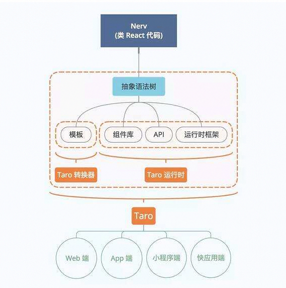

Taro是京东凹凸实验室

解决多端混乱的局面

目前Taro支持的终端

- 微信小程序
- H5 移动端Web页面
- 百度小程序
- 支付宝小程序
- 快应用
- ReactNative
- 字节跳动小程序
- QQ轻应用




全局安装

`yarn global add @tarojs/cli`

新建项目

`taro init myDemo1`


编译项目成H5

`yarn dev:h5`

编译项目成微信小程序

`yarn dev:weapp`


目录结构

```
├── dist                   编译结果目录
├── config                 配置目录
|   ├── dev.js             开发时配置
|   ├── index.js           默认配置
|   └── prod.js            打包时配置
├── src                    源码目录
|   ├── pages              页面文件目录
|   |   ├── index          index 页面目录
|   |   |   ├── index.js   index 页面逻辑
|   |   |   └── index.css  index 页面样式
|   ├── app.css            项目总通用样式
|   └── app.js             项目入口文件
└── package.json
```


```js
import React, { Component } from 'react'
import { View, Text } from '@tarojs/components'
import './index.scss'

export default class Index extends Component {

  componentWillMount () { }

  componentDidMount () { }

  componentWillUnmount () { }

  componentDidShow () { }

  componentDidHide () { }

  render () {
    return (
      <View className='index'>
        <Text>Hello world!</Text>
      </View>
    )
  }
}
```


使用hook

```js
import Taro from '@tarojs/taro'
import React, {  useState } from 'react'
import { View, Text } from '@tarojs/components'
import './index.scss'

function Index(){

  const [userName ,setUserName] = useState('Hello World!!!!')

  return ( 
    <View>
        <Text>{userName}</Text>
    </View>
  )

}

export default Index

```


使用taro的hook

```js
import Taro from '@tarojs/taro'
import { usePageScroll } from '@tarojs/taro'
import React, {  useState } from 'react'
import { View, Text } from '@tarojs/components'
import './index.scss'

function Index(){

  const [userName ,setUserName] = useState('Hello World!!!!')

  usePageScroll(res => {
    console.log(res.scrollTop)
  })

  return ( 
    <View>
        <Text>{userName}</Text>
        <View className="scroll-box"></View>  
    </View>
  )

}

export default Index
```

```scss
.scroll-box {
  height: 1000px;
  width: 400px;
  margin: 0 auto;
  border: 1px solid red;
}
```

