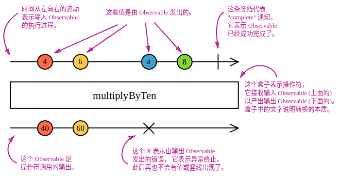

# 概览

## 入门

ReactiveX 结合了 观察者模式、迭代器模式 和 使用集合的函数式编程

在 RxJS 中用来解决异步事件管理的的基本概念是：

**Observable (可观察对象)**: 表示一个概念，这个概念是一个可调用的未来值或事件的集合。
**Observer (观察者)**: 一个回调函数的集合，它知道如何去监听由 Observable 提供的值。
**Subscription (订阅)**: 表示 Observable 的执行，主要用于取消 Observable 的执行。
**Operators (操作符)**: 采用函数式编程风格的纯函数 (pure function)，使用像 map、filter、concat、flatMap 等这样的操作符来处理集合。
**Subject (主体)**: 相当于 EventEmitter，并且是将值或事件多路推送给多个 Observer 的唯一方式。
**Schedulers (调度器)**: 用来控制并发并且是中央集权的调度员，允许我们在发生计算时进行协调，例如 setTimeout 或 requestAnimationFrame 或其他。

第一个示例

```JS
var button = document.querySelector('button');
Rx.Observable.fromEvent(button, 'click')
  .subscribe(() => console.log('Clicked!'));
```

### 纯净性 (Purity)

RxJS可以将应用状态隔离出来，方便状态管理

```js
var button = document.querySelector('button');
Rx.Observable.fromEvent(button, 'click')
  .scan(count => count + 1, 0)
  .subscribe(count => console.log(`Clicked ${count} times`));
```

scan 操作符的工作原理与数组的 reduce 类似。它需要一个暴露给回调函数当参数的初始值。每次回调函数运行后的返回值会作为下次回调函数运行时的参数。

### 流动性 (Flow)

RxJS 提供了一整套操作符来帮助你控制事件如何流经 observables 。

下面的代码展示的是如何控制一秒钟内最多点击一次

```js
var button = document.querySelector('button');
Rx.Observable.fromEvent(button, 'click')
  .throttleTime(1000)
  .scan(count => count + 1, 0)
  .subscribe(count => console.log(`Clicked ${count} times`));
```

其他流程控制操作符有 filter、delay、debounceTime、take、takeUntil、distinct、distinctUntilChanged 等等。

### 值 (Values)

对于流经 observables 的值，你可以对其进行转换。

下面的代码展示的是如何累加每次点击的鼠标 x 坐标

```js
var button = document.querySelector('button');
Rx.Observable.fromEvent(button, 'click')
  .throttleTime(1000)
  .map(event => event.clientX)
  .scan((count, clientX) => count + clientX, 0)
  .subscribe(count => console.log(count));
```

## Observable (可观察对象)

Observables 是多个值的惰性推送集合。它填补了下面表格中的空白：

示例 - 当订阅下面代码中的 Observable 的时候会立即(同步地)推送值1、2、3，然后1秒后会推送值4，再然后是完成流：

```js
var observable = Rx.Observable.create(function (observer) {
  observer.next(1);
  observer.next(2);
  observer.next(3);
  setTimeout(() => {
    observer.next(4);
    observer.complete();
  }, 1000);
});

console.log('just before subscribe');
observable.subscribe({
  next: x => console.log('got value ' + x),
  error: err => console.error('something wrong occurred: ' + err),
  complete: () => console.log('done'),
});
console.log('just after subscribe');
```

func.call() 意思是 "同步地给我一个值"
observable.subscribe() 意思是 "给我任意数量的值，无论是同步还是异步"

## Observable 剖析

在 subscribe 中用 try/catch 代码块来包裹任意代码是个不错的主意，如果捕获到异常的话，会发送 "Error" 通知：

var observable = Rx.Observable.create(function subscribe(observer) {
  try {
    observer.next(1);
    observer.next(2);
    observer.next(3);
    observer.complete();
  } catch (err) {
    observer.error(err); // 如果捕获到异常会发送一个错误
  }
});

### 清理 Observable 执行

```js
var observable = Rx.Observable.from([10, 20, 30]);
var subscription = observable.subscribe(x => console.log(x));
// 稍后：
subscription.unsubscribe();
```

当你订阅了 Observable，你会得到一个 Subscription ，它表示进行中的执行。只要调用 unsubscribe() 方法就可以取消执行。

当我们使用 create() 方法创建 Observable 时，Observable 必须定义如何清理执行的资源。你可以通过在 function subscribe() 中返回一个自定义的 unsubscribe 函数。

```js
var observable = Rx.Observable.create(function subscribe(observer) {
  // 追踪 interval 资源
  var intervalID = setInterval(() => {
    observer.next('hi');
  }, 1000);

  // 提供取消和清理 interval 资源的方法
  return function unsubscribe() {
    clearInterval(intervalID);
  };
});
```

## Observer (观察者)

什么是观察者？ - 观察者是由 Observable 发送的值的消费者。观察者只是一组回调函数的集合，每个回调函数对应一种 Observable 发送的通知类型：next、error 和 complete 。下面的示例是一个典型的观察者对象：

```js
var observer = {
  next: x => console.log('Observer got a next value: ' + x),
  error: err => console.error('Observer got an error: ' + err),
  complete: () => console.log('Observer got a complete notification'),
};
```

要使用观察者，需要把它提供给 Observable 的 subscribe 方法：

```js
observable.subscribe(observer);
```

观察者只是有三个回调函数的对象，每个回调函数对应一种 Observable 发送的通知类型。

RxJS 中的观察者也可能是部分的。如果你没有提供某个回调函数，Observable 的执行也会正常运行，只是某些通知类型会被忽略，因为观察者中没有相对应的回调函数。

## Subscription (订阅)

什么是 Subscription ？ - Subscription 是表示可清理资源的对象，通常是 Observable 的执行。Subscription 有一个重要的方法，即 unsubscribe，它不
需要任何参数，只是用来清理由 Subscription 占用的资源。在上一个版本的 RxJS 中，Subscription 叫做 "Disposable" (可清理对象)。
Subscription 还可以合在一起，这样一个 Subscription 调用 unsubscribe() 方法，可能会有多个 Subscription 取消订阅 。你可以通过把一
个 Subscription 添加到另一个上面来做这件事：

```js
var observable1 = Rx.Observable.interval(400);
var observable2 = Rx.Observable.interval(300);

var subscription = observable1.subscribe(x => console.log('first: ' + x));
var childSubscription = observable2.subscribe(x => console.log('second: ' + x));

subscription.add(childSubscription);

setTimeout(() => {
  // subscription 和 childSubscription 都会取消订阅
  subscription.unsubscribe();
}, 1000);
```

## Subject (主体)

什么是 Subject？ - RxJS Subject 是一种特殊类型的 Observable，它允许将值多播给多个观察者，所以 Subject 是多播的，而普通的 Observables 是单播的(每个已订阅的观察者都拥有 Observable 的独立执行)。

Subject 像是 Observable，但是可以多播给多个观察者。Subject 还像是 EventEmitters，维护着多个监听器的注册表。

每个 Subject 都是 Observable 。 - 对于 Subject，你可以提供一个观察者并使用 subscribe 方法，就可以开始正常接收值。从观察者的角度而言，它无法判断 Observable 执行是来自普通的 Observable 还是 Subject 。

在 Subject 的内部，subscribe 不会调用发送值的新执行。它只是将给定的观察者注册到观察者列表中，类似于其他库或语言中的 addListener 的工作方式。

每个 Subject 都是观察者。 - Subject 是一个有如下方法的对象： next(v)、error(e) 和 complete() 。要给 Subject 提供新值，只要调用 next(theValue)，它会将值多播给已注册监听该 Subject 的观察者们。

在下面的示例中，我们为 Subject 添加了两个观察者，然后给 Subject 提供一些值：

```js
var subject = new Rx.Subject();

subject.subscribe({
  next: (v) => console.log('observerA: ' + v)
});
subject.subscribe({
  next: (v) => console.log('observerB: ' + v)
});

subject.next(1);
subject.next(2);
```

因为 Subject 是观察者，这也就在意味着你可以把 Subject 作为参数传给任何 Observable 的 subscribe 方法

```js
var subject = new Rx.Subject();

subject.subscribe({
  next: (v) => console.log('observerA: ' + v)
});
subject.subscribe({
  next: (v) => console.log('observerB: ' + v)
});

var observable = Rx.Observable.from([1, 2, 3]);

observable.subscribe(subject); // 你可以提供一个 Subject 进行订阅
```

执行结果：

observerA: 1
observerB: 1
observerA: 2
observerB: 2
observerA: 3
observerB: 3

## 多播的 Observables

“多播 Observable” 通过 Subject 来发送通知，这个 Subject 可能有多个订阅者，然而普通的 “单播 Observable” 只发送通知给单个观察者。

多播 Observable 在底层是通过使用 Subject 使得多个观察者可以看见同一个 Observable 执行。

在底层，这就是 multicast 操作符的工作原理：观察者订阅一个基础的 Subject，然后 Subject 订阅源 Observable 。下面的示例与前面使用 observable.subscribe(subject) 的示例类似：

```js
var source = Rx.Observable.from([1, 2, 3]);
var subject = new Rx.Subject();
var multicasted = source.multicast(subject);

// 在底层使用了 `subject.subscribe({...})`:
multicasted.subscribe({
  next: (v) => console.log('observerA: ' + v)
});
multicasted.subscribe({
  next: (v) => console.log('observerB: ' + v)
});

// 在底层使用了 `source.subscribe(subject)`:
multicasted.connect();
```

multicast 操作符返回一个 Observable，它看起来和普通的 Observable 没什么区别，但当订阅时就像是 Subject 。multicast 返回的是 ConnectableObservable，它只是一个有 connect() 方法的 Observable 。

connect() 方法十分重要，它决定了何时启动共享的 Observable 执行。因为 connect() 方法在底层执行了 source.subscribe(subject)，所以它返回的是 Subscription，你可以取消订阅以取消共享的 Observable 执行。

### 引用计数

手动调用 connect() 并处理 Subscription 通常太笨重。通常，当第一个观察者到达时我们想要自动地连接，而当最后一个观察者取消订阅时我们想要自动地取消共享执行。

请考虑以下示例，下面的列表概述了 Subscriptions 发生的经过：

第一个观察者订阅了多播 Observable
多播 Observable 已连接
next 值 0 发送给第一个观察者
第二个观察者订阅了多播 Observable
next 值 1 发送给第一个观察者
next 值 1 发送给第二个观察者
第一个观察者取消了多播 Observable 的订阅
next 值 2 发送给第二个观察者
第二个观察者取消了多播 Observable 的订阅
多播 Observable 的连接已中断(底层进行的操作是取消订阅)
要实现这点，需要显式地调用 connect()，代码如下：

```js
var source = Rx.Observable.interval(500);
var subject = new Rx.Subject();
var multicasted = source.multicast(subject);
var subscription1, subscription2, subscriptionConnect;

subscription1 = multicasted.subscribe({
  next: (v) => console.log('observerA: ' + v)
});
// 这里我们应该调用 `connect()`，因为 `multicasted` 的第一个
// 订阅者关心消费值
subscriptionConnect = multicasted.connect();

setTimeout(() => {
  subscription2 = multicasted.subscribe({
    next: (v) => console.log('observerB: ' + v)
  });
}, 600);

setTimeout(() => {
  subscription1.unsubscribe();
}, 1200);

// 这里我们应该取消共享的 Observable 执行的订阅，
// 因为此后 `multicasted` 将不再有订阅者
setTimeout(() => {
  subscription2.unsubscribe();
  subscriptionConnect.unsubscribe(); // 用于共享的 Observable 执行
}, 2000);
```

如果不想显式调用 connect()，我们可以使用 ConnectableObservable 的 refCount() 方法(引用计数)，这个方法返回 Observable，这个 Observable 会追踪有多少个订阅者。当订阅者的数量从0变成1，它会调用 connect() 以开启共享的执行。当订阅者数量从1变成0时，它会完全取消订阅，停止进一步的执行。

refCount 的作用是，当有第一个订阅者时，多播 Observable 会自动地启动执行，而当最后一个订阅者离开时，多播 Observable 会自动地停止执行。

示例如下：

```js
var source = Rx.Observable.interval(500);
var subject = new Rx.Subject();
var refCounted = source.multicast(subject).refCount();
var subscription1, subscription2, subscriptionConnect;

// 这里其实调用了 `connect()`，
// 因为 `refCounted` 有了第一个订阅者
console.log('observerA subscribed');
subscription1 = refCounted.subscribe({
  next: (v) => console.log('observerA: ' + v)
});

setTimeout(() => {
  console.log('observerB subscribed');
  subscription2 = refCounted.subscribe({
    next: (v) => console.log('observerB: ' + v)
  });
}, 600);

setTimeout(() => {
  console.log('observerA unsubscribed');
  subscription1.unsubscribe();
}, 1200);

// 这里共享的 Observable 执行会停止，
// 因为此后 `refCounted` 将不再有订阅者
setTimeout(() => {
  console.log('observerB unsubscribed');
  subscription2.unsubscribe();
}, 2000);
```

执行结果：

observerA subscribed
observerA: 0
observerB subscribed
observerA: 1
observerB: 1
observerA unsubscribed
observerB: 2
observerB unsubscribed
refCount() 只存在于 ConnectableObservable，它返回的是 Observable，而不是另一个 ConnectableObservable 。

## BehaviorSubject

Subject 的其中一个变体就是 BehaviorSubject，它有一个“当前值”的概念。它保存了发送给消费者的最新值。并且当有新的观察者订阅时，会立即从 BehaviorSubject 那接收到“当前值”。

BehaviorSubjects 适合用来表示“随时间推移的值”。举例来说，生日的流是一个 Subject，但年龄的流应该是一个 BehaviorSubject 。

在下面的示例中，BehaviorSubject 使用值0进行初始化，当第一个观察者订阅时会得到0。第二个观察者订阅时会得到值2，尽管它是在值2发送之后订阅的。

```js
var subject = new Rx.BehaviorSubject(0); // 0是初始值

subject.subscribe({
  next: (v) => console.log('observerA: ' + v)
});

subject.next(1);
subject.next(2);

subject.subscribe({
  next: (v) => console.log('observerB: ' + v)
});

subject.next(3);
```

输出：

observerA: 0
observerA: 1
observerA: 2
observerB: 2
observerA: 3
observerB: 3

## ReplaySubject

ReplaySubject 类似于 BehaviorSubject，它可以发送旧值给新的订阅者，但它还可以记录 Observable 执行的一部分。

ReplaySubject 记录 Observable 执行中的多个值并将其回放给新的订阅者。

当创建 ReplaySubject 时，你可以指定回放多少个值：

```js
var subject = new Rx.ReplaySubject(3); // 为新的订阅者缓冲3个值

subject.subscribe({
  next: (v) => console.log('observerA: ' + v)
});

subject.next(1);
subject.next(2);
subject.next(3);
subject.next(4);

subject.subscribe({
  next: (v) => console.log('observerB: ' + v)
});

subject.next(5);
```

With output:

observerA: 1
observerA: 2
observerA: 3
observerA: 4
observerB: 2
observerB: 3
observerB: 4
observerA: 5
observerB: 5
除了缓冲数量，你还可以指定 window time (以毫秒为单位)来确定多久之前的值可以记录。在下面的示例中，我们使用了较大的缓存数量100，但 window time 参数只设置了500毫秒。

```js
var subject = new Rx.ReplaySubject(100, 500 /* windowTime */);

subject.subscribe({
  next: (v) => console.log('observerA: ' + v)
});

var i = 1;
setInterval(() => subject.next(i++), 200);

setTimeout(() => {
  subject.subscribe({
    next: (v) => console.log('observerB: ' + v)
  });
}, 1000);
```

从下面的输出可以看出，第二个观察者得到的值是3、4、5，这三个值是订阅发生前的500毫秒内发生的：

observerA: 1
observerA: 2
observerA: 3
observerA: 4
observerA: 5
observerB: 3
observerB: 4
observerB: 5
observerA: 6
observerB: 6
...

## AsyncSubject

AsyncSubject 是另一个 Subject 变体，只有当 Observable 执行完成时(执行 complete())，它才会将执行的最后一个值发送给观察者。

```js
var subject = new Rx.AsyncSubject();

subject.subscribe({
  next: (v) => console.log('observerA: ' + v)
});

subject.next(1);
subject.next(2);
subject.next(3);
subject.next(4);

subject.subscribe({
  next: (v) => console.log('observerB: ' + v)
});

subject.next(5);
subject.complete();
```

输出：

observerA: 5
observerB: 5
AsyncSubject 和 last() 操作符类似，因为它也是等待 complete 通知，以发送一个单个值。

## Operators (操作符)

尽管 RxJS 的根基是 Observable，但最有用的还是它的操作符。操作符是允许复杂的异步代码以声明式的方式进行轻松组合的基础代码单元。

什么是操作符？
操作符是 Observable 类型上的方法，比如 .map(...)、.filter(...)、.merge(...)，等等。当操作符被调用时，它们不会改变已经存在的 Observable 实例。相反，它们返回一个新的 Observable ，它的 subscription 逻辑基于第一个 Observable 。

操作符是函数，它基于当前的 Observable 创建一个新的 Observable。这是一个无副作用的操作：前面的 Observable 保持不变。

操作符本质上是一个纯函数 (pure function)，它接收一个 Observable 作为输入，并生成一个新的 Observable 作为输出。订阅输出 Observable 同样会订阅输入 Observable 。在下面的示例中，我们创建一个自定义操作符函数，它将从输入 Observable 接收的每个值都乘以10：

```js
function multiplyByTen(input) {
  var output = Rx.Observable.create(function subscribe(observer) {
    input.subscribe({
      next: (v) => observer.next(10 * v),
      error: (err) => observer.error(err),
      complete: () => observer.complete()
    });
  });
  return output;
}

var input = Rx.Observable.from([1, 2, 3, 4]);
var output = multiplyByTen(input);
output.subscribe(x => console.log(x));
```

输出：

10
20
30
40
注意，订阅 output 会导致 input Observable 也被订阅。我们称之为“操作符订阅链”。

## 实例操作符 vs. 静态操作符

什么是实例操作符？ - 通常提到操作符时，我们指的是实例操作符，它是 Observable 实例上的方法。举例来说，如果上面的 multiplyByTen 是官方提供的实例操作符，它看起来大致是这个样子的：

```js
Rx.Observable.prototype.multiplyByTen = function multiplyByTen() {
  var input = this;
  return Rx.Observable.create(function subscribe(observer) {
    input.subscribe({
      next: (v) => observer.next(10 * v),
      error: (err) => observer.error(err),
      complete: () => observer.complete()
    });
  });
}
```

实例运算符是使用 this 关键字来指代输入的 Observable 的函数。

注意，这里的 input Observable 不再是一个函数参数，它现在是 this 对象。下面是我们如何使用这样的实例运算符：

```js
var observable = Rx.Observable.from([1, 2, 3, 4]).multiplyByTen();

observable.subscribe(x => console.log(x));
```

什么是静态操作符？ - 除了实例操作符，还有静态操作符，它们是直接附加到 Observable 类上的。静态操作符在内部不使用 this 关键字，而是完全依赖于它的参数。

静态操作符是附加到 Observalbe 类上的纯函数，通常用来从头开始创建 Observalbe 。

最常用的静态操作符类型是所谓的创建操作符。它们只接收非 Observable 参数，比如数字，然后创建一个新的 Observable ，而不是将一个输入 Observable 转换为输出 Observable 。

一个典型的静态操作符例子就是 interval 函数。它接收一个数字(非 Observable)作为参数，并生产一个 Observable 作为输出：

```js
var observable = Rx.Observable.interval(1000 /* 毫秒数 */);
```

创建操作符的另一个例子就是 create，已经在前面的示例中广泛使用。点击这里查看所有静态操作符列表。

然而，有些静态操作符可能不同于简单的创建。一些组合操作符可能是静态的，比如 merge、combineLatest、concat，等等。这些作为静态运算符是有道理的，因为它们将多个 Observables 作为输入，而不仅仅是一个，例如：

```js
var observable1 = Rx.Observable.interval(1000);
var observable2 = Rx.Observable.interval(400);

var merged = Rx.Observable.merge(observable1, observable2);
```

Marble diagrams (弹珠图)
要解释操作符是如何工作的，文字描述通常是不足以描述清楚的。许多操作符都是跟时间相关的，它们可能会以不同的方式延迟(delay)、取样(sample)、节流(throttle)或去抖动值(debonce)。图表通常是更适合的工具。弹珠图是操作符运行方式的视觉表示，其中包含输入 Obserable(s) (输入可能是多个 Observable )、操作符及其参数和输出 Observable 。

在弹珠图中，时间流向右边，图描述了在 Observable 执行中值(“弹珠”)是如何发出的。

在下图中可以看到解剖过的弹珠图。



在整个文档站中，我们广泛地使用弹珠图来解释操作符的工作方式。它们在其他环境中也可能非常有用，例如在白板上，甚至在我们的单元测试中(如 ASCII 图)。

## 创建操作符

ajax
bindCallback
bindNodeCallback
create
defer
empty
from
fromEvent
fromEventPattern
fromPromise
generate
interval
never
of
repeat
repeatWhen
range
throw
timer

## 转换操作符

buffer
bufferCount
bufferTime
bufferToggle
bufferWhen
concatMap
concatMapTo
exhaustMap
expand
groupBy
map
mapTo
mergeMap
mergeMapTo
mergeScan
pairwise
partition
pluck
scan
switchMap
switchMapTo
window
windowCount
windowTime
windowToggle
windowWhen
过滤操作符
debounce
debounceTime
distinct
distinctKey
distinctUntilChanged
distinctUntilKeyChanged
elementAt
filter
first
ignoreElements
audit
auditTime
last
sample
sampleTime
single
skip
skipLast
skipUntil
skipWhile
take
takeLast
takeUntil
takeWhile
throttle
throttleTime

## 组合操作符

combineAll
combineLatest
concat
concatAll
exhaust
forkJoin
merge
mergeAll
race
startWith
switch
withLatestFrom
zip
zipAll

## 多播操作符

cache
multicast
publish
publishBehavior
publishLast
publishReplay
share

## 错误处理操作符

catch
retry
retryWhen

## 工具操作符

do
delay
delayWhen
dematerialize
finally
let
materialize
observeOn
subscribeOn
timeInterval
timestamp
timeout
timeoutWith
toArray
toPromise
条件和布尔操作符
defaultIfEmpty
every
find
findIndex
isEmpty
数学和聚合操作符
count
max
min
reduce

## Scheduler (调度器)

什么是调度器？ - 调度器控制着何时启动 subscription 和何时发送通知。它由三部分组成：

调度器是一种数据结构。 它知道如何根据优先级或其他标准来存储任务和将任务进行排序。
调度器是执行上下文。 它表示在何时何地执行任务(举例来说，立即的，或另一种回调函数机制(比如 setTimeout 或 process.nextTick)，或动画帧)。
调度器有一个(虚拟的)时钟。 调度器功能通过它的 getter 方法 now() 提供了“时间”的概念。在具体调度器上安排的任务将严格遵循该时钟所表示的时间。
调度器可以让你规定 Observable 在什么样的执行上下文中发送通知给它的观察者。

在下面的示例中，我们采用普通的 Observable ，它同步地发出值1、2、3，并使用操作符 observeOn 来指定 async 调度器发送这些值。

```js
var observable = Rx.Observable.create(function (observer) {
  observer.next(1);
  observer.next(2);
  observer.next(3);
  observer.complete();
})
.observeOn(Rx.Scheduler.async);

console.log('just before subscribe');
observable.subscribe({
  next: x => console.log('got value ' + x),
  error: err => console.error('something wrong occurred: ' + err),
  complete: () => console.log('done'),
});
console.log('just after subscribe');
```

输出结果：

just before subscribe
just after subscribe
got value 1
got value 2
got value 3
done
注意通知 got value... 在 just after subscribe 之后才发送，这与我们到目前为止所见的默认行为是不一样的。这是因为 observeOn(Rx.Scheduler.async) 在 Observable.create 和最终的观察者之间引入了一个代理观察者。在下面的示例代码中，我们重命名了一些标识符，使得其中的区别变得更明显：

```js
var observable = Rx.Observable.create(function (proxyObserver) {
  proxyObserver.next(1);
  proxyObserver.next(2);
  proxyObserver.next(3);
  proxyObserver.complete();
})
.observeOn(Rx.Scheduler.async);

var finalObserver = {
  next: x => console.log('got value ' + x),
  error: err => console.error('something wrong occurred: ' + err),
  complete: () => console.log('done'),
};

console.log('just before subscribe');
observable.subscribe(finalObserver);
console.log('just after subscribe');
```

proxyObserver 是在 observeOn(Rx.Scheduler.async) 中创建的，它的 next(val) 函数大概是下面这样子的：

```js
var proxyObserver = {
  next: (val) => {
    Rx.Scheduler.async.schedule(
      (x) => finalObserver.next(x),
      0 /* 延迟时间 */,
      val /* 会作为上面函数所使用的 x */
    );
  },

  // ...
}
```

async 调度器操作符使用了 setTimeout 或 setInterval，即使给定的延迟时间为0。照例，在 JavaScript 中，我们已知的是 setTimeout(fn, 0) 会在下一次事件循环迭代的最开始运行 fn 。这也解释了为什么发送给 finalObserver 的 got value 1 发生在 just after subscribe 之后。

调度器的 schedule() 方法接收一个 delay 参数，它指的是相对于调度器内部时钟的一段时间。调度器的时钟不需要与实际的挂钟时间有任何关系。这也就是为什么像 delay 这样的时间操作符不是在实际时间上操作的，而是取决于调度器的时钟时间。这在测试中极其有用，可以使用虚拟时间调度器来伪造挂钟时间，同时实际上是在同步执行计划任务。

## 调度器类型

async 调度器是 RxJS 提供的内置调度器中的一个。可以通过使用 Scheduler 对象的静态属性创建并返回其中的每种类型的调度器。

调度器	目的
null	不传递任何调度器的话，会以同步递归的方式发送通知。用于定时操作或尾递归操作。
Rx.Scheduler.queue	当前事件帧中的队列调度(蹦床调度器)。用于迭代操作。
Rx.Scheduler.asap	微任务的队列调度，它使用可用的最快速的传输机制，比如 Node.js 的 process.nextTick() 或 Web Worker 的 MessageChannel 或 setTimeout 或其他。用于异步转换。
Rx.Scheduler.async	使用 setInterval 的调度。用于基于时间的操作符。
使用调度器
你可能在你的 RxJS 代码中已经使用过调度器了，只是没有明确地指明要使用的调度器的类型。这是因为所有的 Observable 操作符处理并发性都有可选的调度器。如果没有提供调度器的话，RxJS 会通过使用最小并发原则选择一个默认调度器。这意味着引入满足操作符需要的最小并发量的调度器会被选择。例如，对于返回有限和少量消息的 observable 的操作符，RxJS 不使用调度器，即 null 或 undefined 。对于返回潜在大量的或无限数量的消息的操作符，使用 queue 调度器。对于使用定时器的操作符，使用 aysnc 调度器。

因为 RxJS 使用最少的并发调度器，如果出于性能考虑，你想要引入并发，那么可以选择不同的调度器。要指定具体的调度器，可以使用那些采用调度器的操作符方法，例如 from([10, 20, 30], Rx.Scheduler.async) 。

静态创建操作符通常可以接收调度器作为参数。 举例来说，from(array, scheduler) 可以让你指定调度器，当发送从 array 转换的每个通知的时候使用。调度器通常作为操作符的最后一个参数。下面的静态创建操作符接收调度器参数：

bindCallback
bindNodeCallback
combineLatest
concat
empty
from
fromPromise
interval
merge
of
range
throw
timer
使用 subscribeOn 来调度 subscribe() 调用在什么样的上下文中执行。 默认情况下，Observable 的 subscribe() 调用会立即同步地执行。然而，你可能会延迟或安排在给定的调度器上执行实际的 subscription ，使用实例操作符 subscribeOn(scheduler)，其中 scheduler 是你提供的参数。

使用 observeOn 来调度发送通知的的上下文。 正如我们在上面的示例中所看到的，实例操作符 observeOn(scheduler) 在源 Observable 和目标观察者之间引入了一个中介观察者，中介负责调度，它使用给定的 scheduler 来调用目标观察者。

实例操作符可能会接收调度器作为参数。

像 bufferTime、debounceTime、delay、auditTime、sampleTime、throttleTime、timeInterval、timeout、timeoutWith、windowTime 这样时间相关的操作符全部接收调度器作为最后的参数，并且默认的操作是在 Rx.Scheduler.async 调度器上。

其他接收调度器作为参数的实例操作符：cache、combineLatest、concat、expand、merge、publishReplay、startWith。

注意，cache 和 publishReplay 都接收调度器是因为它们使用了 ReplaySubject 。ReplaySubjects 的构造函数接收一个可选的调度器作为最后的参数，因为 ReplaySubject 可能会处理时间，这只在调度器的上下文中才有意义。默认情况下，ReplaySubject 使用 queue 调度器来提供时钟。