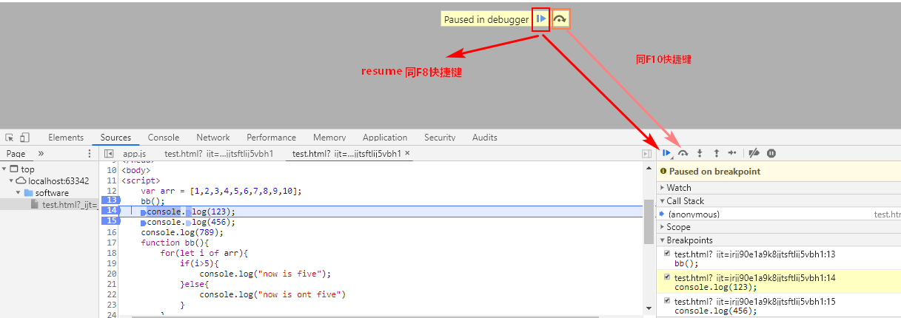
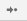

# debug

## 1.进入Debug

在Source中找到需要调试的文件,在需要调试的那一行设置断点,刷新页面,代码就会执行到断点处暂停,即可开始Debug



## 2,开始Debug(debug 是不会改变程序执行的顺序的, 只会改变速度或按你的要求停下来  )

案列

```js
 var arr = [1,2,3,4,5,6,7,8,9,10];
    bb();
    console.log(123);
    console.log(456);
    console.log(789);
    function bb(){
        for(let i of arr){
            if(i>5){
                console.log("now is five");
            }else{
                console.log("now is ont five")
            }
        }
    }
```

### 1.调试窗口


这个箭头是继续执行脚本的命令,如果后面还有断点,继续执行代码,遇到下一个断点会暂停



这个箭头是普通单步执行


1. 第一个箭头是,单步执行,但是遇到函数调用会直接执行完函数
2. 第二个箭头是,单步执行,但是遇到函数调用会进入函数
3. 第三个箭头是,单步执行,但是会跳出当前函数(当然会执行完当前函数)


这个是注释断点,和代码的注释一样,仍旧显示但是不起作用,注释断点.


这个图标激活之后,在代码出错之后会直接跳转到代码出错的那一行

### 2.侧边展示栏


watch ---- 监听变量;
点击+号可以添加你想要观察的变量或者表达式

Call Stack ---当断点执行到某一程序块处停下来后，右侧调试区的`Call Stack` 会显示当前断点所处的方法调用栈，从上到下由最新调用处依次往下排列

Scope ---查看此时局部变量和全局变量的值;

Breakponits---展示断点

#### 3.退出Debug

删除所有断点.,然后点击继续执行箭头(F8),然后刷新即可退出
