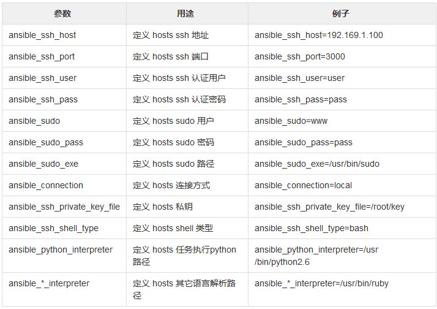

## 环境准备
192.168.1.30 	CentOS7 	ansible   ansible管理节点
192.168.1.31 	CentOS7 	node01 	  被管理节点1
192.168.1.32 	CentOS7 	node02 	  被管理节点2
192.168.1.33 	CentOS7 	node03 	  被管理节点3
192.168.1.34 	CentOS7 	node04 	  被管理节点4

`vi /etc/hosts`

    127.0.0.1 localhost
    192.168.1.30 ansible
    192.168.1.31 node01
    192.168.1.32 node02
    192.168.1.33 node03
    192.168.1.34 node04

同步hosts文件
`for i in {1,2,3,4}; do scp /etc/hosts root@node0$i:/etc/hosts; done`

配置epel源
`wget -O /etc/yum.repos.d/epel.repo http://mirrors.aliyun.com/repo/epel-7.repo`
`yum clean all`
`yum makecache`

安装ansible
`yum -y install ansible`
`ansible --version`


生成公私钥
`ssh-keygen`
`for i in {1,2,3,6}; do ssh-copy-id -i node0$i ; done`

## Inventory

编辑组
`vi /etc/ansible/hosts`这个是默认的inventory

    [webserver]
    node0[1:4]

    [webserver:vars]
    ansible_ssh_port=22
    ansible_ssh_user=root

    [apache]
    node0[1:2]
    [apache.vars]

    [nginx]
    node0[2:4]

    # 定义多个组，把一个组当另外一个组的组员
    [webserver:children]  #webserver组包括两个子组：apache nginx
    apache
    nginx

`ansible dockers -m ping -i /etc/dockers -o`这样可以指定inventory目录为/etc/dockers


### Inventory内置参数




## Ad-Hoc

### ansible命令格式

    [root@ansible ~]# ansible -h
    Usage: ansible <host-pattern> [options]
    -a MODULE_ARGS   #模块参数
    -C, --check  #检查语法
    -f FORKS #并发
    --list-hosts #列出主机列表
    -m MODULE_NAME #模块名字
    -o 使用精简的输出

`ansible webserver -m shell -a 'uptime' -o`

### 主机的匹配

一台目标主机
`ansible node1 -m ping`

多台目标主机
`ansible node1,192.168.1.32 -m ping`

所有目标主机
`ansible all -m ping`

### 组的匹配

列出nginx组的所有主机
`ansible nginx --list`

pingnginx组的所有主机
`ansible nginx -m ping`

匹配apache组中有，但是nginx组中没有的所有主机
`ansible 'apache:!nginx' -m ping -o`

匹配apache组和nginx组中都有的机器（交集）
`ansible 'apache:&nginx' -m ping -o`

匹配apache组nginx组两个组所有的机器（并集）
`ansible 'apache:nginx' -m ping -o`


### ansible-doc 常用命令

`ansible-doc -h`

    Usage: ansible-doc [-l|-F|-s] [options] [-t <plugin type> ] [plugin]
    -j  以json格式显示所有模块信息
    -l  列出所有的模块
    -s  查看模块常用参数
    # 直接跟模块名，显示模块所有信息

###　command模块

ansible默认的模块,执行命令，注意：shell中的"<", ">", "|", ";", "&","$"等特殊字符不能在command模块中使用，如果需要使用，则用shell模块

`ansible-doc -s command`查看模块参数

在node01服务器上面执行ls命令，默认是在当前用户的家目录/root
`ansible node01 -a 'ls'`


chdir  先切换工作目录，再执行后面的命令，一般情况下在编译时候使用
`ansible node01 -a 'chdir=/tmp pwd'`

creates  如果creates的文件不存在，则执行后面的操作
tmp目录存在，则不执行后面的ls命令
`ansible node1 -a 'creates=/tmp ls /etc/passwd' `

removes  和creates相反，如果removes的文件存在，才执行后面的操作
tmp文件存在，则执行了后面的ls命令
`ansible node1 -a 'removes=/tmp ls /etc/passwd'`


### shell模块

专门用来执行shell命令的模块，和command模块一样，参数基本一样，都有chdir,creates,removes等参数

`ansible-doc -s shell`查看模块参数

`ansible node1 -m shell -a 'mkdir /tmp/test'`


#执行下面这条命令，每次执行都会更新文件的时间戳
`ansible node1 -m shell -a 'cd /tmp/test && touch 1.txt && ls'` 

由于有时候不想更新文件的创建时间戳，则如果存在就不执行creates
`ansible node1 -m shell -a 'creates=/tmp/test/1.txt cd /tmp/test && touch 1.txt && ls'`

skipped, since /tmp/test/1.txt exists

## script模块

`ansible-doc -s script`查看模块参数

编写shell脚本
`vim ansible_test.sh` 

    #!/bin/bash
    echo `hostname`

在所有被管理机器上执行该脚本
`ansible all -m script -a '/root/ansible_test.sh'`

## 文件相关的模块

### file

用于对文件的处理，创建，删除，权限控制等

`ansible-doc -s file`

    path     #要管理的文件路径
    recurse  #递归
    state：
        directory  #创建目录，如果目标不存在则创建目录及其子目录
        touch      #创建文件，如果文件存在，则修改文件 属性
        
        absent     #删除文件或目录
        mode       #设置文件或目录权限
        owner      #设置文件或目录属主信息
        group      #设置文件或目录属组信息
        link       #创建软连接，需要和src配合使用
        hard       #创建硬连接，需要和src配合使用


创建目录
`ansible node1 -m file -a 'path=/tmp/test1 state=directory'`

创建文件
`ansible node1 -m file -a 'path=/tmp/test2 state=touch'`

建立软链接（src表示源文件，path表示目标文件）
`ansible node1 -m file -a 'src=/tmp/test1 path=/tmp/test3 state=link'`

删除文件
`ansible node1 -m file -a 'path=/tmp/test2 state=absent'`

创建文件时同时设置权限等信息
`ansible node1 -m file -a 'path=/tmp/test4 state=directory mode=775 owner=root group=root'`


### copy

用于管理端复制文件到远程主机，并可以设置权限，属组，属主等


`ansible-doc -s copy`查看模块参数

    src      #需要copy的文件的源路径
    dest     #需要copy的文件的目标路径
    backup   #对copy的文件进行备份
    content  #直接在远程主机被管理文件中添加内容，会覆盖原文件内容
    mode     #对copy到远端的文件设置权限
    owner    #对copy到远端的文件设置属主
    group    #对copy到远端文件设置属组


复制文件到远程主机并改名
`ansible node1 -m copy -a 'dest=/tmp/a.sh src=/root/ansible_test.sh'`

复制文件到远程主机，并备份远程文件,安装时间信息备份文件（当更新文件内容后，重新copy时用到）
`ansible node1 -m copy -a 'dest=/tmp/a.sh src=/root/ansible_test.sh backup=yes'`

直接在远程主机a.sh中添加内容

    ansible node1 -m copy -a 'dest=/tmp/a.sh content="#!/bin/bash\n echo `uptime`"'

复制文件到远程主机，并设置权限及属主与属组

    ansible node1 -m copy -a 'dest=/tmp/passwd src=/etc/passwd mode=700 owner=root group=root'

### fetch

`ansible-doc -s fetch` 查看模块参数

src      #指定需要从远端机器拉取的文件路径
dest     #指定从远端机器拉取下来的文件存放路径

从被管理机器上拉取cron日志文件，默认会已管理节点地址创建一个目录，并存放在内
`ansible node1 -m fetch -a 'dest=/tmp src=/var/log/cron'`

##　用户相关的模块

### user

用于对系统用户的管理，用户的创建、删除、家目录、属组等设置
复制代码

`ansible-doc -s user`查看模块参数

    name        #指定用户的名字
    home        #指定用户的家目录
    uid         #指定用户的uid
    group       #指定用户的用户组
    groups      #指定用户的附加组
    password    #指定用户的密码
    shell       #指定用户的登录shell
    create_home #是否创建用户家目录，默认是yes
    remove      #删除用户时，指定是否删除家目录
    state：
        absent    #删除用户
      

创建用户名指定家目录，指定uid及组

`ansible node1 -m user -a 'name=mysql home=/opt/mysql uid=1002 group=root'`

`ansible node1 -m shell -a 'id mysql && ls -l /opt'`

创建用户，不创建家目录，并且不能登录

`ansible node1 -m user -a 'name=apache shell=/bin/nologin uid=1003 create_home=no'`

`ansible node1 -m shell  -a 'id apache && tail -1 /etc/passwd'`

删除用户

`ansible node1 -m user -a 'name=apache state=absent'`

删除用户并删除家目录

`ansible node1 -m user -a 'name=mysql state=absent remove=yes'`

### group

用于创建组，当创建用户时如果需要指定组，组不存在的话就可以通过group先创建组

`ansible-doc -s group`查看模块参数

    name     #指定组的名字
    gid      #指定组的gid
    state：
        absent   #删除组
        present  #创建组（默认的状态）

创建组

`ansible node1 -m group -a 'name=www'`

创建组并指定gid

`ansible node1 -m group -a 'name=www1 gid=1005'`

删除组

`ansible node1 -m group -a 'name=www1 state=absent'`

## 软件包相关的模块

### yum

用于对软件包的管理，下载、安装、卸载、升级等操作
复制代码

`ansible-doc -s yum` 查看模块参数

    name            #指定要操作的软件包名字
    download_dir    #指定下载软件包的存放路径，需要配合download_only一起使用
    download_only   #只下载软件包，而不进行安装，和yum --downloadonly一样
    list:
        installed   #列出所有已安装的软件包
        updates     #列出所有可以更新的软件包
        repos       #列出所有的yum仓库
    state:   
        installed, present   #安装软件包(两者任选其一都可以)
        removed, absent      #卸载软件包
        latest      #安装最新软件包
    
列出所有已安装的软件包

`ansible node1 -m yum -a 'list=installed'`

列出所有可更新的软件包

`ansible node1 -m yum -a 'list=updates'`

列出所有的yum仓库

`ansible node1 -m yum -a 'list=repos'`

只下载软件包并到指定目录下

`ansible node1 -m yum -a 'name=httpd download_only=yes download_dir=/tmp'`

安装软件包

`ansible node1 -m yum -a 'name=httpd state=installed'`

卸载软件包

`ansible node1 -m yum -a 'name=httpd state=removed'`

安装包组，类似yum groupinstall 'Development Tools'

`ansible node1 -m yum -a 'name="@Development Tools" state=installed'`

### pip

用于安装python中的包

查看模块参数
`ansible-doc -s pip`

使用pip时，需要保证被管理机器上有python-pip软件包

`ansible node1 -m yum -a 'name=python-pip'`

安装pip包

`ansible node1 -m pip -a 'name=flask'`

## service

服务模块，用于对服务进行管理，服务的启动、关闭、开机自启等
复制代码

查看模块参数

`ansible-doc -s service`

    name       #指定需要管理的服务名
    enabled    #指定是否开机自启动
    state:     #指定服务状态
        started    #启动服务
        stopped    #停止服务
        restarted  #重启服务
        reloaded   #重载服务

启动服务，并设置开机自启动 

`ansible node1 -m service -a 'name=crond state=started enabled=yes'`

## 计划任务相关的模块

### cron

用于指定计划任务，和crontab -e一样
复制代码

查看模块参数

`ansible-doc -s cron`

    job     #指定需要执行的任务
    minute   #分钟
    hour     #小时
    day      #天
    month    #月
    weekday  #周
    name     #对计划任务进行描述
    state:
        absetn   #删除计划任务

创建一个计划任务，并描述是干嘛用的

`ansible node1 -m cron -a "name='这是一个测试的计划任务' minute=* hour=* day=* month=* weekday=* job='/bin/bash /root/test.sh'"`

查看计划
`ansible node1 -m shell -a 'crontab -l'`

创建一个没有带描述的计划任务

`ansible node1 -m cron -a "job='/bin/sh /root/test.sh'"`

删除计划任务

`ansible node1 -m cron -a "name='None' job='/bin/sh /root/test.sh' state=absent"`

## 系统信息相关的模块

### setup

用于获取系统信息的一个模块

查看模块参数

`ansible-doc -s setup`

查看系统所有信息

`ansible node1 -m setup`

filter 对系统信息进行过滤

`ansible node1 -m setup -a 'filter=ansible_all_ipv4_addresses'`

常用的过滤选项

+ ansible_all_ipv4_addresses         所有的ipv4地址
+ ansible_all_ipv6_addresses         所有的ipv6地址
+ ansible_architecture               系统的架构
+ ansible_date_time                  系统时间
+ ansible_default_ipv4               系统的默认ipv4地址
+ ansible_distribution               系统名称
+ ansible_distribution_file_variety  系统的家族
+ ansible_distribution_major_version 系统的版本
+ ansible_domain                     系统所在的域
+ ansible_fqdn                       系统的主机名
+ ansible_hostname                   系统的主机名,简写
+ ansible_os_family                  系统的家族
+ ansible_processor_cores            cpu的核数
+ ansible_processor_count            cpu的颗数
+ ansible_processor_vcpus            cpu的个数


# Ansible之Playbook

## Playbook介绍

Playbook与ad-hoc相比,是一种完全不同的运用ansible的方式，类似与saltstack的state状态文件。ad-hoc无法持久使用，playbook可以持久使用。
playbook是由一个或多个play组成的列表，play的主要功能在于将事先归并为一组的主机装扮成事先通过ansible中的task定义好的角色。从根本上来讲，所谓的task无非是调用ansible的一个module。将多个play组织在一个playbook中，即可以让它们联合起来按事先编排的机制完成某一任务

## Playbook核心元素

+ Hosts 执行的远程主机列表
+ Tasks 任务集
+ Varniables 内置变量或自定义变量在playbook中调用
+ Templates 模板，即使用模板语法的文件，比如配置文件等
+ Handlers 和notity结合使用，由特定条件触发的操作，满足条件方才执+ 行，否则不执行
+ tags 标签，指定某条任务执行，用于选择运行playbook中的部分代码。

## Playbook语法

playbook使用yaml语法格式，后缀可以是yaml,也可以是yml。

+ 在单一一个playbook文件中，可以连续三个连子号(---)区分多个play。还有选择性的连续三个点号(...)用来表示play的结尾，也可省略。
+ 次行开始正常写playbook的内容，一般都会写上描述该playbook的功能。
+ 使用#号注释代码。
+ 缩进必须统一，不能空格和tab混用。
+ 缩进的级别也必须是一致的，同样的缩进代表同样的级别，程序判别配置的级别是通过缩进结合换行实现的。
+ YAML文件内容和Linux系统大小写判断方式保持一致，是区分大小写的，k/v的值均需大小写敏感
+ k/v的值可同行写也可以换行写。同行使用:分隔。
+ v可以是个字符串，也可以是一个列表
+ 一个完整的代码块功能需要最少元素包括 name: task


1. 创建playbook文件

```yaml
---                       #固定格式
- hosts: node01 node02   #定义需要执行主机
  remote_user: root       #远程用户
  vars:                   #定义变量
    http_port: 80       #变量

  tasks:                             #定义一个任务的开始
    - name: create new file          #定义任务的名称
      file: name=/tmp/playtest.txt state=touch   #调用模块，具体要做的事情
    - name: create new user
      user: name=test02 system=yes shell=/sbin/nologin
    - name: install package
      yum: name=httpd
    - name: config httpd
      template: src=./httpd.conf dest=/etc/httpd/conf/httpd.conf
      notify:                 #定义执行一个动作(action)让handlers来引用执行，与handlers配合使用
        - restart apache      #notify要执行的动作，这里必须与handlers中的name定义内容一致
    - name: copy index.html
      copy: src=/var/www/html/index.html dest=/var/www/html/index.html
    - name: start httpd
      service: name=httpd state=started
    - name: stop firewalld
      service: name=firewalld state=stopped
  handlers:                                    #处理器：更加tasks中notify定义的action触发执行相应的处理动作
    - name: restart apache                     #要与notify定义的内容相同
      service: name=httpd state=restarted      #触发要执行的动作
```

2. 测试页面准备
`$ echo "<h1>playbook test file</h1>" >/var/www/html/index.html`

3. 配置文件准备
`$ cat httpd.conf |grep ^Listen`

    Listen {{ http_port }}

4. 执行
`$ ansible-playbook playbook01.yml`

5. 验证
`$ curl 192.168.1.31:80`
`$ curl 192.168.1.32:80`


`$ ansible-playbook -h`
#ansible-playbook常用选项：
--check  or -C    #只检测可能会发生的改变，但不真正执行操作
--list-hosts      #列出运行任务的主机
--list-tags       #列出playbook文件中定义所有的tags
--list-tasks      #列出playbook文件中定义的所以任务集
--limit           #主机列表 只针对主机列表中的某个主机或者某个组执行
-f                #指定并发数，默认为5个
-t                #指定tags运行，运行某一个或者多个tags。（前提playbook中有定义tags）
-v                #显示过程  -vv  -vvv更详细


## Playbook中元素属性

### 主机与用户

在一个playbook开始时，最先定义的是要操作的主机和用户

```yaml
---
- hosts: 192.168.1.31
  remote_user: root
```

除了上面的定义外，还可以在某一个tasks中定义要执行该任务的远程用户

```yaml
tasks: 
  - name: run df -h
    remote_user: test
    shell: name=df -h
```

还可以定义使用sudo授权用户执行该任务

```yaml
tasks: 
  - name: run df -h
    sudo_user: test
    sudo: yes
    shell: name=df -h
```

### tasks任务列表

每一个task必须有一个名称name,这样在运行playbook时，从其输出的任务执行信息中可以很清楚的辨别是属于哪一个task的，如果没有定义 name，action的值将会用作输出信息中标记特定的task。
每一个playbook中可以包含一个或者多个tasks任务列表，每一个tasks完成具体的一件事，（任务模块）比如创建一个用户或者安装一个软件等，在hosts中定义的主机或者主机组都将会执行这个被定义的tasks。

```yaml
tasks:
  - name: create new file
    file: path=/tmp/test01.txt state=touch
  - name: create new user
    user: name=test001 state=present
```


### Handlers与Notify

很多时候当我们某一个配置发生改变，我们需要重启服务，（比如httpd配置文件文件发生改变了）
这时候就可以用到handlers和notify了；
(当发生改动时)notify actions会在playbook的每一个task结束时被触发，而且即使有多个不同
task通知改动的发生，notify actions知会被触发一次；比如多个resources指出因为一个配置文
件被改动，所以apache需要重启，但是重新启动的操作知会被执行一次。

[root@ansible ~]# cat httpd.yml 
#用于安装httpd并配置启动
---
- hosts: 192.168.1.31
  remote_user: root

  tasks:
  - name: install httpd
    yum: name=httpd state=installed
  - name: config httpd
    template: src=/root/httpd.conf dest=/etc/httpd/conf/httpd.conf
    notify:
      - restart httpd
  - name: start httpd
    service: name=httpd state=started

  handlers:
    - name: restart httpd
      service: name=httpd state=restarted

#这里只要对httpd.conf配置文件作出了修改，修改后需要重启生效，在tasks中定义了restart httpd这个
action，然后在handlers中引用上面tasks中定义的notify。


## Playbook中变量的使用

环境说明：这里配置了两个组，一个apache组和一个nginx组

`$ cat /etc/ansible/hosts`

    [apache]
    192.168.1.36
    192.168.1.33

    [nginx]
    192.168.1.3[1:2]

### 命令行指定变量

执行playbook时候通过参数-e传入变量，这样传入的变量在整个playbook中都可以被调用，属于全局变量
复制代码

`$ cat variables.yml`

```yaml
---
- hosts: all
  remote_user: root

  tasks:
    - name: install pkg
      yum: name={{ pkg }}
```

#执行playbook 指定pkg
`$ ansible-playbook -e "pkg=httpd" variables.yml`

### hosts文件中定义变量

在/etc/ansible/hosts文件中定义变量，可以针对每个主机定义不同的变量，也可以定义一个组的变量，
然后直接在playbook中直接调用。注意，组中定义的变量没有单个主机中的优先级高。
复制代码

编辑hosts文件定义变量

`$ vim /etc/ansible/hosts`

    [apache]
    192.168.1.36 webdir=/opt/test     #定义单个主机的变量
    192.168.1.33
    [apache:vars]      #定义整个组的统一变量
    webdir=/web/test

    [nginx]
    192.168.1.3[1:2]
    [nginx:vars]
    webdir=/opt/web


编辑playbook文件

`$ cat variables.yml`

```yaml
---
- hosts: all
  remote_user: root

  tasks:
    - name: create webdir
      file: name={{ webdir }} state=directory   #引用变量
```

执行playbook

`$ ansible-playbook variables.yml`


playbook文件中定义变量

编写playbook时，直接在里面定义变量，然后直接引用，可以定义多个变量；
注意：如果在执行playbook时，又通过-e参数指定变量的值，那么会以-e参数指定的为准。

编辑playbook

`$ cat variables.yml`

```yaml
---
- hosts: all
  remote_user: root
  vars:                #定义变量
    pkg: nginx         #变量1
    dir: /tmp/test1    #变量2

  tasks:
    - name: install pkg
      yum: name={{ pkg }} state=installed    #引用变量
    - name: create new dir
      file: name={{ dir }} state=directory   #引用变量
```

执行playbook

`$ ansible-playbook variables.yml`

如果执行时候又重新指定了变量的值，那么会已重新指定的为准
`$ ansible-playbook -e "dir=/tmp/test2" variables.yml`

### 调用setup模块获取变量
 
setup模块默认是获取主机信息的，有时候在playbook中需要用到，所以可以直接调用。

编辑playbook文件

`$ cat variables.yml`

```yaml
---
- hosts: all
  remote_user: root

  tasks:
    - name: create file
      file: name={{ ansible_fqdn }}.log state=touch   #引用setup中的ansible_fqdn
```

执行playbook
`$ ansible-playbook variables.yml`

### 独立的变量YAML文件中定义

为了方便管理将所有的变量统一放在一个独立的变量YAML文件中，playbook文件直接引用文件调用变量即可。

定义存放变量的文件
`$ cat var.yml` 

    var1: vsftpd
    var2: httpd

编写playbook
`$ cat variables.yml`

```yaml
---
- hosts: all
  remote_user: root
  vars_files:    #引用变量文件
    - ./var.yml   #指定变量文件的path（这里可以是绝对路径，也可以是相对路径）

  tasks:
    - name: install package
      yum: name={{ var1 }}   #引用变量
    - name: create file
      file: name=/tmp/{{ var2 }}.log state=touch   #引用变量
```

执行playbook
`$ ansible-playbook  variables.yml`


## Playbook中标签的使用

一个playbook文件中，执行时如果想执行某一个任务，那么可以给每个任务集进行打标签，这样在执行的时候可以通过-t选择指定标签执行，还可以通过--skip-tags选择除了某个标签外全部执行等。
复制代码

编辑playbook
`$ cat httpd.yml`

```yaml
---
- hosts: 192.168.1.31
  remote_user: root

  tasks:
    - name: install httpd
      yum: name=httpd state=installed
      tags: inhttpd

    - name: start httpd
      service: name=httpd state=started
      tags: sthttpd

    - name: restart httpd
      service: name=httpd state=restarted
      tags: 
        - rshttpd
        - rs_httpd
```

正常执行的结果
`$ ansible-playbook httpd.yml` 

    PLAY [192.168.1.31] **************************************************************************************************************************

    TASK [Gathering Facts] ***********************************************************************************************************************
    ok: [192.168.1.31]

    TASK [install httpd] *************************************************************************************************************************
    ok: [192.168.1.31]

    TASK [start httpd] ***************************************************************************************************************************
    ok: [192.168.1.31]

    TASK [restart httpd] *************************************************************************************************************************
    changed: [192.168.1.31]

    PLAY RECAP ***********************************************************************************************************************************
    192.168.1.31               : ok=4    changed=1    unreachable=0    failed=0    skipped=0    rescued=0    ignored=0


1）通过-t选项指定tags进行执行

通过-t指定tags名称，多个tags用逗号隔开
`$ ansible-playbook -t rshttpd httpd.yml` 

    PLAY [192.168.1.31] **************************************************************************************************************************

    TASK [Gathering Facts] ***********************************************************************************************************************
    ok: [192.168.1.31]

    TASK [restart httpd] *************************************************************************************************************************
    changed: [192.168.1.31]

    PLAY RECAP ***********************************************************************************************************************************
    192.168.1.31               : ok=2    changed=1    unreachable=0    failed=0    skipped=0    rescued=0    ignored=0

2）通过--skip-tags选项排除不执行的tags
`$ ansible-playbook --skip-tags inhttpd httpd.yml`

    PLAY [192.168.1.31] **************************************************************************************************************************

    TASK [Gathering Facts] ***********************************************************************************************************************
    ok: [192.168.1.31]

    TASK [start httpd] ***************************************************************************************************************************
    ok: [192.168.1.31]

    TASK [restart httpd] *************************************************************************************************************************
    changed: [192.168.1.31]

    PLAY RECAP ***********************************************************************************************************************************
    192.168.1.31               : ok=3    changed=1    unreachable=0    failed=0    skipped=0    rescued=0    ignored=0

## Playbook中模板的使用

template模板为我们提供了动态配置服务，使用jinja2语言，里面支持多种条件判断、循环、逻辑运算、比较操作等。其实说白了也就是一个文件，和之前配置文件使用copy一样，只是使用copy，不能根据服务器配置不一样进行不同动态的配置。这样就不利于管理。
说明：
1、多数情况下都将template文件放在和playbook文件同级的templates目录下（手动创建），这样playbook文件中可以直接引用，会自动去找这个文件。如果放在别的地方，也可以通过绝对路径去指定。
2、模板文件后缀名为.j2。

示例：通过template安装httpd

1）playbook文件编写

`$ cat testtmp.yml`

模板示例
```yaml
---
- hosts: all
  remote_user: root
  vars:
    - listen_port: 88    #定义变量

  tasks:
    - name: Install Httpd
      yum: name=httpd state=installed
    - name: Config Httpd
      template: src=httpd.conf.j2 dest=/etc/httpd/conf/httpd.conf    #使用模板
      notify: Restart Httpd
    - name: Start Httpd
      service: name=httpd state=started
      
  handlers:
    - name: Restart Httpd
      service: name=httpd state=restarted
```

2）模板文件准备，httpd配置文件准备，这里配置文件端口使用了变量

[root@ansible PlayBook]# cat templates/httpd.conf.j2 |grep ^Listen
Listen {{ listen_port }}

3）查看目录结构
复制代码
