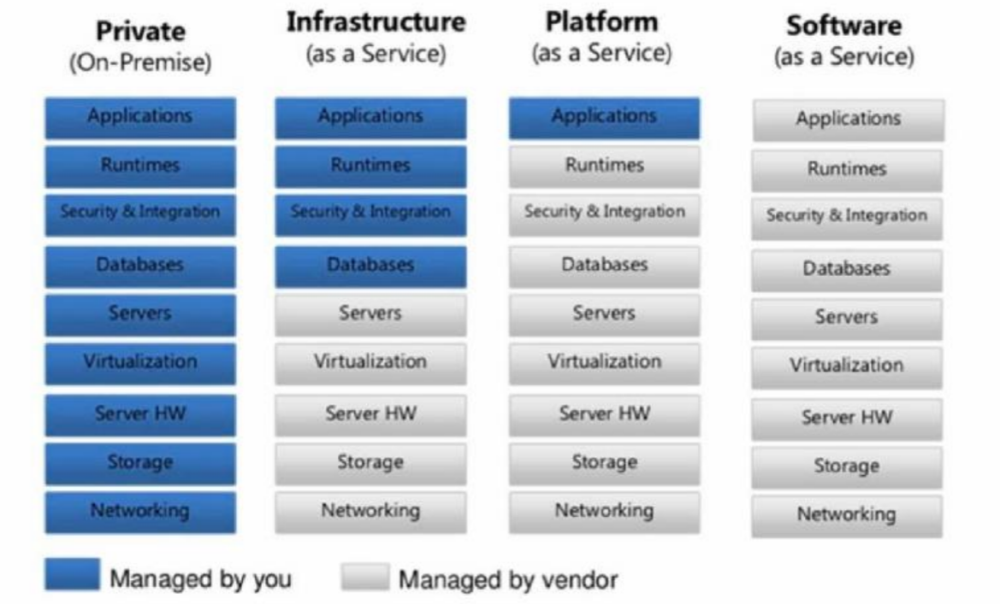
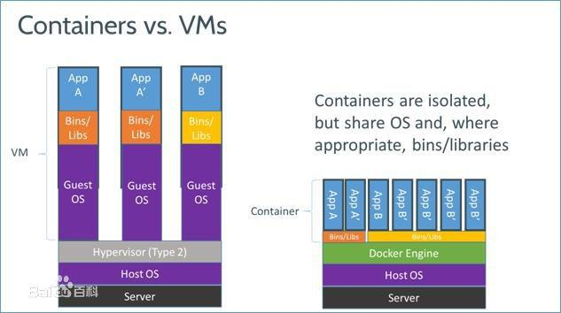

# docker

## 概述
Docker 是 dotcloud 公司开源的一款产品 dotcloud 是 2010 年新成立的一家公司,
主要基于 PAAS ( Platfrom as a Service ) 平台为开发者提供服务


Linux Container(LXC)是一种内核虚拟化技术,可以提供轻量级的虚拟化,以便隔离进程和资源

Docker是PAAS提供商 dotCloud开源的一个基于 LXC 的高级容器引擎,源代码托管在 Github 上, 基于 go 语言并遵从 Apache2.0 协议开源

Docker 设想是交付运行环境如同海运,OS 如同一个货轮,每一个在 OS 基础上的软
件都如同一个集装箱,用户可以通过标准化手段自由组装运行环境,同时集装箱的内容可
以由用户自定义,也可以由专业人员制造

## *AAS


 
## container与VMs的区别


container相对于VMs安全性差但性能强
因为VMs在操作系统层消耗了更多资源，但操作系统能有效隔离，故安全性高


Docker 仓库：https://hub.docker.com

Docker 自身组件
> Docker Client:Docker 的客户端
> Docker Server:Docker daemon 的主要组成部分,接受用户通过 Docker Client
发出的请求,并按照相应的路由规则实现路由分发
> Docker 镜像:Docker 镜像运行之后变成容器(docker run)

## 安装docker

更换到阿里源

    ```shell
        cat >/etc/yum.repos.d/docker.repo <<-EOF
        [dockerrepo]
        name=Docker Repository
        baseurl=https://yum.dockerproject.org/repo/main/centos/7
        enabled=1
        gpgcheck=1
        gpgkey=https://yum.dockerproject.org/gpg EOF
    ```
`yum makecache`重新产生源的缓存
`systemctl start docker`
`systemctl enable docker`
`docker run hello-world`

## 加速docker

`cp /lib/systemd/system/docker.service /etc/systemd/system/docker.service.bak`
`chmod 777 /etc/systemd/system/docker.service`
`vim /etc/systemd/system/docker.service`
插入以下内容
ExecStart=/usr/bin/dockerd-current --registry-
mirror=https://kfp63jaj.mirror.aliyuncs.com \

`systemctl daemon-reload`
`systemctl restart`
`ps -ef | grep docker`


`docker run --name db --env MYSQL_ROOT_PASSWORD=example -d mariadb`
`docker run --name MyWordPress --link db:mysql -p 8080:80 -d wordpress`


## 基本命令

### 镜像

docker images 列出本地所有镜像
docker info 守护进程的系统资源设置
docker search IMAGE_NAME 仓库的查询
docker pull Docker 仓库的下载
docker images Docker 镜像的查询
docker rmi IMAGE_NAME:TAG或者IAMGE_ID 删除镜像

### 容器

docker ps 查看当前运行的容器
docker ps -a 查看所有容器
docker run CONTAINER 容器的创建启动
docker start/stop CONTAINER 容器启动停止
docker rm CONTAINER
docker inspect MywordPress 查看容器所有基本信息
docker logs MywordPress 查看容器日志
docker stats MywordPress 查看容器所占用的系统资源
docker exec 容器名 容器内执行的命令 容器执行命令
docker exec -it 容器名 /bin/bash 登入容器的bash

docker run的参数
--restart=always 容器的自动启动
-h x.xx.xx 设置容器主机名
--dns xx.xx.xx.xx 设置容器使用的 DNS 服务器
--dns-search DNS 搜索设置
--add-host hostname:IP 注入 hostname <> IP 解析
--rm 服务停止时自动删除


容器创建时需要指定镜像，每个镜像都由唯一的标示Image ID ，和容器的Container ID 一样，
也可以使用镜像名与版本号两部分组合唯一标示，如果省略版本号，默认使用最新版本标签(latesr)

镜像的分层：Docker 的镜像通过联合文件系统(union filesystem) 将各层文件系统叠加在一起
> bootfs：用于系统引导的文件系统，包括bootloader 和kernel，容器启动完成后会被卸载以节省内存资源
> roofs：位于bootfs之上，表现为Docker 容器的跟文件系统
>> 传统模式中，系统启动时，内核挂载rootfs时会首先将其挂载为“只读”模式，完整性自检完成后将其挂载为读写模式
>> Docker 中，rootfs由内核挂载为“只读”模式，而后通过UFS技术挂载一个“可写”层

镜像的特性
已有的分层只能读不能修改
上层镜像优先级大于底层镜像