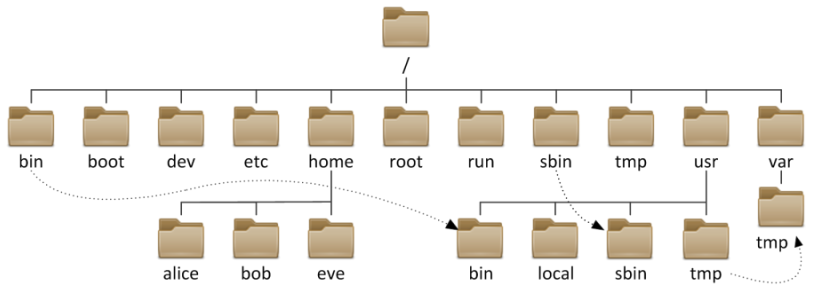

## Linux目录结构

+ bin                   　普通用户使用的命令 /bin/ls, /bin/date
+ sbin                　　管理员使用的命令 /sbin/service 
+ dev                    设备文件 /dev/sda,/dev/sda1,/dev/tty1,/dev/tty2,/dev/pts/1, /dev/zero, /dev/null, /dev/random
+ root                   root用户的HOME
+ home              　　 存储普通用户家目录    
+ lost+found     　　　　 fsck修复时，存储没有链接的文件或目录
+ proc              　　 虚拟的文件系统，反映出来的是内核，进程信息或实时状态 

+ usr                　　系统文件，相当于C:\Windows
  + /usr/local     软件安装的目录，相当于C:\Program
  + /usr/bin      普通用户使用的应用程序
  + /usr/sbin     管理员使用的应用程序
  + /usr/lib      库文件Glibc
  + /usr/lib64   库文件Glibc
+ boot                存放的系统启动相关的文件，例如kernel,grub(引导装载程序)
+ etc                  配置文件（系统相关如网络/etc/sysconfig/network，应用相关配置文件如/etc/ssh/sshd_config...）
+ lib                   库文件Glibc
+ lib64                库文件Glibc
+ tmp                临时文件(全局可写：进程产生的临时文件)   
+ var                存放的是一些变化文件，比如数据库，日志，邮件....
  + mysql:              /var/lib/mysql
  + vsftpd:            /var/ftp
  + mail:                /var/spool/mail
  + cron:                /var/spool/cron
  + log:                /var/log
  + 临时文件:     /var/tmp(进程产生的临时文件)

## 设备挂载目录

==设备（主要指存储设备）挂载目录==
+ media               移动设备默认的挂载点
+ mnt               手工挂载设备的挂载点
+ misc                automount进程挂载
+ net                automount进程挂载

## 命令存储位置

+ /bin              普通用户使用的命令 /bin/ls, /bin/date           RHEL7淘汰
+ /sbin             管理员使用的命令                                RHEL7淘汰
+ /usr/bin          普通用户使用的应用程序
+ /usr/sbin         管理员使用的应用程序

## 库文件存储位置：

+ /lib 　　　　 库文件Glibc RHEL7淘汰
+ /lib64      库文件Glibc RHEL7淘汰
+ /usr/lib 　　库文件Glibc
+ /usr/lib64   库文件Glibc

## 文件时间

`$ ls -l 文件名` 仅看的是文件的修改时间

Linux文件有四种时间：

`$ stat anaconda-ks.cfg //查看文件的详细属性（其中包括文件时间属性）`

访问时间：atime， 查看内容 //RHEL6会延后修改atime
修改时间：mtime，修改内容
改变时间：ctime， 文件属性，比如权限
删除时间：dtime， 文件被删除的时间

`$ ls -l install.log`

    -rw-r--r-- 1 root root 34793 10-23 13:49 install.log

## 文件类型：

### 通过ls -l 
`$ ls -l 文件名`    //看第一个字符
-    普通文件（文本文件，二进制文件，压缩文件，电影，图片。。。）
d    目录文件（蓝色）
b    设备文件（块设备）存储设备硬盘，U盘 /dev/sda, /dev/sda1
c    设备文件（字符设备）打印机，终端 /dev/tty1
s    套接字文件
p    管道文件
l    链接文件（淡蓝色）

### 通过 file
`$ file /etc/hosts`
/etc/hosts: ASCII text

## 查看文件内容

cat     
-n  显示行号
-A  包括控制字符（换行符/制表符）
     linux $     
     Windows ^M$

head 显示文件头部内容 默认10行
head -2 显示文件头部两行
tail 显示文件尾部 默认10行
tail -2 显示文件尾部两行
tail -f 动态显示文件尾部

grep 针对文件内容进行过滤
grep '^root' /etc/passwd

## vim

### 命令模式：
    a. 光标定位 
        hjkl  
        0 $ 
        gg G  
        3G      进入第三行 
        /string (n N 可以循环的)  快速定位到某一行  
        /^d
        /txt$
                  
    b. 文本编辑（少量）
        y        复制  yy 3yy ygg  yG         (以行为单位)
        d        删除 dd 3dd dgg  dG           (以行为单位)    
        p        粘贴
        x        删除光标所在的字符
        D        从光标处删除到行尾
        u        undo撤销
        ^r       redo重做
        r        可以用来修改一个字符
    
    c. 进入其它模式
        a        进入插入模式
        i        进入插入模式
        o        进入插入模式
        A        进入插入模式
        
        :        进入末行模式（扩展命令模式）
        v        进入可视模式
        ^v       进入可视块模式
        V        进入可视行模式
        R        进入替换模式
               
### 可视块模式：
        块插入（在指定块前加入字符）：  选择块，I   在块前插入字符， ESC
        块替换：                                       选择块，r   输入替换的字符  
        块删除：                                       选择块，d | x
        块复制：                                       选择块，y

### 扩展命令模式：
    a. 保存退出
        :10     进入第10行   
        :w      保存   
        :q      退出    
        :wq     保存并退出      
        :w!     强制保存    
        :q!     不保存并退出       
        :wq!    强制保存退出
        :x      保存并退出   ZZ
        
        
    b. 查找替换
        :范围 s/old/new/选项        
        :1,5 s/root/yang/                     从1－5行的root 替换为yang   
        :5,$ s/root/yang/                     $表示最后一行
        :1,$ s/root/yang/g                    =     :% s/root/yang/g    %表示全文  g表示全局
        :% s#/dev/sda#/var/ccc#g
        :,8 s/root/yang/                      从当前行到第8行
        :4,9 s/^#//                           4-9行的开头#替换为空
        :5,10 s/.*/#&/                        5-10前加入#字符  （.*整行   &引用查找的内容）
        
    c. 读入文件/写文件(另存为)
        :w                                    存储到当前文件
        :w /tmp/aaa.txt                       另存为/tmp/aaa.txt  
        :1,3 w /tmp/2.txt
        :r /etc/hosts                         读入文件到当前行后
        :5 r /etc/hosts                       读入文件到第5行后

    d. 设置环境     
        临时设置：        
        :set nu                                设置行号      
        :set ic                                不区分大小写
        :set ai                                自动缩进
        :set list                              显示控制字符
        :set nonu                              取消设置行号     
        :set noic

       永久的环境：
       /etc/vimrc                             影响所有系统用户
       ~/.vimrc                               影响某一个用户
    
        # vim ~/.vimrc 
        set ic
        set nu