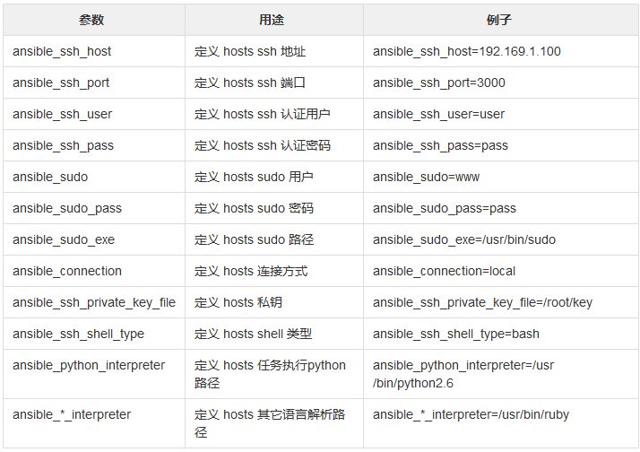

## 环境准备
192.168.1.30 	CentOS7 	ansible   ansible管理节点
192.168.1.31 	CentOS7 	node01 	  被管理节点1
192.168.1.32 	CentOS7 	node02 	  被管理节点2
192.168.1.33 	CentOS7 	node03 	  被管理节点3
192.168.1.34 	CentOS7 	node04 	  被管理节点4

`vi /etc/hosts`

    127.0.0.1 localhost
    192.168.1.30 ansible
    192.168.1.31 node01
    192.168.1.32 node02
    192.168.1.33 node03
    192.168.1.34 node04

同步hosts文件
`for i in {1,2,3,4}; do scp /etc/hosts root@node0$i:/etc/hosts; done`

配置epel源
`wget -O /etc/yum.repos.d/epel.repo http://mirrors.aliyun.com/repo/epel-7.repo`
`yum clean all`
`yum makecache`

安装ansible
`yum -y install ansible`
`ansible --version`

生成公私钥
`ssh-keygen`
`for i in {1,2,3,6}; do ssh-copy-id -i node0$i ; done`

## Inventory

编辑组
`vi /etc/ansible/hosts`这个是默认的inventory

    [webserver]
    node0[1:4]

    [webserver:vars]
    ansible_ssh_port=22
    ansible_ssh_user=root

    [apache]
    node0[1:2]
    [apache.vars]

    [nginx]
    node0[2:4]

    # 定义多个组，把一个组当另外一个组的组员
    [webserver:children]  #webserver组包括两个子组：apache nginx
    apache
    nginx

`ansible dockers -m ping -i /etc/dockers -o`这样可以指定inventory目录为/etc/dockers

### Inventory内置参数

## Ad-Hoc

### ansible命令格式

    [root@ansible ~]# ansible -h
    Usage: ansible <host-pattern> [options]
    -a MODULE_ARGS   #模块参数
    -C, --check  #检查语法
    -f FORKS #并发
    --list-hosts #列出主机列表
    -m MODULE_NAME #模块名字
    -o 使用精简的输出

`ansible webserver -m shell -a 'uptime' -o`

### 主机的匹配

一台目标主机
`ansible node1 -m ping`

多台目标主机
`ansible node1,192.168.1.32 -m ping`

所有目标主机
`ansible all -m ping`

### 组的匹配

列出nginx组的所有主机
`ansible nginx --list`

pingnginx组的所有主机
`ansible nginx -m ping`

匹配apache组中有，但是nginx组中没有的所有主机
`ansible 'apache:!nginx' -m ping -o`

匹配apache组和nginx组中都有的机器（交集）
`ansible 'apache:&nginx' -m ping -o`

匹配apache组nginx组两个组所有的机器（并集）
`ansible 'apache:nginx' -m ping -o`

### ansible-doc 常用命令

`ansible-doc -h`

    Usage: ansible-doc [-l|-F|-s] [options] [-t <plugin type> ] [plugin]
    -j  以json格式显示所有模块信息
    -l  列出所有的模块
    -s  查看模块常用参数
    # 直接跟模块名，显示模块所有信息

###　command模块

ansible默认的模块,执行命令，注意：shell中的"<", ">", "|", ";", "&","$"等特殊字符不能在command模块中使用，如果需要使用，则用shell模块

`ansible-doc -s command`查看模块参数

在node01服务器上面执行ls命令，默认是在当前用户的家目录/root
`ansible node01 -a 'ls'`

chdir  先切换工作目录，再执行后面的命令，一般情况下在编译时候使用
`ansible node01 -a 'chdir=/tmp pwd'`

creates  如果creates的文件不存在，则执行后面的操作
tmp目录存在，则不执行后面的ls命令
`ansible node1 -a 'creates=/tmp ls /etc/passwd' `

removes  和creates相反，如果removes的文件存在，才执行后面的操作
tmp文件存在，则执行了后面的ls命令
`ansible node1 -a 'removes=/tmp ls /etc/passwd'`

### shell模块

专门用来执行shell命令的模块，和command模块一样，参数基本一样，都有chdir,creates,removes等参数

`ansible-doc -s shell`查看模块参数

`ansible node1 -m shell -a 'mkdir /tmp/test'`

#执行下面这条命令，每次执行都会更新文件的时间戳
`ansible node1 -m shell -a 'cd /tmp/test && touch 1.txt && ls'` 

由于有时候不想更新文件的创建时间戳，则如果存在就不执行creates
`ansible node1 -m shell -a 'creates=/tmp/test/1.txt cd /tmp/test && touch 1.txt && ls'`

skipped, since /tmp/test/1.txt exists

## script模块

`ansible-doc -s script`查看模块参数

编写shell脚本
`vim ansible_test.sh` 

    #!/bin/bash
    echo `hostname`

在所有被管理机器上执行该脚本
`ansible all -m script -a '/root/ansible_test.sh'`

## 文件相关的模块

### file

用于对文件的处理，创建，删除，权限控制等

`ansible-doc -s file`

    path     #要管理的文件路径
    recurse  #递归
    state：
        directory  #创建目录，如果目标不存在则创建目录及其子目录
        touch      #创建文件，如果文件存在，则修改文件 属性
        
        absent     #删除文件或目录
        mode       #设置文件或目录权限
        owner      #设置文件或目录属主信息
        group      #设置文件或目录属组信息
        link       #创建软连接，需要和src配合使用
        hard       #创建硬连接，需要和src配合使用

创建目录
`ansible node1 -m file -a 'path=/tmp/test1 state=directory'`

创建文件
`ansible node1 -m file -a 'path=/tmp/test2 state=touch'`

建立软链接（src表示源文件，path表示目标文件）
`ansible node1 -m file -a 'src=/tmp/test1 path=/tmp/test3 state=link'`

删除文件
`ansible node1 -m file -a 'path=/tmp/test2 state=absent'`

创建文件时同时设置权限等信息
`ansible node1 -m file -a 'path=/tmp/test4 state=directory mode=775 owner=root group=root'`

### copy

用于管理端复制文件到远程主机，并可以设置权限，属组，属主等

`ansible-doc -s copy`查看模块参数

    src      #需要copy的文件的源路径
    dest     #需要copy的文件的目标路径
    backup   #对copy的文件进行备份
    content  #直接在远程主机被管理文件中添加内容，会覆盖原文件内容
    mode     #对copy到远端的文件设置权限
    owner    #对copy到远端的文件设置属主
    group    #对copy到远端文件设置属组

复制文件到远程主机并改名
`ansible node1 -m copy -a 'dest=/tmp/a.sh src=/root/ansible_test.sh'`

复制文件到远程主机，并备份远程文件,安装时间信息备份文件（当更新文件内容后，重新copy时用到）
`ansible node1 -m copy -a 'dest=/tmp/a.sh src=/root/ansible_test.sh backup=yes'`

直接在远程主机a.sh中添加内容

    ansible node1 -m copy -a 'dest=/tmp/a.sh content="#!/bin/bash\n echo `uptime`"'

复制文件到远程主机，并设置权限及属主与属组

    ansible node1 -m copy -a 'dest=/tmp/passwd src=/etc/passwd mode=700 owner=root group=root'

### fetch

`ansible-doc -s fetch` 查看模块参数

src      #指定需要从远端机器拉取的文件路径
dest     #指定从远端机器拉取下来的文件存放路径

从被管理机器上拉取cron日志文件，默认会已管理节点地址创建一个目录，并存放在内
`ansible node1 -m fetch -a 'dest=/tmp src=/var/log/cron'`

##　用户相关的模块

### user

用于对系统用户的管理，用户的创建、删除、家目录、属组等设置
复制代码

`ansible-doc -s user`查看模块参数

    name        #指定用户的名字
    home        #指定用户的家目录
    uid         #指定用户的uid
    group       #指定用户的用户组
    groups      #指定用户的附加组
    password    #指定用户的密码
    shell       #指定用户的登录shell
    create_home #是否创建用户家目录，默认是yes
    remove      #删除用户时，指定是否删除家目录
    state：
        absent    #删除用户
      

创建用户名指定家目录，指定uid及组

`ansible node1 -m user -a 'name=mysql home=/opt/mysql uid=1002 group=root'`

`ansible node1 -m shell -a 'id mysql && ls -l /opt'`

创建用户，不创建家目录，并且不能登录

`ansible node1 -m user -a 'name=apache shell=/bin/nologin uid=1003 create_home=no'`

`ansible node1 -m shell  -a 'id apache && tail -1 /etc/passwd'`

删除用户

`ansible node1 -m user -a 'name=apache state=absent'`

删除用户并删除家目录

`ansible node1 -m user -a 'name=mysql state=absent remove=yes'`

### group

用于创建组，当创建用户时如果需要指定组，组不存在的话就可以通过group先创建组

`ansible-doc -s group`查看模块参数

    name     #指定组的名字
    gid      #指定组的gid
    state：
        absent   #删除组
        present  #创建组（默认的状态）

创建组

`ansible node1 -m group -a 'name=www'`

创建组并指定gid

`ansible node1 -m group -a 'name=www1 gid=1005'`

删除组

`ansible node1 -m group -a 'name=www1 state=absent'`

## 软件包相关的模块

### yum

用于对软件包的管理，下载、安装、卸载、升级等操作
复制代码

`ansible-doc -s yum` 查看模块参数

    name            #指定要操作的软件包名字
    download_dir    #指定下载软件包的存放路径，需要配合download_only一起使用
    download_only   #只下载软件包，而不进行安装，和yum --downloadonly一样
    list:
        installed   #列出所有已安装的软件包
        updates     #列出所有可以更新的软件包
        repos       #列出所有的yum仓库
    state:   
        installed, present   #安装软件包(两者任选其一都可以)
        removed, absent      #卸载软件包
        latest      #安装最新软件包
    
列出所有已安装的软件包

`ansible node1 -m yum -a 'list=installed'`

列出所有可更新的软件包

`ansible node1 -m yum -a 'list=updates'`

列出所有的yum仓库

`ansible node1 -m yum -a 'list=repos'`

只下载软件包并到指定目录下

`ansible node1 -m yum -a 'name=httpd download_only=yes download_dir=/tmp'`

安装软件包

`ansible node1 -m yum -a 'name=httpd state=installed'`

卸载软件包

`ansible node1 -m yum -a 'name=httpd state=removed'`

安装包组，类似yum groupinstall 'Development Tools'

`ansible node1 -m yum -a 'name="@Development Tools" state=installed'`

### pip

用于安装python中的包

查看模块参数
`ansible-doc -s pip`

使用pip时，需要保证被管理机器上有python-pip软件包

`ansible node1 -m yum -a 'name=python-pip'`

安装pip包

`ansible node1 -m pip -a 'name=flask'`

## service

服务模块，用于对服务进行管理，服务的启动、关闭、开机自启等
复制代码

查看模块参数

`ansible-doc -s service`

    name       #指定需要管理的服务名
    enabled    #指定是否开机自启动
    state:     #指定服务状态
        started    #启动服务
        stopped    #停止服务
        restarted  #重启服务
        reloaded   #重载服务

启动服务，并设置开机自启动 

`ansible node1 -m service -a 'name=crond state=started enabled=yes'`

## 计划任务相关的模块

### cron

用于指定计划任务，和crontab -e一样
复制代码

查看模块参数

`ansible-doc -s cron`

    job     #指定需要执行的任务
    minute   #分钟
    hour     #小时
    day      #天
    month    #月
    weekday  #周
    name     #对计划任务进行描述
    state:
        absetn   #删除计划任务

创建一个计划任务，并描述是干嘛用的

`ansible node1 -m cron -a "name='这是一个测试的计划任务' minute=* hour=* day=* month=* weekday=* job='/bin/bash /root/test.sh'"`

查看计划
`ansible node1 -m shell -a 'crontab -l'`

创建一个没有带描述的计划任务

`ansible node1 -m cron -a "job='/bin/sh /root/test.sh'"`

删除计划任务

`ansible node1 -m cron -a "name='None' job='/bin/sh /root/test.sh' state=absent"`

## 系统信息相关的模块

### setup

用于获取系统信息的一个模块

查看模块参数

`ansible-doc -s setup`

查看系统所有信息

`ansible node1 -m setup`

filter 对系统信息进行过滤

`ansible node1 -m setup -a 'filter=ansible_all_ipv4_addresses'`

常用的过滤选项

+ ansible_all_ipv4_addresses         所有的ipv4地址
+ ansible_all_ipv6_addresses         所有的ipv6地址
+ ansible_architecture               系统的架构
+ ansible_date_time                  系统时间
+ ansible_default_ipv4               系统的默认ipv4地址
+ ansible_distribution               系统名称
+ ansible_distribution_file_variety  系统的家族
+ ansible_distribution_major_version 系统的版本
+ ansible_domain                     系统所在的域
+ ansible_fqdn                       系统的主机名
+ ansible_hostname                   系统的主机名,简写
+ ansible_os_family                  系统的家族
+ ansible_processor_cores            cpu的核数
+ ansible_processor_count            cpu的颗数
+ ansible_processor_vcpus            cpu的个数

# Playbook

## Playbook介绍

Playbook与ad-hoc相比,是一种完全不同的运用ansible的方式，类似与saltstack的state状态文件。ad-hoc无法持久使用，playbook可以持久使用。
playbook是由一个或多个play组成的列表，play的主要功能在于将事先归并为一组的主机装扮成事先通过ansible中的task定义好的角色。从根本上来讲，所谓的task无非是调用ansible的一个module。将多个play组织在一个playbook中，即可以让它们联合起来按事先编排的机制完成某一任务

## Playbook核心元素

+ Hosts 执行的远程主机列表
+ Tasks 任务集
+ Varniables 内置变量或自定义变量在playbook中调用
+ Templates 模板，即使用模板语法的文件，比如配置文件等
+ Handlers 和notity结合使用，由特定条件触发的操作，满足条件方才执+ 行，否则不执行
+ tags 标签，指定某条任务执行，用于选择运行playbook中的部分代码。

## Playbook语法

playbook使用yaml语法格式，后缀可以是yaml,也可以是yml。

+ 在单一一个playbook文件中，可以连续三个连子号(---)区分多个play。还有选择性的连续三个点号(...)用来表示play的结尾，也可省略。
+ 次行开始正常写playbook的内容，一般都会写上描述该playbook的功能。
+ 使用#号注释代码。
+ 缩进必须统一，不能空格和tab混用。
+ 缩进的级别也必须是一致的，同样的缩进代表同样的级别，程序判别配置的级别是通过缩进结合换行实现的。
+ YAML文件内容和Linux系统大小写判断方式保持一致，是区分大小写的，k/v的值均需大小写敏感
+ k/v的值可同行写也可以换行写。同行使用:分隔。
+ v可以是个字符串，也可以是一个列表
+ 一个完整的代码块功能需要最少元素包括 name: task

