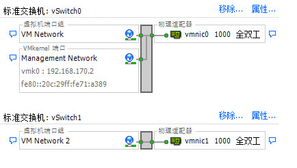
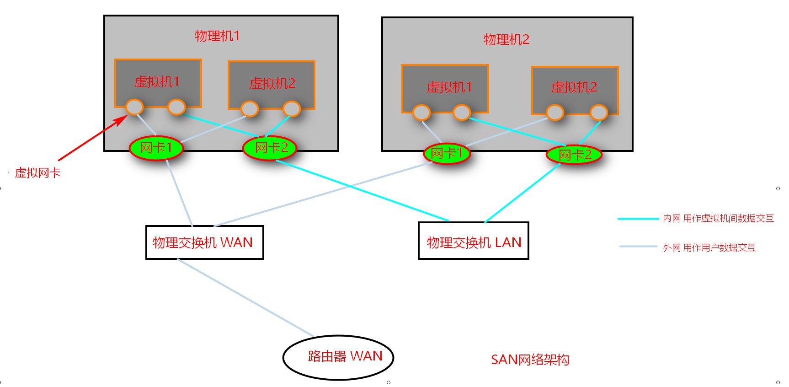

# EXSI

## 介绍

VMware EXSI 是一款行业领先、专门构建的裸机 hypervisor。ESXi 直接安装在物
理服务器上,并将其划分为多个逻辑服务器,即虚拟机

##　准备
在VMware14中安装
准备 VMware-VMvisor-Installer-6.0.0-2494585.x86_64.iso和VMware-viclient-all-6.0.0-2502222.exe

## 安装步骤

> 新建虚拟机 自定义(高级)

> 稍后安装操作系统

> 选择VMware ESX

> 2处理器 每个处理器2内核

> 内存4G

> 使用仅主机模式网络

> 选择LSI Logic

> 选择SCSI

> 创建新的磁盘

> 100G 将磁盘拆分成多个文件

> 完成后 编辑虚拟机 添加网卡 仅主机模式

> CD/DVD 使用ISO映像 VMware-VMvisor-Installer-6.0.0-2494585.x86_64.iso

> 打开虚拟机
> 选择ESXI-6.0.0-2494585-standard Installer

> 输入密码后回车 再按f2进入设置 选择设置管理网络

> 选择Network Adapters 然后用空格选中两张网卡 回车

> 然后选中IPv4 Configuration

ip配置方法:

> 1. 打开vmware的编辑->虚拟网络编辑器->查看vmnet1的子网地址和子网掩码(这里假定分别是192.168.170.0, 255.255.255.0)
> 2. 上图中 IPv4 Address就设置为192.168.170.2到192.168.170.254范围中任意一个
> 3. Subnet Mask设置为255.255.255.0
> 4. Default Gateway 设置为192.168.170.1 (默认为x.x.x.1)
> 5. 按ESC 然后按Y 保存配置 再按ESC退出到 System Customization界面 选择Restart Managment Network重启网络
> 6. 然后再主机开命令行 ping 你设置的ip地址 能ping通说明网络设置无误

使用client工具

> 1. 安装VMware-viclient-all-6.0.0-2502222.exe, 安装好后登陆 输入ip 用户名 密码
> 2. 用户->空白处右键添加用户 登陆hahaha 用户名 hahaha 密码 ABCDabcd1234 这里需要复杂密码 大小写数字都要有且够长 不出现用户名
> 3. 主页->角色->空白处右键添加新角色user 特权选择虚拟机主机主机配置文件
> 4. 主页->清单-> 空白处右键->新建资源池 名称mariadb cpu份额正常 内存资源自定义4096 取消不受限制 限制300MB->确定
> 5. 右键点击mariadb资源池->权限->右键->添加权限->点击添加hahaha->确定->选择角色为user->确定
> 6. 现在可以退出client 然后通过hahaha来重新登陆client了
> 7. 用root登陆client 配置->网络->添加网络->虚拟机->创建标准交换机->下一步->下一步->完成
> 8. 点击刚添加的vSwitch1右上角属性->网络适配器->添加->适配器->选中vmnic1

网络结构图

SAN网络结构图

新建虚拟机

> 1. root登陆client 文件->新建->虚拟机->自定义->下一步直到虚拟机版本->选择虚拟机版本8->选中Linux, 版本选中ubuntu Linux64
> 2. cpu  1核 内存1G 两块网卡->网卡2选择VM Network2 适配器都选VMXNET3->SCSI控制器璇LSI Logic并行->创建虚拟磁盘完成
> 3. 物理机192.168.170.2->点击配置->存储->右键点击datasore1->浏览数据存储->在/下新建ISO目录->上传文件->上传centos7的iso文件->选中启动时连接->完成
> 4. 然后编辑虚拟机设置->CD/DVD驱动器->数据存储ISO文件->浏览->datastore1->找到刚刚上传的iso文件打开
> 5. 另外一种iso文件启动的方法 先打开虚拟机 然后点击上方的光驱图标选择CD/DVD驱动器->连接到本地磁盘上的ISO映像->选择你的iso文件,然后到控制台Ctrl+Alt+Delet 重启虚拟机就可以进入引导
> 
> 打开虚拟机电源