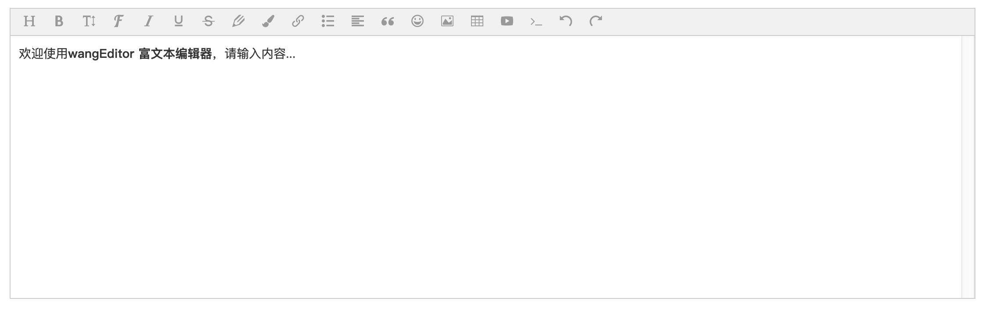
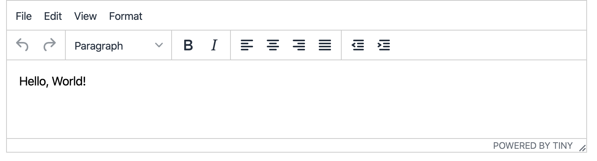
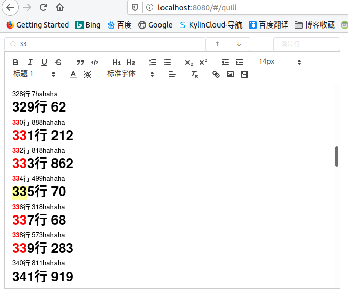

# 富文本编辑器

## 主流富文本编辑器对比

+ wangEditor（国产，基于javascript和css开发的web富文本编辑器，开源免费）优势：轻量简介，最重要的是开源且中文文档齐全。缺点：更新不及时。没有强大的开发团队支撑。



+ UEditor（百度）优势：插件多，基本曼度各种需求，由百度web前端研发部开发。缺点：插件提交较大，网页加载速度相对就慢了些。使用复杂。属于前后端不分离插件。在使用时需要配置后端的一些东西，使用不便。
+ Kindeditor 优势：文档齐全，为中文，阅读方便。缺点：图片上传存在问题，上传历史过多，会全部加载，导致浏览器卡顿。
补充
+ Tinymce是一款功能强大的富文本编辑器，文档为英文, 访问需梯子.


+ vue-quill-editor 容易上手,简约

## vue-quill-editor

`npm install vue-quill-editor -S`

`npm install quill -S`

gitee地址
[https://gitee.com/jeffka/vue-quill-editor](https://gitee.com/jeffka/vue-quill-editor)



下面代码在quill本身的基础上增加了以下功能

+ 查找内容, 并将找到的内容高亮显示,可以向上向下翻阅找到的其它内容
+ 行号跳转, 支持跳转至制定行

```js

<template>
  <div>
    <el-row>
      <el-col :span=6>
        <el-input
        placeholder="请输入内容"
        prefix-icon="el-icon-search"
        size="mini"
        @change="searchEnter"
        v-model="search" clearable>
        </el-input>
      </el-col>
      <el-col :span=2>
        <el-button-group>
          <el-button size="mini" icon="el-icon-top" @click="FollowingHeightlight(false)"></el-button>
          <el-button size="mini" icon="el-icon-bottom" @click="FollowingHeightlight()"></el-button>
        </el-button-group>
      </el-col>
      <el-col :span=2>
        <el-input
          placeholder="跳转行"
          size="mini"
          @change="jumpLineEnter"
          v-model="jumpLine" clearable>
        </el-input>
      </el-col>
    </el-row>
    <el-row>
      <el-col :span="10">
        <!-- 图片上传组件辅助-->
      <el-upload
        class='avatar-uploader'
        :action='serverUrl'
        name='file'
        :headers='header'
        :show-file-list='false'
        list-type='picture'
        :multiple='false'
        :on-success='uploadSuccess'
        :on-error='uploadError'
        :before-upload='beforeUpload'
      ></el-upload>
      <quill-editor
        class='editor'
        v-model='content'
        ref='myQuillEditor'
        :options='editorOption'
        @blur='onEditorBlur($event)'
        @focus='onEditorFocus($event)'
        @change='onEditorChange($event)'
      >
      </quill-editor>
      </el-col>
    </el-row>
  </div>
</template>

<script>
import { quillEditor } from 'vue-quill-editor'
import 'quill/dist/quill.core.css'
import 'quill/dist/quill.snow.css'
import 'quill/dist/quill.bubble.css'

// 工具栏配置
const toolbarOptions = [
  ['bold', 'italic', 'underline', 'strike'], // 加粗 斜体 下划线 删除线
  ['blockquote', 'code-block'], // 引用  代码块
  [{ header: 1 }, { header: 2 }], // 1、2 级标题
  [{ list: 'ordered' }, { list: 'bullet' }], // 有序、无序列表
  [{ script: 'sub' }, { script: 'super' }], // 上标/下标
  [{ indent: '-1' }, { indent: '+1' }], // 缩进
  // [{'direction': 'rtl'}],                         // 文本方向
  [{ size: ['small', false, 'large', 'huge'] }], // 字体大小
  [{ header: [1, 2, 3, 4, 5, 6, false] }], // 标题
  [{ color: [] }, { background: [] }], // 字体颜色、字体背景颜色
  [{ font: [] }], // 字体种类
  [{ align: [] }], // 对齐方式
  ['clean'], // 清除文本格式
  ['link', 'image', 'video'] // 链接、图片、视频
]

export default {
  props: {
    /* 编辑器的内容 */
    value: {
      type: String
    },
    /* 图片大小 */
    maxSize: {
      type: Number,
      default: 4000 // kb
    }
  },

  components: {
    quillEditor
  },

  data () {
    return {
      content: this.value,
      quillUpdateImg: false, // 根据图片上传状态来确定是否显示loading动画，刚开始是false,不显示
      editorOption: {
        theme: 'snow', // or 'bubble'
        // placeholder: '您想说点什么？',
        modules: {
          toolbar: {
            container: toolbarOptions,
            // container: '#toolbar',
            handlers: {
              image: function (value) {
                if (value) {
                  // 触发input框选择图片文件
                  document.querySelector('.avatar-uploader input').click()
                } else {
                  this.quill.format('image', false)
                }
              }
              // link: function(value) {
              //   if (value) {
              //     var href = prompt('请输入url')
              //     this.quill.format('link', href)
              //   } else {
              //     this.quill.format('link', false)
              //   }
              // },
            }
          }
        }
      },
      serverUrl:
        'https://testihospitalapi.ebaiyihui.com/oss/api/file/store/v1/saveFile', // 这里写你要上传的图片服务器地址
      header: {
        // token: sessionStorage.token
      }, // 有的图片服务器要求请求头需要有token
      search: '',
      searchElem: null,
      searchObj: {
        li: [],
        index: null,
        preNode: null
      },
      jumpLine: ''
    }
  },
  watch: {
  },
  mounted () {
  },

  updated () {
  },

  methods: {
    onEditorBlur () {
      // 失去焦点事件
    },
    onEditorFocus () {
      // 获得焦点事件
    },
    onEditorChange () {
      // 内容改变事件
      this.$emit('input', this.content)
    },

    // 富文本图片上传前
    beforeUpload () {
      // 显示loading动画
      this.quillUpdateImg = true
    },

    uploadSuccess (res, file) {
      // res为图片服务器返回的数据
      // 获取富文本组件实例
      let quill = this.$refs.myQuillEditor.quill
      // 如果上传成功
      if (res.code === 200) {
        // 获取光标所在位置
        let length = quill.getSelection().index
        // 插入图片  res.url为服务器返回的图片地址
        quill.insertEmbed(length, 'image', res.result.url)
        // 调整光标到最后
        quill.setSelection(length + 1)
      } else {
        this.$message.error('图片插入失败')
      }
      // loading动画消失
      this.quillUpdateImg = false
    },
    // 富文本图片上传失败
    uploadError () {
      // loading动画消失
      this.quillUpdateImg = false
      this.$message.error('图片插入失败')
    },

    cleanHightlight () {
      let reg = new RegExp(`<strong class="normal-bg" name="searchItem">(.+?)</strong>`, 'g')
      let qlEditor = document.getElementsByClassName('ql-editor')[0]
      qlEditor.innerHTML = qlEditor.innerHTML.replace(reg, '$1')
      this.searchObj = {
        li: [],
        index: null,
        preNode: null
      }
    },

    searchEnter () {
      this.cleanHightlight()
      if (this.search === '') {
        return false
      }
      let reg = new RegExp(`(${this.search})`, 'g')
      let qlEditor = document.getElementsByClassName('ql-editor')[0]
      qlEditor.innerHTML = qlEditor.innerHTML.replace(reg, '<strong class="normal-bg" name="searchItem">$1</strong>')
      this.searchObj.li = [...document.getElementsByName('searchItem')]
      this.FollowingHeightlight()
      this.searchObj.preNode = this.searchObj.li[0] // 储存上一个节点
    },

    FollowingHeightlight (isFollowing = true) {
      if (this.searchObj.index !== null) {
        this.searchObj.index += isFollowing ? 1 : -1
        let max = this.searchObj.li.length - 1
        if (this.searchObj.index < 0) this.searchObj.index = max
        if (this.searchObj.index > max) this.searchObj.index = 0
      } else {
        this.searchObj.index = 0
      }
      let elemNode = this.searchObj.li[this.searchObj.index]
      this.jumpNodePos(elemNode) // 让这个元素显示在窗口中央
      let preNode = this.searchObj.preNode
      this.deepNextBackground(elemNode, preNode) // 加深这个元素的背景颜色
      this.searchObj.preNode = elemNode // 储存上一个节点
    },

    jumpNodePos (elemNode) {
      let qlEditor = document.getElementsByClassName('ql-editor')[0]
      qlEditor.scrollTop = elemNode.offsetTop - qlEditor.offsetHeight / 2
    },

    deepNextBackground (elemNode, preNode) {
      elemNode.className = 'deep-bg'
      if (preNode !== null) {
        preNode.className = 'normal-bg'
      }
    },

    jumpLineEnter () {
      if (this.jumpLine === '') {
        return false
      }
      if (!(/^[1-9]+[0-9]*$/.test(this.jumpLine))) { // 不是正整数字符串
        this.$message('请输入正确的行号')
        this.jumpLine = ''
        return false
      }
      const qlEditor = document.getElementsByClassName('ql-editor')[0]
      let scrollHeight = 0
      for (let i = 0; i < this.jumpLine; i++) {
        if (qlEditor.childNodes[i] === undefined) {
          this.$message('没那么多行')
          this.jumpLine = ''
          return false
        }
        scrollHeight += qlEditor.childNodes[i].offsetHeight
      }
      // 让这行滚到中间
      qlEditor.scrollTop = scrollHeight - qlEditor.offsetHeight / 2
      return true
    },
    searchChange () {
      console.log(this.$refs.searchInput)
    },

    hightLight () {
      // this.value
    }
  }
}
</script>

<style>
.editor {
  line-height: normal !important;
  height: 400px;
}
.ql-snow .ql-tooltip[data-mode='link']::before {
  content: '请输入链接地址:';
}
.ql-snow .ql-tooltip.ql-editing a.ql-action::after {
  border-right: 0px;
  content: '保存';
  padding-right: 0px;
}

.ql-snow .ql-tooltip[data-mode='video']::before {
  content: '请输入视频地址:';
}

.ql-snow .ql-picker.ql-size .ql-picker-label::before,
.ql-snow .ql-picker.ql-size .ql-picker-item::before {
  content: '14px';
}
.ql-snow .ql-picker.ql-size .ql-picker-label[data-value='small']::before,
.ql-snow .ql-picker.ql-size .ql-picker-item[data-value='small']::before {
  content: '10px';
}
.ql-snow .ql-picker.ql-size .ql-picker-label[data-value='large']::before,
.ql-snow .ql-picker.ql-size .ql-picker-item[data-value='large']::before {
  content: '18px';
}
.ql-snow .ql-picker.ql-size .ql-picker-label[data-value='huge']::before,
.ql-snow .ql-picker.ql-size .ql-picker-item[data-value='huge']::before {
  content: '32px';
}

.ql-snow .ql-picker.ql-header .ql-picker-label::before,
.ql-snow .ql-picker.ql-header .ql-picker-item::before {
  content: '文本';
}
.ql-snow .ql-picker.ql-header .ql-picker-label[data-value='1']::before,
.ql-snow .ql-picker.ql-header .ql-picker-item[data-value='1']::before {
  content: '标题1';
}
.ql-snow .ql-picker.ql-header .ql-picker-label[data-value='2']::before,
.ql-snow .ql-picker.ql-header .ql-picker-item[data-value='2']::before {
  content: '标题2';
}
.ql-snow .ql-picker.ql-header .ql-picker-label[data-value='3']::before,
.ql-snow .ql-picker.ql-header .ql-picker-item[data-value='3']::before {
  content: '标题3';
}
.ql-snow .ql-picker.ql-header .ql-picker-label[data-value='4']::before,
.ql-snow .ql-picker.ql-header .ql-picker-item[data-value='4']::before {
  content: '标题4';
}
.ql-snow .ql-picker.ql-header .ql-picker-label[data-value='5']::before,
.ql-snow .ql-picker.ql-header .ql-picker-item[data-value='5']::before {
  content: '标题5';
}
.ql-snow .ql-picker.ql-header .ql-picker-label[data-value='6']::before,
.ql-snow .ql-picker.ql-header .ql-picker-item[data-value='6']::before {
  content: '标题6';
}

.ql-snow .ql-picker.ql-font .ql-picker-label::before,
.ql-snow .ql-picker.ql-font .ql-picker-item::before {
  content: '标准字体';
}
.ql-snow .ql-picker.ql-font .ql-picker-label[data-value='serif']::before,
.ql-snow .ql-picker.ql-font .ql-picker-item[data-value='serif']::before {
  content: '衬线字体';
}
.ql-snow .ql-picker.ql-font .ql-picker-label[data-value='monospace']::before,
.ql-snow .ql-picker.ql-font .ql-picker-item[data-value='monospace']::before {
  content: '等宽字体';
}

.avatar-uploader {
  display: none;
}

.icon-reg::after {
  content:".*";
  height: 100%;
  width: 5px;
  margin-right: 8px;
  margin-top: 5px;
  display: inline-block;
  vertical-align: middle;
  pointer-events: all;
}

.deep-bg {
  background-color: #FFFF99 ;
}

.normal-bg {
  color: red ;
}
</style>

```