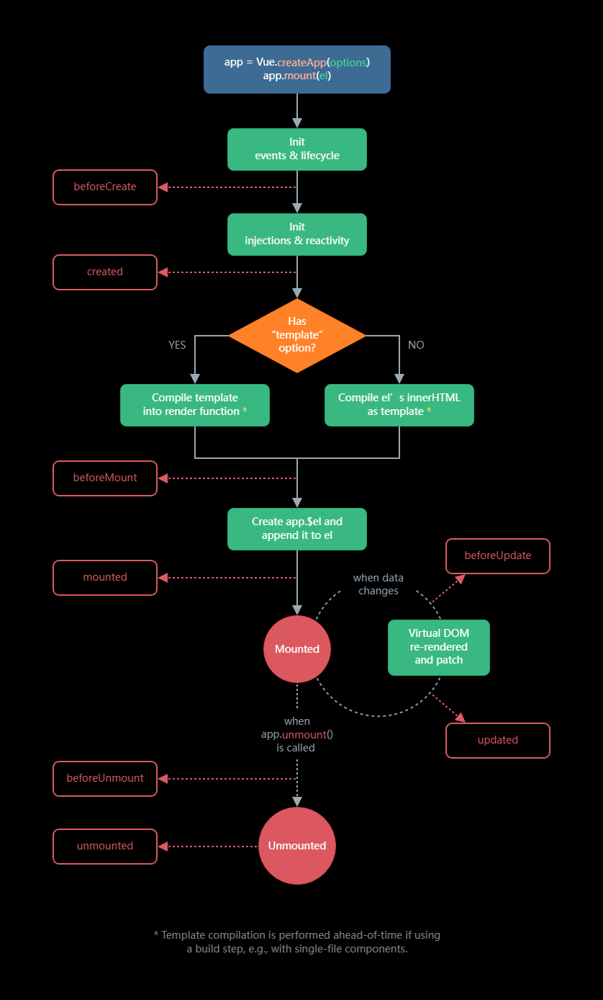
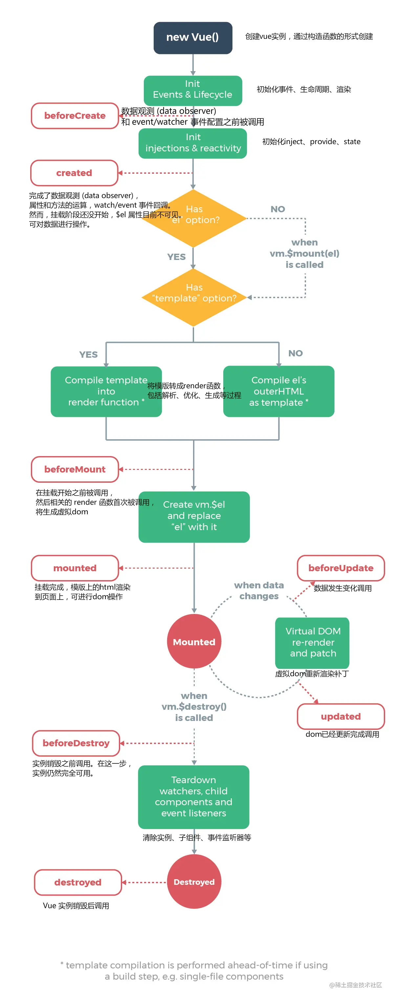

## 1. 应用 & 组件实例


### 1.1 创建一个应用实例

```js
const RootComponent = { 
  /* 选项 */ 
}
const app = Vue.createApp(RootComponent)
const vm = app.mount('#app')
```

### 2. 生命周期钩子



https://juejin.cn/post/6844903608593416206



实例初始化
`beforeCreate`
初始化依赖注入和property
`created`
解析编译template
`beforeMount`
替换el, 挂载实例

如果数据发生更新
`beforeUpdate`
patch dom然后重新渲染
`updated`

如果退出了组件
`beforeDestory`
销毁实例
`destroyed`
解绑数据 移除监听器
