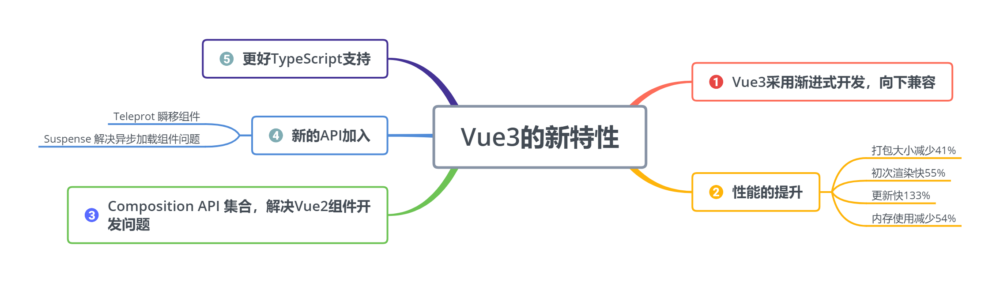

# vue3的新特性



## 安装

```bash
npm install -g @vue/cli
# OR
yarn global add @vue/cli

vue --version
# @vue/cli 4.5.6

vue create project_name
```


## 目录解构

```
|-node_modules       -- 所有的项目依赖包都放在这个目录下
|-public             -- 公共文件夹
---|favicon.ico      -- 网站的显示图标
---|index.html       -- 入口的html文件
|-src                -- 源文件目录，编写的代码基本都在这个目录下
---|assets           -- 放置静态文件的目录，比如logo.pn就放在这里
---|components       -- Vue的组件文件，自定义的组件都会放到这
---|App.vue          -- 根组件，这个在Vue2中也有
---|main.ts          -- 入口文件，因为采用了TypeScript所以是ts结尾
---|shims-vue.d.ts   -- 类文件(也叫定义文件)，因为.vue结尾的文件在ts中不认可，所以要有定义文件
|-.browserslistrc    -- 在不同前端工具之间公用目标浏览器和node版本的配置文件，作用是设置兼容性
|-.eslintrc.js       -- Eslint的配置文件，不用作过多介绍
|-.gitignore         -- 用来配置那些文件不归git管理
|-package.json       -- 命令配置和包管理文件
|-README.md          -- 项目的说明文件，使用markdown语法进行编写
|-tsconfig.json      -- 关于TypoScript的配置文件
|-yarn.lock          -- 使用yarn后自动生成的文件，由Yarn管理，安装yarn包时的重要信息存储到yarn.lock文件中
```

main.ts

```ts
import { createApp } from "vue"; // 引入vue文件，并导出`createApp`
import App from "./App.vue"; // 引入自定义组件，你在页面上看的东西基本都在这个组件里

createApp(App).mount("#app"); // 把App挂载到#app节点上，在public目录下的index.html找节点
```


## setup和ref

```vue
<template>
  
  <div>
    <h2>欢迎光临红浪漫洗浴中心</h2>
    <div>请选择一位美女为你服务</div>
  </div>
  <div>
    <button
      v-for="(item, index) in girls"
      v-bind:key="index"
      @click="selectGirlFun(index)"
    >
      {{ index }} : {{ item }}
    </button>
  </div>
  <div>你选择了【{{ selectGirl }}】为你服务</div>
</template>
<script lang="ts">
import { defineComponent, ref } from "vue";
export default defineComponent({
  name: "App",
  setup() {
    const girls = ref(["大脚", "刘英", "晓红"]);
    const selectGirl = ref("");
    const selectGirlFun = (index: number) => {
      selectGirl.value = girls.value[index];
    };
    //因为在模板中这些变量和方法都需要条用，所以需要return出去。
    return {
      girls,
      selectGirl,
      selectGirlFun,
    };
  },
});
</script>
```

## reactive

```vue
<template>
  
  <div>
    <h2>欢迎光临红浪漫洗浴中心</h2>
    <div>请选择一位美女为你服务</div>
  </div>
  <div>
    <button
      v-for="(item, index) in girls"
      v-bind:key="index"
      @click="selectGirlFun(index)"
    >
      {{ index }} : {{ item }}
    </button>
  </div>
  <div>你选择了【{{ selectGirl }}】为你服务</div>
</template>
<script>
import { reactive, toRefs } from "vue";
interface DataProps {
  girls: string[];
  selectGirl: string;
  selectGirlFun: (index: number) => void;
}
export default {
  name: "App",
  setup() {
    const data: DataProps = reactive({
      girls: ["大脚", "刘英", "晓红"],
      selectGirl: "",
      selectGirlFun: (index: number) => {
        data.selectGirl = data.girls[index];
      },
    });
    return { ...toRefs(data) };
  },
};
</script>
```


## 生命周期

- setup() :开始创建组件之前，在`beforeCreate`和`created`之前执行。创建的是`data`和`method`
- onBeforeMount() : 组件挂载到节点上之前执行的函数。
- onMounted() : 组件挂载完成后执行的函数。
- onBeforeUpdate(): 组件更新之前执行的函数。
- onUpdated(): 组件更新完成之后执行的函数。
- onBeforeUnmount(): 组件卸载之前执行的函数。
- onUnmounted(): 组件卸载完成后执行的函数
- onActivated(): 被包含在`<keep-alive>`中的组件，会多出两个生命周期钩子函数。被激活时执行。
- onDeactivated(): 比如从 A 组件，切换到 B 组件，A 组件消失时执行。
- onErrorCaptured(): 当捕获一个来自子孙组件的异常时激活钩子函数（以后用到再讲，不好展现）。

注：使用`<keep-alive>`组件会将数据保留在内存中，比如我们不想每次看到一个页面都重新加载数据，就可以使用`<keep-alive>`组件解决。

### Vue2.x 和 Vue3.x 生命周期对比

```js
Vue2--------------vue3
beforeCreate  -> setup()
created       -> setup()
beforeMount   -> onBeforeMount
mounted       -> onMounted
beforeUpdate  -> onBeforeUpdate
updated       -> onUpdated
beforeDestroy -> onBeforeUnmount
destroyed     -> onUnmounted
activated     -> onActivated
deactivated   -> onDeactivated
errorCaptured -> onErrorCaptured
```