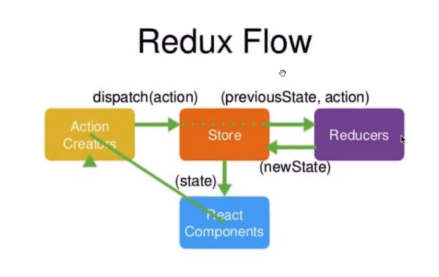

# redux

## Redux介绍

Redux是一个用来管理管理数据状态和UI状态的JavaScript应用工具。
随着JavaScript单页应用（SPA）开发日趋复杂，JavaScript需要管
理比任何时候都要多的state（状态），Redux就是降低管理难度的




## 安装redux

`npm install --save redux`

store

```js
//store/index.js
import { createStore } from 'redux'  // 引入createStore方法
import reducer from './reducer'
const store = createStore()          // 创建数据存储仓库
export default store                 //暴露出去
```

reducer

```js
//store/reducer.js
const defaultState = {
  inputValue : 'Write Something',
  list:[
      '早上4点起床，锻炼身体',
      '中午下班游泳一小时'
  ]
}  //默认数据
export default (state = defaultState,action)=>{
  if(action.type === 'changeInput'){
    let newState = JSON.parse(JSON.stringify(state)) //深度拷贝state
    newState.inputValue = action.value
    return newState
  }
  return state
}
```

## 获取store值

```js
// 在construtor中
this.state=store.getState();

this.state.inputValue
```

安装了`Redux Dev Tools`后可以在store/index.js中添加以下代码

```js
window.__REDUX_DEVTOOLS_EXTENSION__ && window.__REDUX_DEVTOOLS_EXTENSION__()) // 创建数据存储仓库
```

## 修改store值

```js
// constructor
this.storeChange = this.storeChange.bind(this)  //转变this指向
store.subscribe(this.storeChange) //订阅Redux的状态

// 定义storeChange方法
storeChange(){
  this.setState(store.getState())
}

changeInputValue(e){
  const action ={
    type:'changeInput',
    value:e.target.value
  }
  store.dispatch(action)
}
```

store只是一个仓库，它并没有管理能力，它会把接收到的action自动转发给Reducer

reducer中
state: 指的是原始仓库里的状态
action: 指的是action新传递的状态

