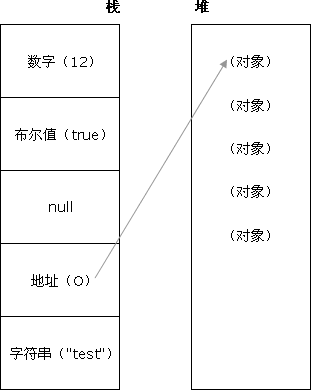

# js

## 数据类型

原始数据类型和 引用数据类型

### 原始数据类型

Undefined，Null，Boolean，Number、String

原始数据类型直接存储在栈（stack）中的简单数据段，占据空间小，大小固定，属于被频繁使用的数据，所以存储在栈中

按值传递(call by value)是最常用的求值策略：函数的形参是被调用时所传实参的副本。修改形参的值并不会影响实参。

```js
const func = (a, b) => {
    a = b
    console.log(a, b); // 2 2
}
const A = 1, B = 2;
func(A, B)
console.log(A, B); // 1 2
```

全局栈

A -> 1
B -> 2

func内部栈

a -> 1
b -> 2

注意不是这样 a -> A

### 引用数据类型

对象、数组、函数

引用数据类型直接存储在堆中，占据空间大，大小不固定，如果存储在栈中，将会影响程序运行的性能，引用数据类型在栈中存储了指针，该指针指向堆中该实体的起始地址，当解释器寻找引用值时，会首先检索其在栈中的地址，取得地址后，从堆中获得实体。

按引用传递(call by reference)时，函数的形参接收实参的隐式引用，而不再是副本。这意味着函数形参的值如果被修改，实参也会被修改。同时两者指向相同的值。



```js
const A = {
    a : 1,
    b : 2,
}
let B = A;
A.a = 3;
console.log(A, B);
// Object { a: 3, b: 2 }
// Object { a: 3, b: 2 }
```

栈
变量名 地址    值
a      00004   1
b      00005   2
func   00006   [10001]

堆

变量名 地址    值
func   10001   Function

## 引用

## 字面量

字面量是一种表示值的记法
js字面量（literal） 分为以下几个

+ number literal        8   就是数字字面量
+ string literal　　'hello'  字符串字面量
+ object literal　　{} 对象字面量
+ array literal　　[] 数组字面量
+ function 　　function (){alert('aa');} 函数字面量
+ regexp literal    // 正则字面量
