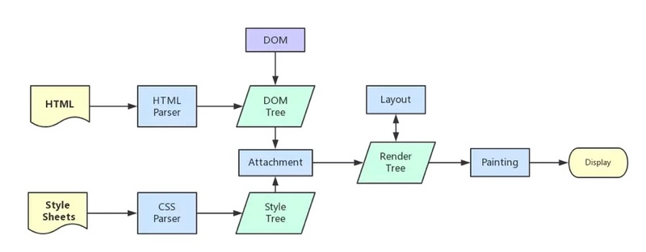

# 浏览器的多进程与js线程

## 浏览器与进程

ubuntu20系统中
firefox浏览器

浏览器是多进程的
浏览器每打开一个标签页，就相当于创建了一个独立的浏览器进程

### Browser进程

- 负责浏览器界面显示，与用户交互。如前进，后退等
- 负责各个页面的管理，创建和销毁其他进程
- 网络资源的管理，下载等

### 标签页进程

每个独立的Tab标签是一个进程
浏览器会将相同的标签页进程合并，每一个Tab标签对应一个进程并不一定是绝对的

### 第三方插件进程

每种类型的插件对应一个进程，仅当使用该插件时才创建

### GPU进程

最多一个，用于3D绘制等

### 浏览器渲染进程（浏览器内核）

浏览器渲染进程又叫Renderer进程，内部是多线程的，
也就是我们每个标签页所拥有的进程，互不影响，负责页面渲染，脚本执行，事件处理等

#### 图形用户界面GUI渲染线程

负责渲染浏览器界面，包括解析HTML、CSS、构建DOM树、Render树、布局与绘制等
当界面需要重绘（Repaint）或由于某种操作引发回流(reflow)时，该线程就会执行

#### JS引擎线程

JS内核，也称JS引擎，负责处理执行javascript脚本等待任务队列的任务的到来，然后加以处理，浏览器无论什么时候都只有一个JS引擎在运行JS程序

#### 事件触发线程

听起来像JS的执行，但是其实归属于浏览器，而不是JS引擎，用来控制时间循环
当JS引擎执行代码块如setTimeout时（也可来自浏览器内核的其他线程,如鼠标点击、AJAX异步请求等），会将对应任务添加到事件线程中
当对应的事件符合触发条件被触发时，该线程会把事件添加到待处理队列的队尾，等待JS引擎的处理
待处理队列中的事件排队等待JS引擎处理（当JS引擎空闲时才会去执行）

#### 定时触发器线程

setInterval与setTimeout所在线程
定时计时器并不是由JS引擎计时的，因为如果JS引擎是单线程的，如果JS引擎处于堵塞状态，那会影响到计时的准确
当计时完成被触发，事件会被添加到事件队列，等待JS引擎空闲了执行

#### 异步HTTP请求线程

在XMLHttpRequest在连接后新启动的一个线程
线程如果检测到请求的状态变更，如果设置有回调函数，该线程会把回调函数添加到事件队列，同理，等待JS引擎空闲了执行

## 为什么JS引擎被设计为单线程的

JavaScript作为一门客户端的脚本语言，主要的任务是处理用户的交互，而用户的交互无非就是响应DOM的增删改，使用事件队列的形式，
一次事件循环只处理一个事件响应，使得脚本执行相对连续。如果JS引擎被设计为多线程的，那么DOM之间必然会存在资源竞争，那么语言的
实现会变得非常臃肿，在客户端跑起来，资源的消耗和性能将会是不太乐观的，故设计为单线程的形式，并附加一些其他的线程来实现异步的
形式，这样运行成本相对于使用JS多线程来说降低了很多。

## 浏览器内核中线程之间的关系

### GUI渲染线程与JS引擎线程互斥

因为JS引擎可以修改DOM树，那么如果JS引擎在执行修改了DOM结构的同时，GUI线程也在渲染页面，那么这样就会导致渲染线程获取的DOM的元素信息可能与JS引擎操作DOM后的结果不一致。为了防止这种现象，GUI线程与JS线程需要设计为互斥关系，当JS引擎执行的时候，GUI线程需要被冻结，但是GUI的渲染会被保存在一个队列当中，等待JS引擎空闲的时候执行渲染。
由此也可以推出，如果JS引擎正在进行CPU密集型计算，那么JS引擎将会阻塞，长时间不空闲，导致渲染进程一直不能执行渲染，页面就会看起来卡顿卡顿的，渲染不连贯，所以，要尽量避免JS执行时间过长。

### JS引擎线程与事件触发线程、定时触发器线程、异步HTTP请求线程

事件触发线程、定时触发器线程、异步HTTP请求线程三个线程有一个共同点，那就是使用回调函数的形式，当满足了特定的条件，这些回调函数会被执行。这些回调函数被浏览器内核理解成事件，在浏览器内核中拥有一个事件队列，这三个线程当满足了内部特定的条件，会将这些回调函数添加到事件队列中，等待JS引擎空闲执行。例如异步HTTP请求线程，线程如果检测到请求的状态变更，如果设置有回调函数，回调函数会被添加事件队列中，等待JS引擎空闲了执行。
但是，JS引擎对事件队列（宏任务）与JS引擎内的任务（微任务）执行存在着先后循序，当每执行完一个事件队列的时间，JS引擎会检测内部是否有未执行的任务，如果有，将会优先执行（微任务）。

### WebWorker

因为JS引擎是单线程的，当JS执行时间过长会页面阻塞，那么JS就真的对CPU密集型计算无能为力么？
所以，后来HTML5中支持了 Web Worker。

Web Workers 使得一个Web应用程序可以在与主执行线程分离的后台线程中运行一个脚本操作。这样做的好处是可以在一个单独的线程中执行费时的处理任务，从而允许主（通常是UI）线程运行而不被阻塞/放慢。

注意点：
WebWorker可以想浏览器申请一个子线程，该子线程服务于主线程，完全受主线程控制。
JS引擎线程与worker线程间通过特定的方式通信（postMessage API，需要通过序列化对象来与线程交互特定的数据）

所以，如果需要进行一些高耗时的计算时，可以单独开启一个WebWorker线程，这样不管这个WebWorker子线程怎么密集计算、怎么阻塞，都不会影响JS引擎主线程，只需要等计算结束，将结果通过postMessage传输给主线程就可以了。

另外，还有个东西叫 SharedWorker，与WebWorker在概念上所不同。

WebWorker 只属于某一个页面，不会和其他标签页的Renderer进程共享，WebWorker是属于Renderer进程创建的进程。
SharedWorker 是由浏览器单独创建的进程来运行的JS程序，它被所有的Renderer进程所共享，在浏览器中，最多只能存在一个SharedWorker进程。

SharedWorker由进程管理，WebWorker是某一个Renderer进程下的线程。

浏览器的渲染流程

每个浏览器内核的渲染流程不一样，下面我们主要以webkit为主。
首先是渲染的前奏：

    浏览器输入url，浏览器主进程接管，开了一个下载线程
    然后进行HTTP请求（DNS查询、IP寻址等等），等待响应，开始下载响应报文。
    将下载完的内容转交给Renderer进程管理
    开始渲染...

在说渲染之前，需要理解一些概念：

    DOM Tree： 浏览器将HTML解析成树形的数据结构。
    CSS Rule Tree：浏览器将CSS解析成树形的数据结构。
    Render Tree：DOM树和CSS规则树合并后生产Render树。
    layout：有了Render Tree，浏览器已经能知道网页中有哪些节点、各个节点的CSS定义以及他们的从属关系，从而去计算出每个节点在屏幕中的位置。
    painting: 按照算出来的规则，通过显卡，把内容画到屏幕上。
    reflow（回流）：当浏览器发现某个部分发生了点变化影响了布局，需要倒回去重新渲染，内行称这个回退的过程叫 reflow。reflow 会从 <html> 这个 root frame 开始递归往下，依次计算所有的结点几何尺寸和位置。reflow 几乎是无法避免的。现在界面上流行的一些效果，比如树状目录的折叠、展开（实质上是元素的显 示与隐藏）等，都将引起浏览器的 reflow。鼠标滑过、点击……只要这些行为引起了页面上某些元素的占位面积、定位方式、边距等属性的变化，都会引起它内部、周围甚至整个页面的重新渲 染。通常我们都无法预估浏览器到底会 reflow 哪一部分的代码，它们都彼此相互影响着。
    repaint（重绘）：改变某个元素的背景色、文字颜色、边框颜色等等不影响它周围或内部布局的属性时，屏幕的一部分要重画，但是元素的几何尺寸没有变。

注意：display:none的节点不会被加入Render Tree，而visibility: hidden则会，所以display:none会触发reflow，visibility: hidden会触发repaint。

浏览器内核拿到响应报文之后，渲染大概分为以下步骤

    解析html生产DOM树。
    解析CSS规则。
    根据DOM Tree和CSS Tree生成Render Tree。
    根据Render树进行layout，负责各个元素节点的尺寸、位置计算。
    绘制Render树(painting)，绘制页面像素信息。
    浏览器会将各层的信息发送给GPU，GPU会将各层合成（composite），显示在屏幕上。

详细步骤略去，大概步骤如下，渲染完毕后JS引擎开始执行load事件

由图中可以看出，css在加载过程中不会影响到DOM树的生成，但是会影响到Render树的生成，进而影响到layout，所以一般来说，style的link标签需要尽量放在head里面，因为在解析DOM树的时候是自上而下的，而css样式又是通过异步加载的，这样的话，解析DOM树下的body节点和加载css样式能尽可能的并行，加快Render树的生成的速度，当然，如果css是通过js动态添加进来的，会引起页面的重绘或重新布局。
标准一直是规定style元素不应出现在body元素中。

前面提到了load事件，那么与DOMContentLoaded事件有什么分别。

    当 DOMContentLoaded 事件触发时，仅当DOM加载完成，不包括样式表，图片。 (譬如如果有async加载的脚本就不一定完成)
    当 onLoad 事件触发时，页面上所有的DOM，样式表，脚本，图片都已经加载完成了。 （渲染完毕了）

顺序是：DOMContentLoaded -> load