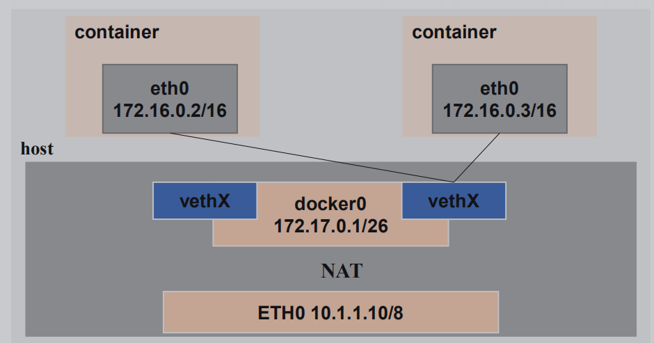
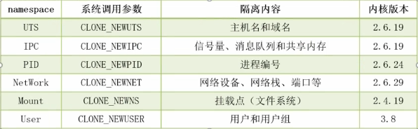

docker0 是一个虚拟的交换机(网桥)

vethX 是network namespace,不同的network namespace之间的网络会相互隔离.vethX一端在容器内部成为虚拟网卡eth0,另一端在宿主机上 名称类似veth6f182c8, 起连通作用

容器访问外部网络

`iptables -t nat -A POSTROUTING -s 172.17.0.0/16 -o docker0 -j MASQUERADE`这是个SNAT转换,借助防火墙的SNAT规则

外部网络访问容器

`docker run -d -p 80:80 apache`执行这条命令会出现下面的规则

`iptable -t nat -A PREROUTING -m addrtype --dst-type LOCAL -j DOCKER`

`iptable -t nat -A DOCKER ! -i docker0 -p tcp -m --dport 80 -j DNAT --to-destination 172.17.0.2:80`

这两个是DVAT转换

`docker inspect 容器名`可以查看容器具体信息

namespace

##　Docker 网络模式修改Docker 进程网络修改

###　Docker 进程网络修改
`-b, --bridge=""` 指定 Docker 使用的网桥设备,默认情况下 Docker 会自动创建和使用 docker0 网桥设备,通过此
参数可以使用已经存在的设备
`--bip` 指定 Docker0 的 IP 和掩码,使用标准的 CIDR 形式,如 10.10.10.10/24
`--dns` 配置容器的 DNS,在启动 Docker 进程是添加,所有容器全部生效Docker 容器网络修改

###　Docker 容器网络修改

`--dns` 用于指定启动的容器的 DNS
`--net` 用于指定容器的网络通讯方式,有以下四个值
+ bridge:Docker 默认方式,网桥模式
+ none:容器没有网络栈
+ container:使用其它容器的网络栈,Docker容器会加入其它容器的 network namespace
+ host:表示容器使用 Host 的网络,没有自己独立的网络栈。容器可以完全访问 Host 的网络,不安全暴露端口

暴露端口
-p / P 选项的使用格式
> -p :<ContainerPort> 将制定的容器端口映射至主机所有地址的一个动态端口
> -p <HostPort>:<ContainerPort>:映射至指定的主机端口
> -p <IP>::<ContainerPort>:映射至指定的主机的 IP 的动态端口
> -p　<IP>:<HostPort>:<ContainerPort>:映射至指定的主机 IP 的主机端口
> -P(大):暴露所需要的所有端口
* docker port ContainerName 可以查看容器当前的映射关系自定义 Docker0 网桥的网络地址

###　自定义 Docker0 桥的网络地址

修改 `/etc/docker/daemon.json` 文件

	{
		"bip": "192.168.1.5/24",
		"fixed-cidr": "10.20.0.0/16",
		"fixed-cidr-v6": "2001:db8::/64",
		"mtu": "1500",
		"default-gateway": "10.20.1.1",
		"default-gateway-v6": "2001:db8:abcd::89",
		"dns": ["10.20.1.2","10.20.1.3"]
	}

### 常见隔离方式基础命令说明

`docker network ls`
查看当前可用的网络类型
`docker network create -d 类型` 网络空间名称
类型分为:
+ `overlay network`
+ `bridge network`不同网络空间进行隔离

`docker network create -d bridge lamp` 创建名为lamp的网络
`docker run --name tomcat01 --network=lamp -d tomcat:v1.0` 创建容器时指定网络为上面创建的lamp
 
docker network create -d bridge --subnet "172.26.0.0/16" --gateway "172.26.0.1" my-bridge-network
docker run -d --network=my-bridge-network --name test1
docker run -d --name test2

### 桥接器进行主机间通讯

[root@localhost network-scripts]# vi ifcfg-eth0
DEVICE=eth0
HWADDR=00:0C:29:06:A2:35
TYPE=Ethernet
UUID=34b706cc-aa46-4be3-91fc-d1f48c301f23
ONBOOT=yes
BRIDGE=br0
NM_CONTROLLED=yes
BOOTPROTO=static
[root@localhost network-scripts]# vi ifcfg-br0
//改成这样
DEVICE=br0
TYPE=Bridge
ONBOOT=yes
BOOTPROTO=static
IPADDR=192.168.216.131
NETMASK=255.255.255.0
GATEWAY=192.168.216.2
DNS=8.8.8.8
[root@localhost network-scripts]# yum install -y git
[root@localhost network-scripts]# git clone https://github.com/jpetazzo/pipework
[root@localhost network-scripts]# cp pipework/pipework /usr/local/bin/
[root@localhost network-scripts]# docker run -itd --net=none --name=ff centos-6-x86 bash
[root@localhost network-scripts]# pipework br0 fl 192.168.216.135/24O v e rNameSpace

2.3.6 数据存储
讲师:汪洋目录
1
2
3
数据卷特性
容器中的数据卷
存储驱动1
数据卷特性数据卷特性
Why Data Volumes?
> Docker 镜像由多个只读层叠加而成,启动容器时,Docker 会加载只读镜像层并在镜像栈顶部添加一个读写层
> 如果运行中的容器修改了现有的一个已经存在的文件,那么该文件将会从读写层下面的的只读层复制到读写层,
该文件的只读版本仍然存在,只是已经被读写层中该文件的副本所隐藏,次即“写时复制”机制数据卷意义
Why Data Volumes?
> 关闭并重启容器,其数据不受影响;但删除 Docker 容器,则其改变将会全部丢失
> 存在的问题
>> 存在于联合文件系统中,不易于宿主机访问
>> 容器间数据共享不便
>> 删除容器其数据会丢失
> 解决方案:“卷”
>> “卷”是容器上的一个或多个“目录”,此类目录可绕过联合文件系统,与宿主机上的某目录“绑定”数据卷意义
Data Volumes?
> Volume 可以在运行容器时即完成创建与绑定操作。当然,前提需要拥有对应的申明
> Volume 的初衷就是数据持久化数据卷类型
Volume types
> Bind mount volume
> Docker-managed volume2
容器中的数据卷在容器中使用 Volumes
在容器中使用 Volumes
> Docker-managed Volume
>> docker run -it --name roc -v MOUNTDIR roc/lamp:v1.0
>> docker inspect -f {{.Mounts}}
roc
> Bind-mount Volume
>> docker run -it --name roc -v HOSTDIR:VOLUMEDIR roc/lamp:v1.0
> Union Volume
>> docker run -it --name roc --volumes-from ContainerName roc/lamp:v1.03
存储驱动存储驱动
存储驱动
Docker 存储驱动 ( storage driver ) 是 Docker 的核心组件,它是 Docker 实现分成镜像的基础
1、device mapper ( DM ):性能和稳定性存在问题,不推荐生产环境使用
2、btrfs:社区实现了 btrfs driver,稳定性和性能存在问题
3、overlayfs:内核 3.18 overlayfs 进入主线,性能和稳定性优异,第一选择Docker overlayfs driver - 1
Docker overlayfs driverDocker overlayfs driver - 2
Docker overlayfs driver
mount -t overlay overlay -olowerdir=./low,upperdir=./upper,workdir=./work ./merged修改为 overlayfs 存储驱动
change overlayfs driver
echo "overlay" > /etc/modules-load.d/overlay.conf
cat /proc/modules|grep overlay
reboot
vim /etc/systemd/system/docker.service
--storage-driver=overlay \O v e r

2.3.7 资源限制
讲师:汪洋目录
1
2
3
内存资源限制
CPU 资源限制
限制实验1
内存资源限制重点提示
Why Data Volumes?
> CGroup 是 Control Groups 的缩写,是 Linux 内核提供的一种可以限制、记录、隔离进程组 (process groups) 所
使用的物力资源 (如 cpu memory i/o 等等) 的机制。2007 年进入 Linux 2.6.24 内核,CGroups 不是全新创造的,它
将进程管理从 cpuset 中剥离出来,作者是 Google 的 Paul Menage
> 默认情况下,如果不对容器做任何限制,容器能够占用当前系统能给容器提供的所有资源
> Docker 限制可以从 Memory、CPU、Block I/O 三个方面
> OOME:Out Of Memory Exception
>> 一旦发生 OOME,任何进程都有可能被杀死,包括 docker daemon 在内
>> 为此,Docker 调整了 docker daemon 的 OOM 优先级,以免被内核关闭重点提示
Why Data Volumes?
> 为应用做内存压力测试,理解正常业务需求下使用的内存情况,然后才能进入生产环境使用
> 一定要限制容器的内存使用上限
> 尽量保证主机的资源充足,一旦通过监控发现资源不足,就进行扩容或者对容器进行迁移
> 如果可以(内存资源充足的情况),尽量不要使用 swap,swap 的使用会导致内存计算复杂,对调度器非常不友好设置方式
Why Data Volumes?
在 docker 启动参数中,和内存限制有关的包括(参数的值一般是内存大小,也就是一个正数,后面跟
着内存单位 b、k、m、g,分别对应 bytes、KB、MB、和 GB):
• -m --memory:容器能使用的最大内存大小,最小值为 4m
• --memory-swap:容器能够使用的 swap 大小
• --memory-swappiness:默认情况下,主机可以把容器使用的匿名页(anonymous page)swap 出来,你可以
设置一个 0-100 之间的值,代表允许 swap 出来的比例
• --memory-reservation:设置一个内存使用的 soft limit,设置值小于 –m 设置
• --kernel-memory:容器能够使用的 kernel memory 大小,最小值为 4m。
• --oom-kill-disable:是否运行 OOM 的时候杀死容器。只有设置了 -m,才可以把这个选项设置为 false,
否则容器会耗尽主机内存,而且导致主机应用被杀死设置解释
Why Data Volumes?2
CPU 资源限制CPU 限制说明
在容器中使用 Volumes
Docker 提供的 CPU 资源限制选项可以在多核系统上限制容器能利用哪些 vCPU。而对容器最多能使用的 CPU 时间
有两种限制方式:
• 一是有多个 CPU 密集型的容器竞争 CPU 时,设置各个容器能使用的 CPU 时间相对比例
• 二是以绝对的方式设置容器在每个调度周期内最多能使用的 CPU 时间CPU 限制方式
在容器中使用 Volumes
--cpuset-cpus="" 允许使用的 CPU 集,值可以为 0-3,0,1
-c,--cpu-shares=0 CPU 共享权值(相对权重),默认值 1024
--cpuset-mems="" 允许在上执行的内存节点(MEMs)
--cpu-period=0 即可设置调度周期,CFS 周期的有效范围是 1ms~1s,对应的--cpu-period的数值范围是
1000~1000000
--cpu-quota=0
设置在每个周期内容器能使用的 CPU 时间,容器的 CPU 配额必须不小于 1ms,即--
cpu-quota的值必须 >= 1000,单位微秒
Example
docker run -it --cpu-period=50000 --cpu-quota=25000 ubuntu:16.04 /bin/bash
docker run -it --cpu-period=10000 --cpu-quota=20000 ubuntu:16.04 /bin/bashCPU 限制方式 - 2
--cpus
在容器中使用 Volumes
能够限制容器可以使用的主机 CPU 个数,并且还可以指定如 1.5 之类的小数NUMA
在容器中使用 Volumes
NUMA
非统一内存访问(NUMA)是一种用于多处理器的电脑记忆体设计,内存访问时间取决于处理器的内存位置。 在NUMA
下,处理器访问它自己的本地存储器的速度比非本地存储器(存储器的地方到另一个处理器之间共享的处理器或存
储器)快一些3
限制实验限制实验
存储驱动
> docker run --name stress -it --rm -m 256m lorel/docker-stress-ng:latest stress -vm 2
> docker run --name stress -it --rm --cpus 2 lorel/docker-stress-ng:latest stress --cpu 8
> docker run --name stress -it --rm --cpuset-cpus 0 lorel/docker-stress-ng:latest stress --cpu 8O v e r

2.3.8 总结
讲师:汪洋远程访问
Why Data Volumes?
修改 /etc/docker/daemon.json 文件
"hosts": ["tcp://0.0.0.0:2375","unix://var/run/docker.sock"]
example:
docker -H Ip:Port CommandOCI
Why Data Volumes?
Open Container Initiative
> 由 Linux 基金会主导于 2015 年 6 月创立
> 旨在围绕容器格式和运行时定制一个开放的工业化标准
Contains two specifications
> the Runtime Specification ( runtime-spec )
> the Image Specification ( runtime-spec )Runc
Why Data Volumes?
是对于 OCI 标准的一个参考实现,是一个可以用于创建和运行容器的 CLI ( command-
line interface )工具。runC 直接与容器所依赖的 cgroup/linux kernel 等进行交互,
负责为容器配置 cgroup/namespace 等启动容器所需的环境,创建启动容器的相关进程。
为了兼容 OCI 标准,Docker 也做了架构调整。将容器运行时相关的程序从 Docker
daemon 剥离出来,形成了 Containerd。Containerd 向 Docker 提供运行容器的 API,
二者通过 grpc 进行交互。Containerd 最后会通过 Runc 来实际运行容器runC 实现架构O v e r

Harbor - 企业级 Docker 私有仓库
一、安装底层需求
Python 应该是 2.7 或更高版本
Docker 引擎应为 1.10 或更高版本
Docker Compose 需要为 1.6.0 或更高版本
docker-compose : curl -L https://github.com/docker/compose/releases/download/1.9.0/docker-compose-`uname -s`-`uname -m`
> /usr/local/bin/docker-compose
二、 Harbor 安装: Harbor 官方地址: https://github.com/vmware/harbor/releases
1 、解压软件包: tar xvf harbor-offline-installer-<version>.tgz
https://github.com/vmware/harbor/releases/download/v1.2.0/harbor-offline-installer-v1.2.0.tgz
2 、配置 harbor.cfg
a 、必选参数
hostname :目标的主机名或者完全限定域名
ui_url_protocol : http 或 https 。默认为 http
db_password :用于 db_auth 的 MySQL 数据库的根密码。更改此密码进行任何生产用途
max_job_workers :(默认值为 3 )作业服务中的复制工作人员的最大数量。对于每个映像复制作业,
工作人员将存储库的所有标签同步到远程目标。增加此数字允许系统中更多的并发复制作业。但是,由于每个工
作人员都会消耗一定数量的网络 / CPU / IO 资源,请根据主机的硬件资源,仔细选择该属性的值
customize_crt :( on 或 off 。默认为 on )当此属性打开时, prepare 脚本将为注册表的令牌的生成 / 验证创
建私钥和根证书
ssl_cert : SSL 证书的路径,仅当协议设置为 https 时才应用
ssl_cert_key : SSL 密钥的路径,仅当协议设置为 https 时才应用
secretkey_path :用于在复制策略中加密或解密远程注册表的密码的密钥路径
3 、创建 https 证书以及配置相关目录权限
openssl genrsa -des3 -out server.key 2048
openssl req -new -key server.key -out server.csr
cp server.key server.key.org
openssl rsa -in server.key.org -out server.key
openssl x509 -req -days 365 -in server.csr -signkey server.key -out server.crt
mkdir /data/cert
chmod -R 777 /data/cert
4 、运行脚本进行安装
./install.sh
5 、访问测试
https://reg.yourdomain.com 的管理员门户(将 reg.yourdomain.com 更改为您的主机名 harbor.cfg )。请注意,默
认管理员用户名 / 密码为 admin / Harbor12345
6 、上传镜像进行上传测试a 、指定镜像仓库地址
vim /etc/docker/daemon.json
{
"insecure-registries": ["serverip"]
}
b 、下载测试镜像
docker pull hello-world
c 、给镜像重新打标签
docker tag hello-world serverip/hello-world:latest
d 、登录进行上传
docker login serverip
7 、其它 Docker 客户端下载测试
a 、指定镜像仓库地址
vim /etc/docker/daemon.json
{
"insecure-registries": ["serverip"]
}
b 、下载测试镜像
docker pull serverip/hello-world:latest
三、 Harbor 原理说明
1 、软件资源介绍
Harbor 是 VMware 公司开源的企业级 DockerRegistry 项目,项目地址为 https://github.com/vmware/harbor 。其目
标是帮助用户迅速搭建一个企业级的 Dockerregistry 服务。它以 Docker 公司开源的 registry 为基础,提供了管理 UI ,
基于角色的访问控制 (Role Based Access Control) , AD/LDAP 集成、以及审计日志 (Auditlogging) 等企业用户需求的功
能,同时还原生支持中文。 Harbor 的每个组件都是以 Docker 容器的形式构建的,使用 Docker Compose 来对它进行部
署。用于部署 Harbor 的 Docker Compose 模板位于 /Deployer/docker-compose.yml ,由 5 个容器组成,这几个容器通过
Docker link 的形式连接在一起,在容器之间通过容器名字互相访问。对终端用户而言,只需要暴露 proxy ( 即
Nginx )的服务端口
Proxy :由 Nginx 服务器构成的反向代理。
Registry :由 Docker 官方的开源 registry 镜像构成的容器实例。
UI :即架构中的 core services , 构成此容器的代码是 Harbor 项目的主体。
MySQL :由官方 MySQL 镜像构成的数据库容器。
Log :运行着 rsyslogd 的容器,通过 log-driver 的形式收集其他容器的日志
2 、 Harbor 特性
a 、基于角色控制:用户和仓库都是基于项目进行组织的, 而用户基于项目可以拥有不同的权限
b 、基于镜像的复制策略:镜像可以在多个 Harbor 实例之间进行复制
c 、支持 LDAP : Harbor 的用户授权可以使用已经存在 LDAP 用户
d 、镜像删除 & 垃圾回收: Image 可以被删除并且回收 Image 占用的空间,绝大部分的用户操作 API , 方便
用户对系统进行扩展e 、用户 UI :用户可以轻松的浏览、搜索镜像仓库以及对项目进行管理
f 、轻松的部署功能: Harbor 提供了 online 、 offline 安装,除此之外还提供了 virtualappliance 安装
g 、 Harbor 和 docker registry 关系: Harbor 实质上是对 docker registry 做了封装,扩展了自己的业务模块
3 、 Harbor 认证过程
a 、 dockerdaemon 从 docker registry 拉取镜像。
b 、如果 dockerregistry 需要进行授权时, registry 将会返回 401 Unauthorized 响应,同时在响应中包含了 docker
client 如何进行认证的信息。
c 、 dockerclient 根据 registry 返回的信息,向 auth server 发送请求获取认证 token 。
d 、 auth server 则根据自己的业务实现去验证提交的用户信息是否存符合业务要求。
e 、用户数据仓库返回用户的相关信息。
f 、 auth server 将会根据查询的用户信息,生成 token 令牌,以及当前用户所具有的相关权限信息 . 上述就是
完整的授权过程 . 当用户完成上述过程以后便可以执行相关的 pull/push 操作。认证信息会每次都带在请求头中
Harbor 整体架构
4 、 Harbor 认证流程
a 、首先,请求被代理容器监听拦截,并跳转到指定的认证服务器。
b 、 如果认证服务器配置了权限认证,则会返回 401 。通知 dockerclient 在特定的请求中需要带上一个合法的
token 。而认证的逻辑地址则指向架构图中的 core services 。
c 、 当 docker client 接受到错误 code 。 client 就会发送认证请求 ( 带有用户名和密码 ) 到 coreservices 进行 basic
auth 认证。
d 、 当 C 的请求发送给 ngnix 以后, ngnix 会根据配置的认证地址将带有用户名和密码的请求发送到 core
serivces 。
e 、 coreservices 获取用户名和密码以后对用户信息进行认证 ( 自己的数据库或者介入 LDAP 都可以 ) 。成功以
后,返回认证成功的信息Harbor 认证流程

Docker

尚硅谷 - 汪洋

目录
一、Docker 简介	4
1、Docker 诞生	4
2、Docker 相关解释	4
3、Docker 与传统虚拟化对比	5
4、Docker 的构成	5
5、Docker 历经过程	6
二、Docker 安装	7
1、Docker 的安装方式	7
Script Install	7
YUM Install	8
RPM Install	8
2、Docker 镜像加速配置	8
3、Docker 化应用体验	9
环境分析	9
代码展现	9
三、Docker 容器管理	9
1、Docker 基础概念	9
2、Docker 基础命令	9
3、单一容器管理命令	10
4、Run 常用的一些参数	10
5、Docker-Compose	11
Docker-compose installl	11
Docker-compose 用法	11
演示代码记录	11
四、Docker 镜像管理	12
1、镜像的特性	12
2、容器转换为镜像	12
3、Dockerfile	12
转换命令	13
Dockerfile 语法	13
4、镜像的导出以及导入	16
五、镜像仓库构建	16
1、官方仓库构建方式	16
2、Harbor 构建	16
六、Docker 中的网络	17
1、Linux 内核中的 NameSpace	17
2、Docker 网络通讯示意图	17
3、Docker 中的防火墙规则	18
4、Docker 网络的修改	18
Docker 进程网络修改	18
Docker 容器网络修改	18
5、端口的暴露方式	19
6、网络隔离	19
基础命令说明	19
使用网络名字空间进行隔离代码记录	19
使容器配置上独立 IP 进行通讯	20
七、数据存储	21
1、数据卷特性	21
2、数据卷的意义	21
3、数据卷的类型	22
4、容器中使用数据卷的方法	22
5、存储驱动	23
Docker overlayfs driver	23
修改为 overlayfs 存储驱动	23
八、资源限制	24
1、内存资源限制	24
相关说明	24
重点提示	24
2、内存限制设置方式	24
3、参数示意图	25
4、CPU 资源限制	25
相关说明	25
CPU 限制方式	25
5、限制性实验	26
九、补充	26
1、配置 Docker 远程访问	26
2、容器标准化结构	27
Open Container Initiative	27
Contains two specifications	27
RUNC ？	27
RUNC 架构图	28
3、常见命令关联图	28

一、Docker 简介
1、Docker 诞生
Docker 是 dotcloud 公司开源的一款产品 dotcloud 是 2010 年新成立的一家公司，主要基于 PAAS ( Platfrom as a Service ) 平台为开发者提供服务。2013 年 10 月 dotcloud 公司改名为 Docker 股份有限公司

2、Docker 相关解释
    • Linux Container  是一种内核虚拟化技术，可以提供轻量级的虚拟化，以便隔离进程和资源
    • Docker  是  PAAS  提供商 dotCloud  开源的一个基于 LXC 的高级容器引擎，源代码托管在 Github 上, 基于 go 语言并遵从 Apache2.0 协议开源
    • Docker 设想是交付运行环境如同海运，OS 如同一个货轮，每一个在 OS 基础上的软件都如同一个集装箱，用户可以通过标准化手段自由组装运行环境，同时集装箱的内容可以由用户自定义，也可以由专业人员制造

3、Docker 与传统虚拟化对比

4、Docker 的构成
    • Docker 仓库：https://hub.docker.com
    • Docker 自身组件
> Docker Client：Docker 的客户端
> Docker Server：Docker daemon 的主要组成部分，接受用户通过 Docker Client 发出的请求，并按照相应的路由规则实现路由分发
  > Docker 镜像：Docker 镜像运行之后变成容器（docker run）

5、Docker 历经过程

二、Docker 安装
1、Docker 的安装方式
Script Install
yum update
$ curl -sSL https://get.docker.com/ | sh
systemctl start docker
systemctl enable docker
docker run hello-world

YUM Install
yum update
cat >/etc/yum.repos.d/docker.repo <<-EOF
[dockerrepo]
name=Docker Repository
baseurl=https://yum.dockerproject.org/repo/main/centos/7 
enabled=1 
gpgcheck=1 
gpgkey=https://yum.dockerproject.org/gpg EOF
yum install docker

RPM Install
https://download.docker.com/linux/centos/7/x86_64/stable/Packages/

.
2、Docker 镜像加速配置
cp /lib/systemd/system/docker.service  /etc/systemd/system/docker.service
chmod 777 /etc/systemd/system/docker.service 
vim    /etc/systemd/system/docker.service   	
    ExecStart=/usr/bin/dockerd-current  --registry-mirror=https://kfp63jaj.mirror.aliyuncs.com \ 
systemctl   daemon-reload
systemctl   restart   docker
ps   -ef   |   grep docker
阿里云Docker官网：https://dev.aliyun.com/search.html

3、Docker 化应用体验
环境分析
WordPress 运行环境需要如下软件的支持：
    • PHP 5.6 或更新软件
    • MySQL 5.6 或 更新版本
    • Apache 和 mod_rewrite 模块

代码展现
docker run --name db --env MYSQL_ROOT_PASSWORD=example -d mariadb
docker run --name MyWordPress --link db:mysql -p 8080:80 -d wordpress

三、Docker 容器管理
1、Docker 基础概念
Docker 三个重要概念：仓库 (Repository)、镜像 (image) 和 容器 (Container)
docker run --name MyWordPress --link db:mysql -p 8080:80 -d wordpress
Docker 指令的基本用法：
docker + 命令关键字(COMMAND) + 一系列的参数

2、Docker 基础命令
docker info			守护进程的系统资源设置
docker search	Docker 	仓库的查询
docker pull	Docker 	仓库的下载
docker images		Docker 镜像的查询
docker rmi			Docker	镜像的删除
docker ps			容器的查询
docker run			容器的创建启动
docker start/stop		容器启动停止
# Docker 指令除了单条使用外，还支持赋值、解析变量、嵌套使用

3、单一容器管理命令
每个容器被创建后，都会分配一个 CONTAINER ID 作为容器的唯一标示，后续对容器的启动、停止、修改、删除等所有操作，都是通过 CONTAINER ID 来完成，偏向于数据库概念中的主键
	docker ps --no-trunc					查看
	docker stop/start CONTAINERID 		停止
	docker start/stop MywordPress 			通过容器别名启动/停止
	docker inspect MywordPress   			查看容器所有基本信息
	docker logs MywordPress  			查看容器日志
	docker stats MywordPress  			查看容器所占用的系统资源
	docker exec 容器名 容器内执行的命令  容器执行命令
	docker exec -it 容器名 /bin/bash  		登入容器的bash

4、Run 常用的一些参数
--restart=always   		容器的自动启动
-h x.xx.xx	 			设置容器主机名
-dns xx.xx.xx.xx	 		设置容器使用的 DNS 服务器
--dns-search				DNS 搜索设置
--add-host hostname:IP	注入 hostname <> IP 解析
--rm						服务停止时自动删除    

5、Docker-Compose
Docker-compose installl
curl -L https://github.com/docker/compose/releases/download/1.14.0/docker-compose-`uname -s`-`uname -m` > /usr/local/bin/docker-compose
docker version

Docker-compose 用法
-f	    	指定使用的 yaml 文件位置				up -d	    启动容器项目
ps	    	显示所有容器信息						pause	    暂停容器
restart	    重新启动容器							unpause	    恢复暂停
logs	    	查看日志信息							rm	        删除容器
config -q     验证 yaml 配置文件是否正确
stop	    	停止容器
start	    	启动容器

演示代码记录
version: '2'

services:
   db:
     image: mysql:5.7
     restart: always
     environment:
       MYSQL_ROOT_PASSWORD: somewordpress
       MYSQL_DATABASE: wordpress
       MYSQL_USER: wordpress
       MYSQL_PASSWORD: wordpress

   wordpress:
     depends_on:
       - db
     image: wordpress:latest
     restart: always
     ports:
       - "8000:80"
     environment:
       WORDPRESS_DB_HOST: db:3306
       WORDPRESS_DB_USER: wordpress
       WORDPRESS_DB_PASSWORD: wordpress

四、Docker 镜像管理
1、镜像的特性
容器创建时需要指定镜像，每个镜像都由唯一的标示 Image ID ，和容器的 Container ID 一样，默认 128 位，可以使用前 16 为缩略形式，也可以使用镜像名与版本号两部分组合唯一标示，如果省略版本号，默认使用最新版本标签 ( latesr )
镜像的分层：Docker 的镜像通过联合文件系统 ( union filesystem ) 将各层文件系统叠加在一起
  > bootfs：用于系统引导的文件系统，包括 bootloader 和 kernel，容器启动完成后会被卸载以节省内存资源
  > roofs：位于 bootfs 之上，表现为 Docker 容器的跟文件系统
    >> 传统模式中，系统启动时，内核挂载 rootfs 时会首先将其挂载为“只读”模式，完整性自检完成后将其挂载为读写模式
    >> Docker 中，rootfs 由内核挂载为“只读”模式，而后通过 UFS 技术挂载一个“可写” 层
	

2、容器转换为镜像
docker commit CID  xx.xx.xx

3、Dockerfile
Dockfile 是一种被 Docker 程序解释的脚本，Dockerfile 由一条一条的指令组成，每条指令对应 Linux 下面的一条命令。Docker 程序将这些 Dockerfile 指令翻译真正的 Linux 命令。Dockerfile 有自己书写格式和支持的命令，Docker 程序解决这些命令间的依赖关系，类似于 Makefile。Docker 程序将读取 Dockerfile，根据指令生成定制的 image

转换命令
docker    build    -t    wangyang/jdk-tomcat   .

Dockerfile 语法
1、FROM（指定基础 image）：
构建指令，必须指定且需要在Dockerfile其他指令的前面。后续的指令都依赖于该指令指定的image。FROM指令指定的基础image可以是官方远程仓库中的，也可以位于本地仓库

example：
	FROM centos:7.2
	FROM centos

2、MAINTAINER（用来指定镜像创建者信息）：
构建指令，用于将image的制作者相关的信息写入到image中。当我们对该image执行docker inspect命令时，输出中有相应的字段记录该信息。
	
example：
	MAINTAINER  wangyang "wangyang@itxdl.cn"
	
3、RUN（安装软件用）：
构建指令，RUN可以运行任何被基础image支持的命令。如基础image选择了Centos，那么软件管理部分只能使用Centos 的包管理命令

example：	
	RUN cd /tmp && curl -L 'http://archive.apache.org/dist/tomcat/tomcat-7/v7.0.8/bin/apache-tomcat-7.0.8.tar.gz' | tar -xz 
	RUN ["/bin/bash", "-c", "echo hello"]

4、CMD（设置container启动时执行的操作）：
设置指令，用于container启动时指定的操作。该操作可以是执行自定义脚本，也可以是执行系统命令。该指令只能在文件中存在一次，如果有多个，则只执行最后一条

example：
	CMD echo “Hello, World!”  

5、ENTRYPOINT（设置container启动时执行的操作）:
设置指令，指定容器启动时执行的命令，可以多次设置，但是只有最后一个有效。
	
example：
	ENTRYPOINT ls -l 
	
#该指令的使用分为两种情况，一种是独自使用，另一种和CMD指令配合使用。当独自使用时，如果你还使用了CMD命令且CMD是一个完整的可执行的命令，那么CMD指令和ENTRYPOINT会互相覆盖只有最后一个CMD或者ENTRYPOINT有效
	# CMD指令将不会被执行，只有ENTRYPOINT指令被执行  
	CMD echo “Hello, World!” 
	ENTRYPOINT ls -l  
	 
	
#另一种用法和CMD指令配合使用来指定ENTRYPOINT的默认参数，这时CMD指令不是一个完整的可执行命令，仅仅是参数部分；ENTRYPOINT指令只能使用JSON方式指定执行命令，而不能指定参数
	FROM ubuntu  
	CMD ["-l"]  
	ENTRYPOINT ["/usr/bin/ls"]  
	
6、USER（设置container容器的用户）：
设置指令，设置启动容器的用户，默认是root用户

example：
	USER daemon  =  ENTRYPOINT ["memcached", "-u", "daemon"]  

7、EXPOSE（指定容器需要映射到宿主机器的端口）：设置指令，该指令会将容器中的端口映射成宿主机器中的某个端口。当你需要访问容器的时候，可以不是用容器的IP地址而是使用宿主机器的IP地址和映射后的端口。要完成整个操作需要两个步骤，首先在Dockerfile使用EXPOSE设置需要映射的容器端口，然后在运行容器的时候指定-p选项加上EXPOSE设置的端口，这样EXPOSE设置的端口号会被随机映射成宿主机器中的一个端口号。也可以指定需要映射到宿主机器的那个端口，这时要确保宿主机器上的端口号没有被使用。EXPOSE指令可以一次设置多个端口号，相应的运行容器的时候，可以配套的多次使用-p选项。

example：
	映射一个端口  
	EXPOSE 22
	相应的运行容器使用的命令  
	docker run -p port1 image  
  
	映射多个端口  
	EXPOSE port1 port2 port3  
	相应的运行容器使用的命令  
	docker run -p port1 -p port2 -p port3 image  
	还可以指定需要映射到宿主机器上的某个端口号  
	docker run -p host_port1:port1 -p host_port2:port2 -p host_port3:port3 image  

8、ENV（用于设置环境变量）：构建指令，在image中设置一个环境变量
	  
example：
	设置了后，后续的RUN命令都可以使用，container启动后，可以通过docker inspect查看这个环境变量，也可以通过在docker run --env key=value时设置或修改环境变量。假如你安装了JAVA程序，需要设置JAVA_HOME，那么可以在Dockerfile中这样写：
	ENV JAVA_HOME /path/to/java/dirent
	

	
	
9、ADD（从src复制文件到container的dest路径）

example：	
	ADD <src> <dest>  
		<src> 是相对被构建的源目录的相对路径，可以是文件或目录的路径，也可以是一个远程的文件url;
		<dest> 是container中的绝对路径

10、COPY （从src复制文件到container的dest路径）
example：	
	COPY <src> <dest> 

10、VOLUME（指定挂载点）：
设置指令，使容器中的一个目录具有持久化存储数据的功能，该目录可以被容器本身使用，也可以共享给其他容器使用。我们知道容器使用的是AUFS，这种文件系统不能持久化数据，当容器关闭后，所有的更改都会丢失。当容器中的应用有持久化数据的需求时可以在Dockerfile中使用该指令

examp：	
	FROM base  
	VOLUME ["/tmp/data"]  

11、WORKDIR（切换目录）：设置指令，可以多次切换(相当于cd命令)，对RUN,CMD,ENTRYPOINT生效

example：
	WORKDIR /p1 WORKDIR p2 RUN vim a.txt  
	
12、ONBUILD（在子镜像中执行）：ONBUILD 指定的命令在构建镜像时并不执行，而是在它的子镜像中执行

example：	
	ONBUILD ADD . /app/src
	ONBUILD RUN /usr/local/bin/python-build --dir /app/src

4、镜像的导出以及导入
导出：docker save -o  xx.xx.xx  xx.xx.xx.tar
导入：docker load -i xx.xx.xx.tar

五、镜像仓库构建
1、官方仓库构建方式
仓库服务器配置：
	docker run -d -v /opt/registry:/var/lib/registry -p 5000:5000 --restart=always registry
	
	vim /etc/docker/daemon.json
		{
			"insecure-registries": ["10.10.10.11:5000"]
		}

客户机设置：
	vim /etc/sysconfig/docker
		--insecure-registry 10.10.10.11:5000    增加
	
	curl -XGET http://10.10.10.11:5000/v2/_catalog    查看已有镜像

2、Harbor 构建
详情见目录下Harbor 构建 pdf

六、Docker 中的网络
1、Linux 内核中的 NameSpace
namespace
系统调用参数
隔离内容
内核版本
UTS
CLONE_NEWUTS
主机名和域名
2.6.19
IPC
CLONE_NEWIPC
信号量、消息队列和共享内存
2.6.19
PID
CLONE_NEWPID
进程编号
2.6.24
NetWork
CLONE_NEWNET
网络设备、网络栈、端口等
2.6.29
Mount
CLONE_NEWNS
挂载点（文件系统）
2.4.19
User
CLONE_NEWUSER
用户和用户组
3.8

2、Docker 网络通讯示意图

3、Docker 中的防火墙规则
容器访问外部网络
iptables -t nat -A POSTROUTING -s 172.17.0.0/16 -o docker0 -j MASQUERADE

外部网络访问容器
    docker run -d -p 80:80 apache 
    iptables -t nat -A  PREROUTING -m addrtype --dst-type LOCAL -j DOCKER
    iptables -t nat -A DOCKER ! -i docker0 -p tcp -m tcp --dport 80 -j  DNAT --to-destination 172.17.0.2:80

4、Docker 网络的修改
Docker 进程网络修改
-b, --bridge=””   指定 Docker 使用的网桥设备，默认情况下 Docker 会自动创建和使用 docker0 网桥设备，通过此参数可以使用已经存在的设备
--bip 指定 Docker0 的 IP 和掩码，使用标准的 CIDR 形式，如 10.10.10.10/24
--dns 配置容器的 DNS，在启动 Docker 进程是添加，所有容器全部生效

Docker 容器网络修改
--dns 用于指定启动的容器的 DNS
--net 用于指定容器的网络通讯方式，有以下四个值
    • bridge：Docker 默认方式，网桥模式
    • none：容器没有网络栈
    • container：使用其它容器的网络栈，Docker容器会加入其它容器的 network namespace
    • host：表示容器使用 Host 的网络，没有自己独立的网络栈。容器可以完全访问 Host 的网络，不安全

5、端口的暴露方式
-p / P 选项的使用格式
	> -p  <ContainerPort>：将制定的容器端口映射至主机所有地址的一个动态端口
	> -p  <HostPort>:<ContainerPort>：映射至指定的主机端口
	> -p  <IP>::<ContainerPort>：映射至指定的主机的 IP 的动态端口
	> -p  <IP>:<HostPort>:<ContainerPort>：映射至指定的主机 IP 的主机端口
	> -P（大）：暴露所需要的所有端口

* docker port ContainerName 可以查看容器当前的映射关系

6、网络隔离
基础命令说明
docker network ls 	查看当前可用的网络类型
		
docker network create -d 类型 网络空间名称

类型分为：
	overlay network
	bridge network

使用网络名字空间进行隔离代码记录
docker network create -d bridge --subnet "172.26.0.0/16" --gateway "172.26.0.1" my-bridge-network
docker run -d --network=my-bridge-network --name test1  hub.c.163.com/public/centos:6.7-tools
docker run -d --name test2  hub.c.163.com/public/centos:6.7-tools

使容器配置上独立 IP 进行通讯
A、配置真是网桥
[root@localhost network-scripts]# vi ifcfg-eth0
		DEVICE=eth0
		HWADDR=00:0C:29:06:A2:35
		TYPE=Ethernet
		UUID=34b706cc-aa46-4be3-91fc-d1f48c301f23
		ONBOOT=yes
		BRIDGE=br0
		NM_CONTROLLED=yes
		BOOTPROTO=static
	
[root@localhost network-scripts]# vi ifcfg-br0
		//改成这样
		DEVICE=br0
		TYPE=Bridge
		ONBOOT=yes
		BOOTPROTO=static
		IPADDR=192.168.216.131
		NETMASK=255.255.255.0
		GATEWAY=192.168.216.2
		DNS=8.8.8.8

B、使用工具分配地址
	[root@localhost network-scripts]# yum install -y git
	
	[root@localhost network-scripts]# git clone https://github.com/jpetazzo/pipework
	
	[root@localhost network-scripts]# cp pipework/pipework /usr/local/bin/
		
	[root@localhost network-scripts]# docker run -itd --net=none --name=ff centos-6-x86 bash
	[root@localhost network-scripts]# pipework br0 fl 192.168.216.135/24

七、数据存储
1、数据卷特性
> Docker 镜像由多个只读层叠加而成，启动容器时，Docker 会加载只读镜像层并在镜像栈顶部添加一个读写层
> 如果运行中的容器修改了现有的一个已经存在的文件，那么该文件将会从读写层下面的的只读层复制到读写层，该文件的只读版本仍然存在，只是已经被读写层中该文件的副本所隐藏，次即“写时复制”机制

2、数据卷的意义
> Volume 可以在运行容器时即完成创建与绑定操作。当然，前提需要拥有对应的申明
> Volume 的初衷就是数据持久化

3、数据卷的类型
> Bind mount volume
> Docker-managed volume

4、容器中使用数据卷的方法
> Docker-managed Volume
>> docker run -it --name roc -v MOUNTDIR roc/lamp:v1.0
>> docker inspect -f {{.Mounts}}  roc
   
> Bind-mount Volume
>> docker run -it --name roc -v HOSTDIR:VOLUMEDIR  roc/lamp:v1.0
> Union Volume
>> docker run -it --name roc --volumes-from ContainerName roc/lamp:v1.0

5、存储驱动
Docker 存储驱动 ( storage driver ) 是 Docker 的核心组件，它是 Docker 实现分成镜像的基础
    • device mapper ( DM )：性能和稳定性存在问题，不推荐生产环境使用
    • btrfs：社区实现了 btrfs driver，稳定性和性能存在问题
    • overlayfs：内核 3.18 overlayfs 进入主线，性能和稳定性优异，第一选择

Docker overlayfs driver

mount -t overlay overlay -olowerdir=./low,upperdir=./upper,workdir=./work ./merged

修改为 overlayfs 存储驱动
echo "overlay" > /etc/modules-load.d/overlay.conf
cat /proc/modules|grep overlay
reboot  
vim /etc/systemd/system/docker.service 
	--storage-driver=overlay \

八、资源限制
1、内存资源限制
相关说明
> CGroup 是 Control Groups 的缩写，是 Linux 内核提供的一种可以限制、记录、隔离进程组 (process groups) 所使用的物力资源 (如 cpu memory i/o 等等) 的机制。2007 年进入 Linux 2.6.24 内核，CGroups 不是全新创造的，它将进程管理从 cpuset 中剥离出来，作者是 Google 的 Paul Menage
> 默认情况下，如果不对容器做任何限制，容器能够占用当前系统能给容器提供的所有资源
> Docker 限制可以从 Memory、CPU、Block I/O 三个方面
> OOME：Out Of Memory Exception
>> 一旦发生 OOME，任何进程都有可能被杀死，包括 docker daemon 在内
    >> 为此，Docker 调整了 docker daemon 的 OOM 优先级，以免被内核关闭

重点提示
> 为应用做内存压力测试，理解正常业务需求下使用的内存情况，然后才能进入生产环境使用
> 一定要限制容器的内存使用上限
> 尽量保证主机的资源充足，一旦通过监控发现资源不足，就进行扩容或者对容器进行迁移
> 如果可以（内存资源充足的情况），尽量不要使用 swap，swap 的使用会导致内存计算复杂，对调度器非常不友好

2、内存限制设置方式
在 docker 启动参数中，和内存限制有关的包括（参数的值一般是内存大小，也就是一个正数，后面跟着内存单位 b、k、m、g，分别对应 bytes、KB、MB、和 GB）： 
    • -m --memory：容器能使用的最大内存大小，最小值为 4m
    • --memory-swap：容器能够使用的 swap 大小
    • --memory-swappiness：默认情况下，主机可以把容器使用的匿名页（anonymous page）swap 出来，你可以设置一个 0-100 之间的值，代表允许 swap 出来的比例
    • --memory-reservation：设置一个内存使用的 soft limit,设置值小于 –m 设置
    • --kernel-memory：容器能够使用的 kernel memory 大小，最小值为 4m。
    • --oom-kill-disable：是否运行 OOM 的时候杀死容器。只有设置了 -m，才可以把这个选项设置为 false，否则容器会耗尽主机内存，而且导致主机应用被杀死

3、参数示意图

4、CPU 资源限制
相关说明
Docker 提供的 CPU 资源限制选项可以在多核系统上限制容器能利用哪些 vCPU。而对容器最多能使用的 CPU 时间有两种限制方式：
    • 一是有多个 CPU 密集型的容器竞争 CPU 时，设置各个容器能使用的 CPU 时间相对比例
    • 二是以绝对的方式设置容器在每个调度周期内最多能使用的 CPU 时间

CPU 限制方式
--cpuset-cpus=""		允许使用的 CPU 集，值可以为 0-3,0,1
-c,--cpu-shares=0		CPU 共享权值（相对权重），默认值 1024
--cpuset-mems=""		允许在上执行的内存节点（MEMs）
--cpu-period=0		即可设置调度周期，CFS 周期的有效范围是 1ms~1s，对应的--cpu-period的数值范围是 1000~1000000
--cpu-quota=0		设置在每个周期内容器能使用的 CPU 时间，容器的 CPU 配额必须不小于 1ms，即 --cpu-quota的值必须 >= 1000，单位微秒
--cpus     			能够限制容器可以使用的主机 CPU 个数，并且还可以指定如 1.5 之类的小数

Example
docker run -it --cpu-period=50000 --cpu-quota=25000 ubuntu:16.04 /bin/bash
docker run -it --cpu-period=10000 --cpu-quota=20000 ubuntu:16.04 /bin/bash

5、限制性实验
> docker run --name stress -it --rm -m 256m lorel/docker-stress-ng:latest stress -vm 2 
> docker run --name stress -it --rm --cpus 2 lorel/docker-stress-ng:latest stress --cpu 8  
> docker run --name stress -it --rm --cpuset-cpus 0 lorel/docker-stress-ng:latest stress --cpu 8 

九、补充
1、配置 Docker 远程访问
修改 /etc/docker/daemon.json 文件
    "hosts": ["tcp://0.0.0.0:2375","unix://var/run/docker.sock"]
example:
    docker -H Ip:Port Command

2、容器标准化结构
Open Container Initiative
> 由 Linux 基金会主导于 2015 年 6 月创立
> 旨在围绕容器格式和运行时定制一个开放的工业化标准

Contains two specifications
> the Runtime Specification ( runtime-spec )
> the Image Specification ( runtime-spec )

RUNC ？
是对于 OCI 标准的一个参考实现，是一个可以用于创建和运行容器的 CLI ( command-line interface )工具。runC 直接与容器所依赖的 cgroup/linux kernel 等进行交互，负责为容器配置 cgroup/namespace 等启动容器所需的环境，创建启动容器的相关进程。

为了兼容 OCI 标准，Docker 也做了架构调整。将容器运行时相关的程序从 Docker daemon 剥离出来，形成了 Containerd。Containerd 向 Docker 提供运行容器的 API，二者通过 grpc 进行交互。Containerd 最后会通过 Runc 来实际运行容器

RUNC 架构图

3、常见命令关联图
