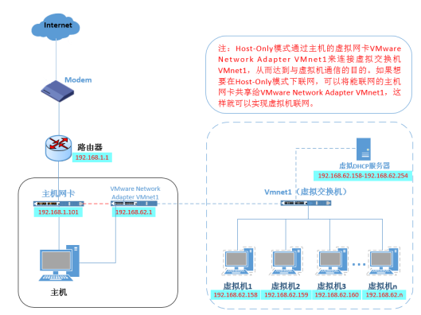
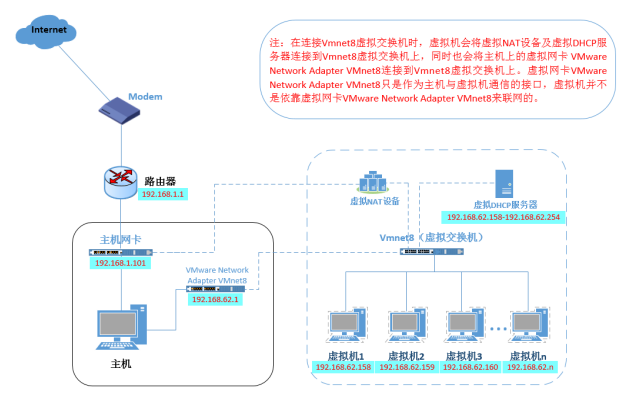
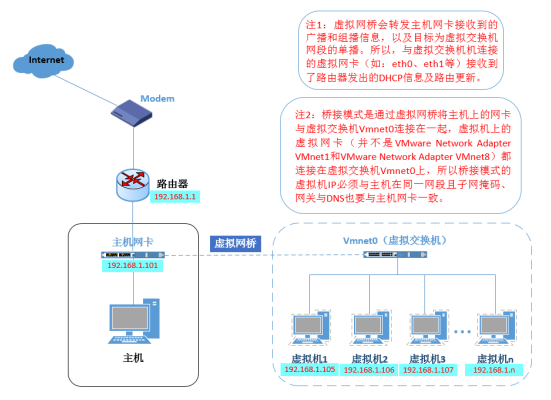

# vmware网络详解

## 虚拟网卡

+ VMware Network Adapter VMnet1作用于仅主机模式，用来实现虚拟机和物理机进行通信，和联网无关系，它的联网需要物理网卡的共享才能上网
+ VMware Network Adapter VMnet8作用于NAT模式，用来实现虚拟机和物理机进行通信，和联网无关系，它是借助于虚拟nat进行联网

## 虚拟交换机

+ VMnet0表示的是用于桥接模式下的虚拟交换机；
+ VMnet1表示的是用于仅主机模式下的虚拟交换机；
+ VMnet8表示的是用于NAT模式下的虚拟交换机。

## 仅主机模式Host-only

配置举例:
在vmware的虚拟网络编辑器中可以看到,vmnet1处于仅主机模式
假如vmnet1的子网ip为192.168.170.0,子网掩码为255.255.255.0
从而vmnet1的子网网关为192.168.170.1(默认为X.X.X.1)
虚拟机中的设置
    ip为192.168.170.2到192.168.170.254范围内的任意一个即可
    子网掩码为255.255.255.0
    网关为192.168.170.1
此时我们就能成功地从主机访问虚拟机的ip

## 地址转换模式NAT

1. VMware中编辑->虚拟网络编辑器->更改设置->VMnet8->勾选将主机虚拟适配器连接到此网络->NAT设置->网关192.168.X.2 (这里X按VMware默认来,这里x是45)
2. 主机配置VMnet8, IP 设置为192.168.x.1 NETMASK设置为255.255.255.0,其余留空
3. 虚拟机中网卡修改配置(centos7中网络配置文件在/etc/sysconfig/network-scripts文件夹下,我这里是ifcfg-ens33文件, 具体哪个文件可以通过ip addr查看) IPADDR=192.168.45.129 PREFIX=24 GATEWAY=192.168.45.2 ONBOOT=yes BOOTPROTP=static 保存退出 然后重启网络
4. vi /etc/resolv.conf 加入 nameserver=192.168.45.2
5. ping www.baidu.com 没问题则成功

其实虚拟机和物理是一个局域网，首先查看虚拟机，虚拟网络配置（NAT模式），是什么网段，例如10网段，那么物理机ip就是192.168.10.1;网关就是192.168.10.2（这里和日常生活不太一样，因为1被物理机占用了）；虚拟机就是192.168.10.X(3-254)。

## 桥接模式(bridge)

桥接模式是通过虚拟网桥进行通信和联网的，而不需要虚拟网卡来使虚拟机和物理机进行通信

桥接模式就是将主机网卡与虚拟机的网卡利用虚拟网桥进行通信。在桥接的作用下，类似于把物理主机虚拟为一个交换机，所有桥接设置的虚拟机连接到这个交换机的一个接口上，物理主机也同样插在这个交换机当中，所以所有桥接下的网卡与网卡都是交换模式的，相互可以访问而不干扰。

在桥接模式下，虚拟机ip地址需要与主机在同一个网段，如果需要联网，则网关与DNS需要与主机网卡一致。其网络结构如下图所示

网络配置
子网掩码,网关,DNS都参考主机
ip需设置为与主机同一网段的ip(需是未被占用的ip,否则会冲突)

linux\vmware网络详解.md
