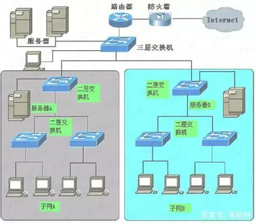
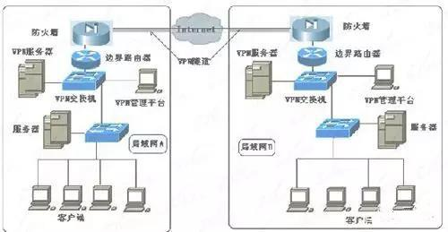
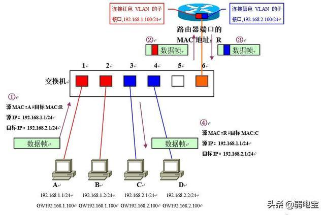

## ARP

地址解析协议，即ARP（Address Resolution Protocol），是根据IP地址获取物理地址的一个TCP/IP协议。主机发送信息时将包含目标IP地址的ARP请求广播到局域网络上的所有主机，并接收返回消息，以此确定目标的物理地址；收到返回消息后将该IP地址和物理地址存入本机ARP缓存中并保留一定时间，下次请求时直接查询ARP缓存以节约资源。

## 交换机与路由器

路由设备检查数据包的目的地址和自己的路由表，如果在路由表中找到转发路径，路由设备把该数据包转发到其它的网段上，否则，丢弃该数据包。专用路由器昂贵、复杂、速度慢、易成为网络瓶颈，因为它要分析所有的广播包并转发其中的一部分，还要和其它的路由器交换路由信息，而且这些处理过程都是由CPU 来处理的(不是专用的ASIC )。

第三层交换机既能像二层交换机那样通过MAC 地址来标识转发数据包，也能像传统路由器那样在两个网段之间进行路由转发。传统路由器采用软件来维护路由表，而三层交换机是通过专用的ASIC芯片来处理 路由转发的。与传统路由器相比，第三层交换机的路由速度一般要快十倍或数十倍。

“边界路由器”处于网络边界的边缘或末端，用于不同网络路由器的连接，这也是目前大多数路由器的类型。如前面介绍的互联网接入路由器和后面要介绍的VPN 路由器都属于边界路由器。这类路由器所支持的网络协议和路由协议比较广，背板带宽非常高，具有较高的吞吐能力，以满足各类不同类型网络(包括局域网和广域 网)的互联。

而“中间节点路由器”则处于局域网的内部，通常用于连接不同局域网，起到一个数据转发的桥梁作用。中间节点路由器更注重MAC地址的记忆能，要求较大的缓 存。因为所连接的网络基本上是局域网，所以所支持的网络协议比较单一，背板带宽也较小，这些都是为了获得最高的性价比，适应一般企业的随能力。

它与三层交换机的路由功能相比，在路由功能上肯定比三层交换机的强，但在局域网这种数据交换频繁的网络中，采用中间节点路由器来进行局域网的连接，网络性能可能会受到一定影响。总的来说，如果所连接的局域网或子网较多、网络互访不是很频繁、路由较复杂的环境中，最好采用中间节点路由器连接方案。但在少数子 网连接、网络间互访频繁的环境中，最好还是采用三层交换机连接方式。而且还可节省设备投资，因为三层交换机不仅具有满足应用需求的路由功能，还可当作交换机用，连接许多网络设备。

### 第三层交换机和路由器的区别

第三层交换机本质还是交换机，只是附带了一些路由器的功能，它的主要功能还是在数据交换，路由只是帮助设备适用面更广、更加实用，扩展其适用性。也就是说，第三层交换机同时兼具数据交换和路由两种功能。

第三层交换机的路由功能因为是附加功能，因为适用环境较为简单，主要是简单的局域网。路由器则不同，它的出现就是为了满足不同类型网络的连接，因此可以适用任何网络，不管是局域网还是广域网，它的优势在于选择最佳路由、负荷分担、链路备份和其他网络进行路由信息的交换等。

从技术上来说，第三层交换机通过硬件执行数据包交换，路由器则基于微处理器的软件路由引擎执行数据包交换。三层路由器在对数据进行路由后，会产生一个MAC地址和IP地址的映射表，当相同数据再次出现时，这个数据就不用通过路由了，从而消除路由器带来的延迟，提高数据包的转发效率。

综上，第三层交换机和路由器之间存在本质的区别，但是从文章描述可以看出，在局域网进行多子网连接时，最好选用三层交换机，特别是在不同子网数据交换频繁的环境中。

相比较而言，路由器的功能比交换机强大，但其速度较慢，价格昂贵，三层交换机既有交换机的转发速度，也有路由的良好控制功能，因此使用相对较广。

## 不同VLAN间通信时数据的流程

