src/views/check/license/license.vue

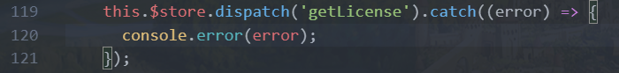

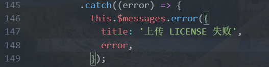

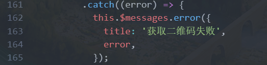

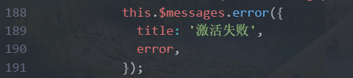

建议封装错误处理

```js
errorHandler (errMsg, title="错误") {
	this.$notify.error({
		title: title,
		message: errMsg,
	});
}
```


### src/views/check/servers/Lists.vue


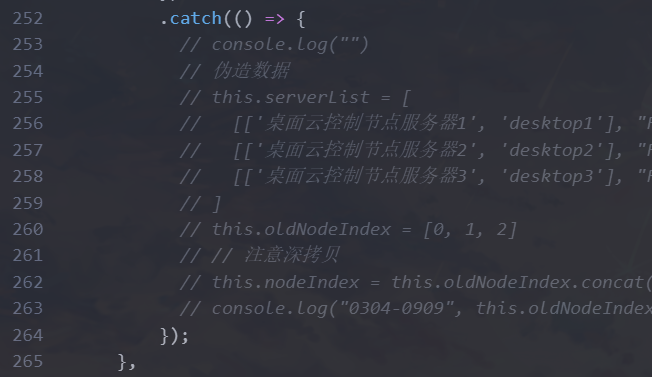

这里没有错误处理

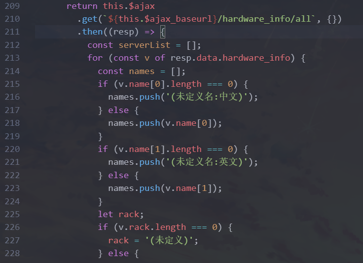

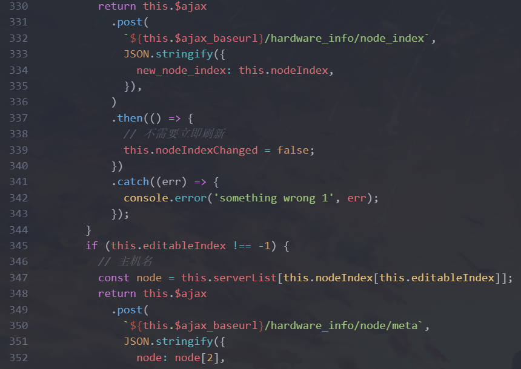


stylus样式比较多 大概30min


### src/views/check/servers/Node.vue

没什么内容 没必要单独成为组件

### src/views/check/servers/Racks.vue

没什么内容 没必要单独成为组件

### src\views\check\Servers.vue

没什么内容 没必要单独成为组件


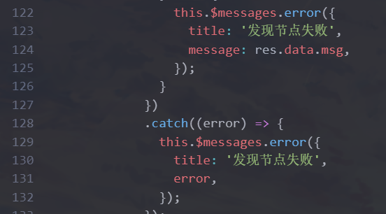

## src\views\deployment\NewNodes.vue

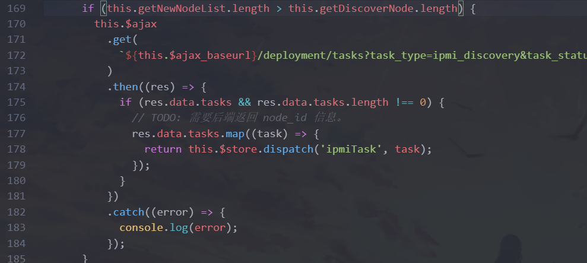

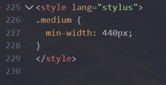

## src\views\deployment\Start.vue

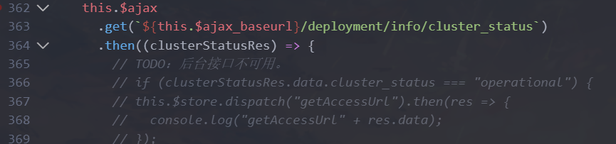

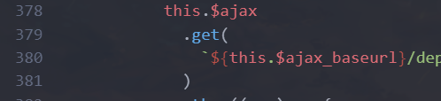