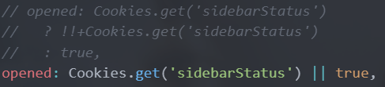
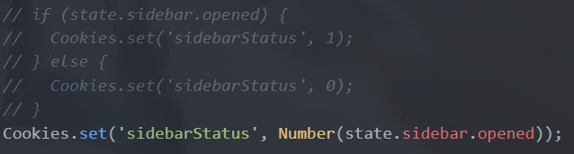

## 1 如果现在要做功能开发。应该是怎么样的一个流程

src/assets 静态资源目录

src/component 普通组件存放目录

src/layout 布局组件存放目录

src/store 存放全局状态 在这里可以定义全局状态

src/router 路由与组件的映射关系

src/view 页面组件存放的目录,页面都写在这里,调用布局组件和普通组件构建页面组件

具体流程(不是很清楚,到时候请教一下):

整理需求 -> 构建简单界面 -> 逻辑 -> 简单测试 -> 添加样式 -> 优化细节  

## 2 以及自己在看代码的过程中。有看到什么问题没有。

### 2.1 未登录跳转

src/App.vue中

````js
beforeCreate() {
  const token = this.$cookies.get('token');
  if (token == null && this.$route.name !== 'Login') {
    this.$router.push({ name: 'Login' });
  }
}
````

通俗点就是没有登录就要登录,但是感觉这个可以写到导航守卫中,找了好久这个功能在哪实现的,到头来发现直接写在这里的.


### 2.2 cookies过期时间

token设置的过期时间是session,关掉浏览器后就需要重新登录.

一般这个是设置一个固定过期时间,即将过期如果还有请求发送就调用刷新token的api以获得新token.(不过对这个项目来说必要性不高).


### 2.3 代码可读性问题

看到了这样的代码 然后理解了好久 嗯......

可读性有点差 还没有注释

```js
 <template
      v-if="
        hasOneShowingChild(item.children, item) &&
        (!onlyOneChild.children || onlyOneChild.noShowingChildren) &&
        !item.alwaysShow"
    >
```


然后还有这样的代码 可读性很差 已注释 换成下面未注释的更好



### 2.4 代码冗余

可以换成下面未注释的更好 简洁




### 2.5 刷新会跳转到登录界面

有时会这样

bug?????


### 2.6 其他问题


```js
beforeUpdate() {
    // const token = this.$cookies.get('token');
    // if (token == null && this.$route.name !== 'Login') {
    //   this.$router.push({ name: 'Login' });
    // }
    // 当第一次加载的时候，获取当前云的状态。
    this.$store.dispatch('getClusterState');
  },
```

这个不应该放在这个钩子中 应该放在mounted中,否则每次修改data都会触发(当然了这个组件的data没有任何属性,不会被修改),

## 3 以及目前自己的了解。知道运维平台实现了一些什么样的功能

这个由于我这里跑的代码不是很完整,具体细节不是很了解

按界面的分类大概猜测一下:

### 3.1 部署

使用界面交互式操作的方式代替以前手动在linux下执行命令的过程,其中包括全局配置,部署变更,节点设置,参数设置(存储,网络设置)等.

### 3.2 查看

这里面的服查看务器功能,我这里显示不了,应该是查看运维平台的服务器的状态(猜测).

查看许可证功能,应该是 展示当前许可证以及上传许可证

### 3.3 监视

对部署中的节点或者已经部署完成的节点,发现异常进行报警.

查看各个节点的状态,以及查看云平台的资源统计


