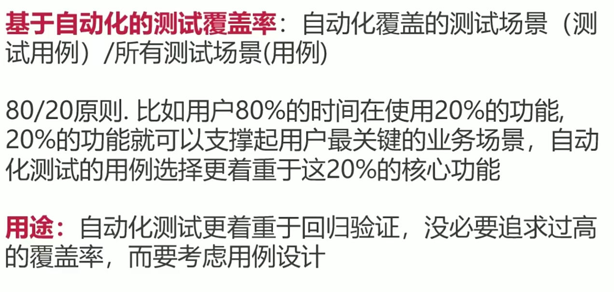

# 概述

## 软件测试概述

### 测试技术方向

黑盒测试
白盒测试
自动化测试
性能测试
安全测试
测试架构

### 软件的分类

系统软件
应用软件

### 软件的生命周期

问题定义
确定好要解决的问题是什么
可行性研究
确定该问题是否存在一个可以解决的方案
需求分析
深入具体的了解用户的需求
概要设计
设计出实现目标系统的几种可能方案, 设计程序的体系结构
详细设计
详细的设计每个模块， 确定实现模块功能所需要的算法和数据结构
编码和单元测试
综合测试
软件维护

### 软件开发模型

边做边改
瀑布模型
计划 -> 需求分析 -> 设计 -> 编码 -> 测试 -> 运行维护
特点:
软件开发的各项活动严格按照线性方式进行
当前活动接受上一项活动的工作结果
当前活动的工作结果需要进行验证
缺点:
由于开发模型是线性的， 增加了开发的风险
早期的错误可能要等到开发后期的阶段才能发现
原型模型
客户与开发公司紧密联系， 开发周期长。 开发会受到需求变更的影响
特点:
实现客户与系统的交互
进一步细化开发软件需求
开发人员可以确定客户的真正需求是什么
螺旋模型
制定计划 风险分析 实施过程（需求确认 软件需求 软件产品设计 设计确认与认证 详细设计 开发 测试） -> 客户评估
特点:
螺旋模型是将瀑布模型与快速原型模型结合起来
强调了其他模型所忽视的风险分析
每一次螺旋包括四个步骤 制定计划 风险分析 实施工程 客户评估
缺点
强调风险分析， 但要求许多客户接受并相信这种分析，是不容易的
敏捷模型
敏捷开发是一种以人为核心， 迭代 循序渐进的开发方法
特点
短周期开发
增量开发
由程序员和测试人员编写的自动化测试来监控开发进度
通过口头沟通 测试和源代码
缺点
团队的组建较难， 人员素质要求较高
对测试人员要求完全掌握各种脚本语言编程， 能执行单元测试， 自动化测试

### 软件开发文档

需求分析文档
概要设计文档
详细设计文档
测试设计文档
测试用例
测试报告

### 开发模型的变迁

最早期: 边做边改
稳定期: 瀑布式
发展期: 敏捷
创新期: DEVOPS

### 项目进程

编程阶段 单元(白盒)-测试参与
编程完成-开发联调（集成测试）-开发为主
提测-冒烟测试（自动化为主手工为辅）-测试执行
测试阶段-系统测试（黑盒功能测试为主，自动化/接口测试为辅，根据项目进行性能，安全测试）
验收阶段-验收测试-测试配合用户或需求

### 软件测试的定义

经典定义：
软件测试是在规定的条件下对程序进行操作，以发现程序错误，衡量软件质量，并对其是否能满足设计要求进行评估的过程

标准定义：
软件测试是使用人工或自动的手段来运行或测定某个软件系统的过程，其目的在于检验它是否满足规定的需求或弄清预期结果与实际结果之间的差别

软件测试目的：
软件测试目的在于发现问题,检查系统是否满足需求

## 软件测试的方法和分类

按生命周期划分
单元测试
冒烟测试
集成测试
系统测试
验收测试
按测试方法划分
白盒测试
静态分析
动态分析
逻辑覆盖测试
语句覆盖
判定覆盖
条件覆盖
路径覆盖
插桩测试
黑盒测试
功能测试
界面测试
冒烟测试
回归测试
业务测试
兼容性测试
易用性测试
自动化测试
web 自动化测试
接口自动化测试
性能测试
负载测试
压力测试
容量测试
并发测试
持久性测试
安全测试
手动臊面
自动化审计
灰盒测试
其它
随机测试
探索性测试
α 测试
β 测试

## 生命周期各测试方法对比

## 常用术语

C/S: C 指的是客户端(Client), S 指的是服务端(Server), 这种软件是基于局域网或互联网，需要一台服务器来安装服务器软件，每台客户端都需要安装客户端软件
B/S: B 指的是浏览器(Browser)
测试用例: 在测试执行之前设计额一套详细的测试方案,包括测试环境,测试步骤,测试数据和预期结果
冒烟测试: 在对一个新版本进行系统大规模地测试之前，先验证一下软件的基本功能是否实现, 是否具备可测性
α 测试: 验收测试的一种, 指的是由用户，测试人员，开发人员等共同参与的内部测试
β 测试: 验收测试的一种, 指的是内侧后的公测, 即完全交给最终用户测试

## 测试常用的模型

### V 模型

### W 模型

### H 模型

### X 模型

## 软件测试覆盖率

覆盖率 = (至少被执行一次的 item 数) / item 的总数

特点
通过覆盖率数据, 可以检测我们的测试是否充分
分析出测试的弱点在哪方面
指导我们设计能够增加覆盖率的测试用例, 有效提高测试质量,但是测试用例设计不能一味追求覆盖率,因为测试成本随覆盖率的增加而增加

需求覆盖
它表示在测试中, 有哪些函数被测试到了, 其被测试到的频率有多大,这些函数在系统所有函数中占的比例有多大通过设计一定的测试用例,要求每个需求点都被测试到

用例覆盖
主要体现在我们每轮测试验证通过的用例数在总用例中的比重

测试人员需要的知识体系

软件测试的原则

