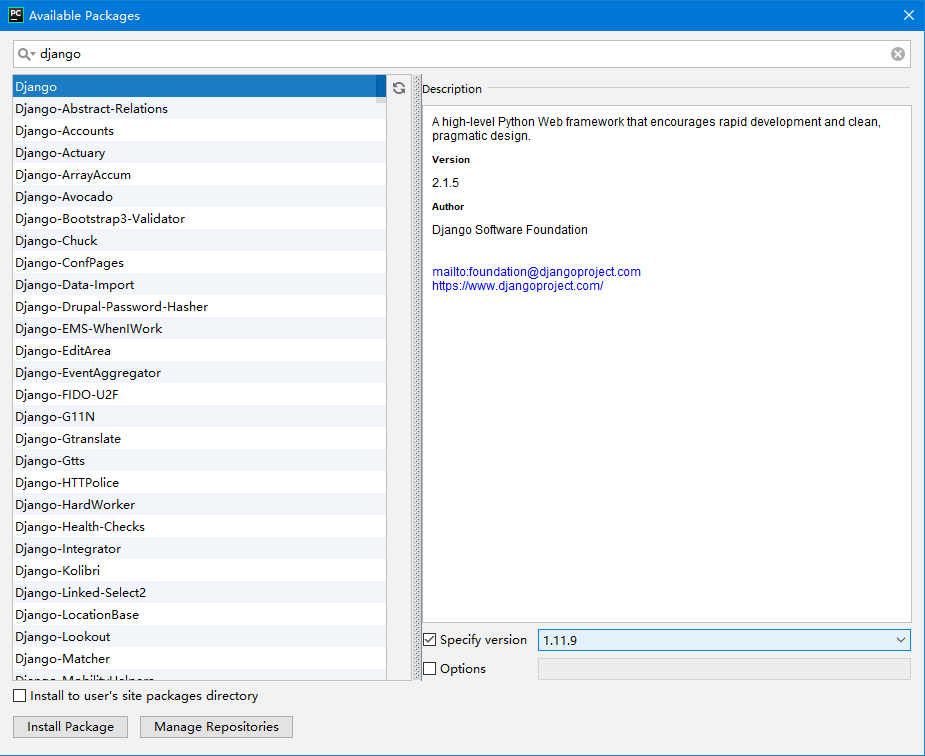
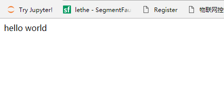

## Django安装与新建项目

##django的安装

-   1.命令行安装django

`pip install django==1.11.9` 

-   2.pycharm安装django

    File-->settings-->Project interpreter-->点击右上方+号

    -->输入django-->Specify version 1.11.9



查询django版本

`python -m django --version`

##新建Django项目

-   使用命令行新建django项目

`django-admin startproject mysite`

-   pycharm创建:

​	File --> New project --> 左侧选Django --> 右侧填项目路径,并且勾选python.exe


1. Django项目的启动:
   1. 命令行启动
      在项目的根目录下(也就是有manage.py的那个目录),运行:

      `python manage.py runserver 0.0.0.0:80`

      --> 在80端口运行该django程序并允许所有IP地址访问

      `python manage.py runserver 端口`   

       --> 在指定的端口运行该django程序并只允许所有当前IP地址访问(即改程序运行所在的机器上)
      `python manage.py runserver`       

       --> 默认在本机的8000端口启动并只允许所有当前IP地址访问(即改程序运行所在的机器上)

      2. PyCharm启动

        Run-->Run...-->mysite(该项目名)-->edit...-->按照下图修改设置

        

配置相关:

-   将settings中的`ALLOWED_HOSTS = []`改为

`ALLOWED_HOSTS = ["47.105.43.45"]` (假设你的服务器地址为47.105.43.45)


-   在settings中加入项目基本路径配置

`BASE_DIR = os.path.dirname(os.path.dirname(os.path.abspath(__file__)))`

将当前文件settings.py的绝对路径的父文件夹的父文件夹路径作为项目的基本路径


-   在settings中的TEMPLATE中加入模版文件路径配置  

`'DIRS': [os.path.join(BASE_DIR, 'templates')],`
 
- 在settings中加入静态文件路径配置

`STATICFILES_DIRS = [os.path.join(BASE_DIR, "static"),]`

-   在settings.py中注释代言csrf的那一行

修改urls.py文件如下

```python
from django.conf.urls import url
from django.contrib import admin
from django.shortcuts import HttpResponse, render


def first_demo(request):
    return HttpResponse('hello world')

urlpatterns = [
    url(r'^admin/', admin.site.urls),
    url(r'^firstdemo/',first_demo),

]
```

这时就我们的第一个小demo就做好了

点击Run-->run 项目名

这时浏览器会自动打开并输入前面设置好的`IP地址/firstdemo`并显示hello world